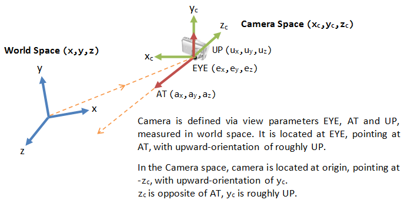
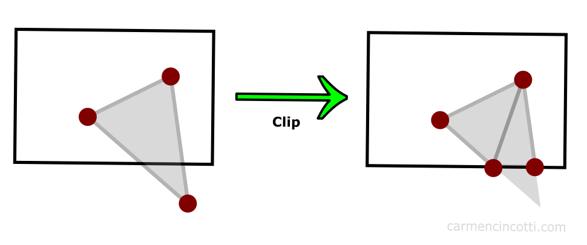

# **🎮 Computer Graphics Questions**

> This material is for related questions:


* [Raytracing](./Coding_questions.md)


## **"M" matrix**

???+Note "How is the "M" matrix derived?"

    **Answer:** The "M" matrix typically refers to the Model Matrix in computer graphics. The Model Matrix is used to transform vertices from object space (local coordinates of the object) to world space (global coordinates in the scene). It encompasses translation, rotation, and scaling operations to position and orient the object within the scene.

    The Model Matrix is derived by <u>combining individual transformation<\u> (translation, rotation, scaling) matrices through mutiplication. The order of transformations is important, and the multiplication order matters. If you want to first scale, then rotate, and finally translate, the transformations should be applied in reverse order when multiplying the matrices.


    In OpenGL, you typically apply the transformations in the following order:

        - Scaling: Apply any scaling transformations first.
        - Rotation: Apply rotation transformations next.
        - Translation: Apply translation transformations last.

    ```cpp
    glm::mat4 myModelMatrix = myTranslationMatrix * myRotationMatrix * myScaleMatrix;
    glm::vec4 myTransformedVector = myModelMatrix * myOriginalVector;
    ```

## **"V" matrix**

???+Note "What is the purpose of the "V" matrix, and how is it derived?"

    **Answer:** The "V" matrix, also known as the View Matrix, is used in computer graphics to transform vertices from world space (global coordinates in the scene) to camera space (view coordinates from the perspective of the camera). The View Matrix effectively represents the position and orientation of the camera within the scene.

    {width="30%", : .center}

    - Computing the Camera Coordinates
        
        From $EYE$, $AT$ and $UP$, we first form the coordinate $(x_c, y_c, z_c)$ for the camera, relative to the world space. We fix $z_c$ to be the opposite of $AT$, i.e., $AT$ is pointing at the $-zc$. We can obtain the direction of $xc$ by taking the cross-product of $AT$ and $UP$. Finally, we get the direction of $yc$ by taking the cross-product of $xc$ and $zc$. Take note that $UP$ is roughly, but not necessarily, orthogonal to $AT$.([Link](https://www3.ntu.edu.sg/home/ehchua/programming/opengl/CG_BasicsTheory.html))

        {width="30%", : .center}

    - Transforming from World Space to Camera Space
        
        Now, the world space is represented by standard orthonormal bases (e1, e2, e3), where e1=(1, 0, 0), e2=(0, 1, 0) and e3=(0, 0, 1), with origin at O=(0, 0, 0). The camera space has orthonormal bases (xc, yc, zc) with origin at EYE=(ex, ey, ez).

        It is much more convenience to express all the coordinates in the camera space. This is done via view transform.

        The view transform consists of two operations: a translation (for moving EYE to the origin), followed by a rotation (to axis the axes):

        {width="30%", : .center}

    - The View Matrix
        
        We can combine the two operations into one single View Matrix:

        {width="30%", : .center}

    In OpenGL, you typically set up the View Matrix using the camera's position, target (the point the camera is looking at), and up vector (the camera's up direction). The glm::lookAt function can be used to construct the View Matrix:

    ```c++
    Copy code
    glm::mat4 viewMatrix = glm::lookAt(cameraPosition, cameraTarget, cameraUp);
    ```
    
    Here's a breakdown of the parameters:

        - cameraPosition: The position of the camera in world space.
        - cameraTarget: The point the camera is looking at in world space.
        - cameraUp: The up direction of the camera.

## **Ortho V.S. Pers**

???+Note "What's the difference between orthographic and perspective projection?"

    **Answer:**

    {width="30%", : .center}

    - In orthographic projection, objects maintain their relative sizes regardless of their distance from the camera. This projection type is often used in technical drawings, architectural plans, and some 2D games where maintaining accurate measurements is crucial. In an orthographic projection, parallel lines in the 3D scene remain parallel in the projected 2D image.

    - Perspective projection emulates how objects appear smaller as they move farther away from the camera, creating a sense of depth and realism. This is how the human eye perceives the world. In perspective projection, objects that are closer to the camera appear larger than objects that are farther away.

    {width="30%", : .center}


## **Viewing frustum**

???+Note "How is the viewing frustum defined?"

    **Answer:** The camera has a limited field of view, which exhibits a view frustum (truncated pyramid), and is specified by four parameters: fovy, aspect, zNear and zFar.

        - Fovy: specify the total vertical angle of view in degrees.
        - Aspect: the ratio of width vs. height. For a particular z, we can get the height from the fovy, and then get the width from the aspect.
        - zNear; the near plane.
        - zFar: the far plane.
    
    The camera space $(x_c, y_c, z_c)$ is renamed to the familiar $(x, y, z)$ for convenience.

    {width="30%", : .center}

    ```cpp
    #include <glm/glm.hpp>
    #include <glm/gtc/matrix_transform.hpp>

    // ...

    // Define camera parameters
    glm::vec3 cameraPosition = glm::vec3(0.0f, 0.0f, 5.0f);
    glm::vec3 cameraTarget = glm::vec3(0.0f, 0.0f, 0.0f);
    glm::vec3 cameraUp = glm::vec3(0.0f, 1.0f, 0.0f);

    // Create the view matrix
    glm::mat4 viewMatrix = glm::lookAt(cameraPosition, cameraTarget, cameraUp);

    // Define projection parameters
    float FOV = glm::radians(45.0f); // Field of view in radians
    float aspectRatio = 800.0f / 600.0f; // Aspect ratio of the viewport
    float nearClip = 0.1f; // Near clipping plane
    float farClip = 100.0f; // Far clipping plane

    // Create the projection matrix
    glm::mat4 projectionMatrix = glm::perspective(FOV, aspectRatio, nearClip, farClip);
    ```

## **Clipping space**

???+Note "What does the clipping space do?"

    **Answer:** `Clipping space` is a crucial concept in computer graphics that defines a volume in which geometry is transformed and clipped before being projected onto the screen. It's an intermediate space between the `normalized device coordinates (NDC)` and the `view frustum`. The primary purpose of `clipping space` is to ensure that only the visible parts of a 3D scene are rendered, improving rendering efficiency and avoiding unnecessary computation for parts of the geometry that won't contribute to the final image.

    {width="40%", : .center}    
    
    When vertices of 3D objects are transformed by the projection matrix, they are transformed to clipping space.

    {width="40%", : .center}

    Mathematically, clipping space can be represented as follows:

    $$-1 ≤ x, y, z ≤ 1$$
    
    Here, $x$, $y$, and $z$ are the coordinates of a vertex in clipping space. Vertices that fall outside this range are clipped. The transformed vertices are then further normalized to NDC, where they can be mapped to the screen space pixel coordinates.

    {width="30%", : .center}

    In OpenGL, the transformation from world coordinates to clipping space is achieved by the combined model-view-projection (MVP) matrix. The vertices' coordinates are multiplied by this matrix to transform them from their original coordinates to clipping space.

    ```cpp
    // Example OpenGL code for transforming vertices to clipping space
    glm::mat4 modelMatrix; // Model transformation
    glm::mat4 viewMatrix;  // Camera view transformation
    glm::mat4 projectionMatrix; // Perspective or orthographic projection
    
    glm::mat4 mvpMatrix = projectionMatrix * viewMatrix * modelMatrix;
    
    // Transform vertices to clipping space
    glm::vec4 clipSpacePosition = mvpMatrix * glm::vec4(worldPosition, 1.0f);
    ```

    Here is the conclusion pipeline:

    {width="30%", : .center}


## **Vectors and matrices**

???+Note "What are the dimensions of commonly used vectors and matrices?"

    **Answer:**

    - Vectors:

        - 2D Vectors: Used for representing points, directions, and displacements in a 2D space.
        - 3D Vectors: Represent positions, directions, and displacements in a 3D space.
        - 4D Vectors (Homogeneous Coordinates): Often used for transformations and perspective projections.
    
    - Matrices:

        - 2x2 Matrices: Used for 2D transformations such as scaling, rotation, and shearing.
        - 3x3 Matrices: Used for 2D transformations, especially in cases where you want to apply transformations that don't affect the z-coordinate.
        - 4x4 Matrices: Used for 3D transformations, including translation, rotation, scaling, and perspective projection.


## **Left/Right-hand Coord**

???+Note "What are left-handed and right-handed coordinate systems in different spaces, and why is there a change?"

    **Answer:**

    Left-handed and right-handed coordinate systems refer to the direction of axes. Different spaces may use different handedness due to historical conventions and mathematical convenience.

    {width="30%", : .center}

    Object Space (or Local Space): This is the coordinate system of an individual object. An object's geometry is usually defined in its own local space.

    - **Difference in Spaces:**

        - World Space: Once an object is placed in a scene, it is transformed into world space coordinates. Here, the position, rotation, and scale of an object with respect to the world are represented.
        - View Space (or Camera Space): This is the coordinate system relative to the camera. When we move or rotate the camera, objects move and rotate in the opposite direction in view space.
        - Clip Space: After the view transformation, a projection (often perspective or orthogonal) is applied to transform objects into clip space. Objects outside of a certain range (the view frustum) get "clipped" out.
        - Screen Space: The transformation from clip space to screen space involves mapping x, y, z coordinates to pixel locations on the screen and depth values for z-buffering.


## **Viewport transformation**

???+Note "What's the purpose of viewport transformation, and how does it change dimensions?"

    **Answer:**Viewport transformation is a crucial step in the rendering pipeline that maps points from the clip space (or normalized device coordinates, NDC) to screen space. It changes the dimensions from [-1, 1] to [0, width] and [0, height].

    {width="30%", : .center}

    Viewport transform is made up of a series of reflection (of y-axis), scaling (of x, y and z axes), and translation (of the origin from the center of the near plane of clipping volume to the top-left corner of the 3D viewport). The viewport transform matrix is given by:

    {width="30%", : .center}

    If the viewport cover the entire screen, $minX=minY=minZ=0$, $w=screenWidth$ and $h=screenHeight$.

## **Depth in Viewport trans**

???+Note "How are depth values handled during viewport transformation? (Storing in the depth buffer)"

    **Answer:** Depth values, often represented by the `z` value in 3D graphics, are crucial for determining the visibility of surfaces in a scene. Depth values are linearly mapped from the range [near, far] to [0, 1] and stored in the depth buffer (or z-buffer) to resolve which surface is "in front" at any given pixel.

    During the viewport transformation, the depth values also undergo a transformation similar to the x and y coordinates, but with a distinct purpose.

    1. **Normalization**: Before the viewport transformation, the perspective division (division by the homogeneous coordinate `w` after the projection transformation) brings depth values into a normalized range, typically between -1 and 1 for clip space.

    2. **Depth Scaling and Translation**: During the viewport transformation, depth values are transformed to fit into the depth range used by the depth buffer. This range is often represented as [0, 1] for many graphics APIs, but it's important to note that the specific range can depend on the system. The transformation can be described by:
   
        $$
        z' = \frac{z_{far} - z_{near}}{2} \times z + \frac{z_{far} + z_{near}}{2}
        $$

        Where:

            - \( z' \) is the transformed depth value.
            - \( z \) is the original depth value from clip space.
            - \( z_{near} \) and \( z_{far} \) represent the near and far clipping planes, respectively.

    3. **Depth Buffer Storage**: After transformation, the resulting depth values are stored in the depth buffer. During rasterization, for each pixel, the GPU checks the depth value of the incoming fragment against the value stored in the depth buffer. If the new fragment's depth value is closer (usually a lesser value, but this depends on depth function settings) to the camera than the stored value, the fragment's color replaces the current color at that pixel, and the depth buffer is updated with the new depth value. If not, the fragment is discarded.


## **NDC**

???+Note "What is NDC (Normalized Device Coordinates)?"

    **Answer:** 

    1. **Definition**: `NDC(Normalized Device Coordinates)` is the coordinate system that vertices are in after the perspective division (or homogeneous divide) by the w component in clip space. It's the stage immediately after clip space.

    2. **Purpose**: The conversion to NDC serves to normalize the coordinates such that they lie within a standard cube, typically ranging from -1 to 1 along each axis. This ensures a consistent and device-agnostic representation of the scene.

    3. **Coordinate Range**: In NDC, the x, y, and z coordinates typically range from -1 to 1. Anything outside this range would have been clipped out in the previous clip space stage.

    4. **Conversion from Clip Space**: To get coordinates in NDC from clip space, you perform the perspective division:

       $$
       x_{ndc} = \frac{x}{w}
       $$

       $$
       y_{ndc} = \frac{y}{w}
       $$

       $$
       z_{ndc} = \frac{z}{w}
       $$
    
    5. **Depth Values in NDC:** Depth values in NDC are crucial for visibility determination and depth testing. After the perspective divide, z values are also in the normalized range, which will then be transformed to the depth range used by the depth buffer during the viewport transformation.

    ???+Warning "Compared with `Clip space`!"

        - Definition: `Clip space` is the coordinate system in which vertices are positioned after undergoing the projection transformation but before the perspective division. In this space, the coordinates are in a homogeneous form.

        - Purpose: The main purpose of clip space is to allow for the clipping of geometry that lies outside the viewing frustum. Any vertex that has a coordinate outside the range of [-w, w] for its x, y, or z values after the projection transformation is considered to be outside the viewing frustum and can be clipped.

        - Coordinate Range: The coordinates in clip space don't have a strictly defined range like in NDC. However, the clipping operation checks the vertices against their homogeneous coordinate w. Vertices with x, y, or z components outside the [-w, w] range are outside the viewing frustum.

## **Rasterization**

???+Note "Definition and purpose of rasterization."

    **Answer:** Rasterization is the process of converting vector primitives (like polygons in 3D models) into a raster format (pixels on a screen). It determines which pixels on the screen should be illuminated and with what color based on the geometry and its attributes (like color, texture, and shading).
    
    {width="30%", : .center}
    
    - **Color:**

        1. **Vertex Colors**: The simplest form of coloring in rasterization involves interpolating vertex colors. Each vertex of a polygon can be assigned a color, and during rasterization, the color of a pixel inside the polygon is interpolated based on the colors of its vertices. This interpolation usually happens in a linear fashion across the surface of the polygon.

            {width="30%", : .center}

        2. **Fragment Shaders**: Modern graphics pipelines allow for the use of fragment shaders (or pixel shaders). These shaders determine the color of each pixel (fragment) during rasterization. They can use various inputs, including textures, lights, and other per-vertex data, to dynamically compute pixel colors.

    - **Texture:**

        1. **Texture Mapping**: One of the primary roles of rasterization in the context of textures is texture mapping, where 2D images (textures) are mapped onto the 3D surfaces of polygons. Each vertex of a polygon can be assigned texture coordinates (often denoted as \( u, v \)). During rasterization, the texture coordinates for a pixel inside the polygon are interpolated from its vertices. These coordinates are then used to sample a color from the texture image.

        2. **Mipmapping**: To efficiently sample textures and avoid aliasing artifacts, especially for distant or minified objects, rasterization can use mipmaps. Mipmaps are a sequence of precomputed textures, each one being a downscaled version of the previous one. The appropriate level of detail is chosen based on the distance and angle of the surface to the camera.

            {width="30%", : .center}

        3. **Texture Filtering**: During rasterization, there might be a need to interpolate between multiple texture samples to get the final color for a pixel. Common methods include bilinear and trilinear filtering.

    - **Shading:**

        1. **Flat Shading**: This is one of the simplest shading methods. In flat shading, each polygon gets a single color, usually computed based on a single normal for the entire polygon and the lighting equation. The result can be a faceted appearance, where each polygon's surface looks flat.

        2. **Gouraud Shading**: In Gouraud shading, lighting calculations are done per vertex, and colors are interpolated across the polygon during rasterization. This results in smoother color transitions compared to flat shading but can miss sharp lighting effects or specular highlights.

        3. **Phong Shading**: Not to be confused with the Phong reflection model, Phong shading involves interpolating the normals from the vertices and then computing the lighting per pixel. This method captures specular highlights more accurately than Gouraud shading.

        4. **Pixel Shaders and Advanced Lighting**: Modern rasterization pipelines use pixel or fragment shaders to achieve advanced shading effects. These shaders can implement complex lighting models, incorporate multiple light sources, and even simulate some global illumination effects. 


## **Vertex/Fragment shader**

???+Note "Role of the vertex/fragment shader."

    **Answer:**

    - **Vertex Shader:**

        1. **Vertex Transformation**: One of the primary responsibilities of the vertex shader is to transform vertex positions from object space (local coordinates) to clip space. This typically involves multiplying the vertex position with a series of transformation matrices such as the model, view, and projection matrices.

        2. **Normal Transformation**: For lighting calculations, normals associated with vertices are transformed to ensure they are in the appropriate space, typically camera or world space.

        3. **Texture Coordinates**: While texture coordinates are usually provided as part of the vertex data, a vertex shader can manipulate them, for instance, to implement certain effects or animations.

        4. **Per-Vertex Lighting**: Lighting calculations can be performed at the vertex level in the vertex shader. This approach is seen in Gouraud shading.

        5. **Tessellation and Geometry Shaders**: Vertex shaders can work in tandem with tessellation and geometry shaders to dynamically create geometry on the GPU.

        6. **Passing Varying Data**: Vertex shaders can output data that is interpolated across fragments and then consumed by the fragment shader. This data might include things like color, texture coordinates, transformed normals, or any custom data required for the fragment shader's operations.

    - **Fragment Shader (Pixel Shader):**

        1. **Pixel Color Calculation**: The primary role of the fragment shader is to determine the final color of each pixel that will be drawn to the screen. 

        2. **Texture Sampling**: The fragment shader samples colors from textures using texture coordinates. This is where texture mapping, including techniques like bilinear and trilinear filtering, and mipmapping, occur.

        3. **Per-Pixel Lighting**: More accurate lighting models, like Phong shading, can be implemented in the fragment shader, where lighting calculations are performed per pixel.

        4. **Special Effects**: Advanced visual effects, such as specular highlights, bump mapping, normal mapping, and shadow mapping, are typically handled in the fragment shader.

        5. **Post-Processing**: While certain post-processing effects might be implemented in other stages or using multiple passes, the fragment shader can be used to apply various screen-space effects like color grading, blurring, or edge detection.

        6. **Conditional Rendering**: The fragment shader can conditionally discard fragments, preventing them from being written to the final framebuffer. This can be used for effects like stippling, transparency, or custom clipping.


When is lighting typically calculated in the vertex shader versus the fragment shader?

Lighting calculations are often done in the vertex shader for efficiency, while finer lighting details are computed in the fragment shader for each pixel.
Purpose of rasterization and knowledge of lighting models.

Rasterization converts primitives to pixels for display. Lighting models simulate how light interacts with surfaces (e.g., Phong, Blinn-Phong).


Components of the Phong lighting model and their roles.

The Phong lighting model consists of ambient, diffuse, and specular components. Ambient contributes to base lighting, diffuse simulates direct light reflection, and specular represents highlights.
Differences between Blinn-Phong and Phong shading.

Blinn-Phong uses the halfway vector between the light and view directions for specular reflection, resulting in more accurate highlights compared to the Phong model.
Principles and benefits of MIPMAPs, determining which level to use.

MIPMAPs are precomputed texture levels to improve rendering quality and performance by reducing aliasing and texture shimmering. The level is chosen based on the pixel size relative to the texture's size.
How are normal maps stored, and what are their pros and cons?

Normal maps store perturbed surface normals in RGB channels, allowing for intricate surface details. Pros include enhanced realism, while cons involve increased memory usage and complexity.
Considerations when storing normal maps.

Normal maps should be stored in tangent space and normalized. The blue channel might encode surface information for optimization.
What is gamma correction and why is it important?

Gamma correction compensates for the nonlinear way monitors display colors, ensuring consistent and accurate color representation.
What is HDR (High Dynamic Range), and why is it used?

HDR allows for a wider range of color and brightness values, simulating real-world lighting conditions and enhancing visual realism.
Explanation of tone mapping and familiarity with different algorithms.

Tone mapping scales HDR values to the limited range of a display, preventing overexposure. Algorithms include Reinhard, ACES, and more.
Implementation of shadow mapping, drawbacks, and improvements.

Shadow mapping involves rendering the scene from the light's perspective to create a depth map. Drawbacks include aliasing and self-shadowing. Improvements involve PCF and PCSS for soft shadows.
Principles of anti-aliasing methods (MSAA, FSAA, SSAA, DLSS).

MSAA (Multisample), FSAA (Full-Screen), SSAA (Super-Sample), and DLSS (Deep Learning Super Sampling) are methods to reduce aliasing artifacts by sampling multiple positions or using AI.
Types and purposes of various buffers in graphics, e.g., color, depth, stencil.

Color buffers store pixel colors, depth buffers store depth values, and stencil buffers control rendering operations like masking and masking.
What is stencil testing, and what are its applications beyond shadows?

Stencil testing masks pixels based on their stencil value, useful for various effects like decals, outlining, and post-processing.
Understanding of alpha blending.

Alpha blending combines the colors of overlapping fragments using their alpha values, allowing for transparency effects.
Rendering semi-transparent objects and considerations.

Semi-transparent objects require sorting based on depth and proper blending to correctly render overlapping parts.
Depth testing process and rendering order of transparent and opaque objects.

Opaque objects are rendered first, and then transparent objects are rendered back-to-front to ensure proper blending.
Shader writing experience.

Provide details about any shaders you have written, such as vertex, fragment, geometry, or compute shaders.
Familiarity with compute shaders.

Compute shaders are used for general-purpose parallel computing tasks, often used for simulations, data processing, and some graphics tasks.
Conditions where the fragment shader executes fewer times than the vertex shader.

In cases where vertex shader operations generate geometry with fewer visible fragments (due to occlusion), the fragment shader executes fewer times.
Introduction to the rendering equation.

The rendering equation describes the light transport in a scene and is used as a foundation for various lighting models.
Brief introduction to BRDF (Bidirectional Reflectance Distribution Function).

BRDF describes how light is reflected from a surface in different directions, and it's an essential part of lighting models.
Meaning of F0 in the Fresnel equation.

F0 represents the reflectance of a surface at normal incidence, indicating how much light is reflected off the surface rather than refracted.
Principles and implementation parameters of PBR (Physically Based Rendering).

PBR aims for realistic rendering by using physically accurate material properties and light interactions.
Knowledge of ray tracing and path tracing.

Ray tracing simulates light paths to generate realistic images, while path tracing is a specific type of ray tracing that simulates light paths through a scene.
Introduction to deferred rendering, purpose, and benefits.

Deferred rendering separates geometry and shading calculations, allowing for efficient handling of multiple light sources and post-processing effects.
Methods to improve rendering efficiency.

Improving rendering efficiency involves techniques like level-of-detail (LOD), occlusion culling, frustum culling, and batching.
Ensuring stable frame rates.

Stable frame rates can be maintained through optimization, LOD, culling, and adaptive quality settings.
Shader code optimization techniques.

Shader code can be optimized by reducing redundant calculations, minimizing branching, using texture atlases, and avoiding unnecessary computations.
Knowledge of GPU architectures.

Familiarity with GPU architectures like NVIDIA's CUDA cores or AMD's Compute Units.
Familiarity with graphics APIs.

Knowledge of graphics APIs like DirectX, Vulkan, OpenGL, and Metal.
Differences between DirectX and OpenGL.

DirectX and OpenGL are graphics APIs with differences in design, implementation, and platform support.
Purpose of GLFW.

GLFW is a library for creating windows, contexts, and handling user input in OpenGL applications.
Texture sampling in GLSL shaders.

Texture sampling in GLSL shaders is done using the texture function, providing a texture and UV coordinates.
Applying lighting with a scaling model matrix along the X-axis.

To apply lighting after a non-uniform scaling along the X-axis, you would transform the normals using the inverse transpose of the model matrix.

Calculating a rotation matrix for an object's Y-axis rotation in world coordinates.
The rotation matrix for rotating around an object's Y-axis by an angle θ is typically represented as:
scss
Copy code
| cos(θ)  0  sin(θ)  0 |
|   0     1    0     0 |
| -sin(θ) 0  cos(θ)  0 |
|   0     0    0     1 |
Identifying the most performance-intensive shader between vertex and fragment shaders for a given algorithm.
Profiling the application's performance will reveal which shader has the most impact on efficiency. Factors include the number of vertices and pixels processed and shader complexity.
Rendering a subset of objects from a scene based on user selection.
Objects can be rendered selectively by implementing an object visibility flag or managing a render queue based on user selection.
Familiarity with post-processing techniques.
Post-processing techniques include effects like depth of field, bloom, motion blur, and color correction applied after rendering.
Implementation of Gaussian blur.
Gaussian blur is implemented by convolving the image with a Gaussian kernel to create a smooth effect.
Implementing bloom.
Bloom involves blurring bright areas and adding them back to the scene for a glowing effect.
Knowledge of Non-Photorealistic Rendering (NPR).
NPR is a style of rendering that aims to emulate artistic and hand-drawn techniques.
Techniques for achieving a cartoon-like rendering style.
Cartoon rendering is achieved by using cel shading, edge detection, and flat shading to create a non-realistic, stylized appearance.
Understanding and comparing different edge detection methods.
Edge detection methods include Sobel, Canny, and Prewitt, each with varying sensitivity to different types of edges.
Intersection of two line segments.
The intersection of two line segments can be determined by checking if the endpoints of each segment are on opposite sides of the other segment.
Ray-triangle intersection.
Ray-triangle intersection can be determined by testing if the ray intersects the plane of the triangle and then checking if the intersection point lies within the triangle.
Ray-AABB intersection.
Ray-AABB intersection can be determined using slabs method or axis-aligned bounding box (AABB) intersection checks along each dimension.
Calculating the arc length between two points on a sphere given in polar coordinates.
The arc length can be calculated using the formula: s = r * θ, where r is the sphere's radius and θ is the angle between the two points in radians.
Determining the intersection between a circle and a matrix.
Intersection between a circle and a matrix is determined by checking if the circle's center lies within the matrix's boundaries and calculating the distance between them.
Testing convex polygon intersection.
Convex polygon intersection can be determined by checking if any edge of one polygon intersects with any edge of the other polygon.
Accelerating ray-triangle intersection with spatial data structures.
Acceleration structures like BVH (Bounding Volume Hierarchy) or KD-tree can be used to efficiently determine ray-triangle intersections.
SVD decomposition of a matrix.
Singular Value Decomposition (SVD) decomposes a matrix into three matrices, U, Σ, and V, where Σ contains the singular values of the original matrix.
Converting a nonlinear problem into a linear problem.
Nonlinear problems can be linearized by approximating them with linear equations using techniques like Taylor series expansion.
Estimating world coordinates from 2D screen coordinates with depth information.
Using the depth value and a perspective transformation, the 2D screen coordinates can be transformed back into 3D world coordinates.
Precision issues in deferred rendering and the use of depth versus direct world position.
Deferred rendering stores position in view space, which loses precision. Depth is preferred for position reconstruction due to its better depth distribution.
Storage space of normals in deferred rendering.
Normals in deferred rendering are stored in view space, as view space normals don't suffer from interpolation issues.
Incorporating Ambient Occlusion (AO) in deferred rendering.
AO can be implemented by sampling the depth buffer and testing occlusion against nearby points to estimate shadowing.
Performance comparison between deferred rendering and forward rendering when sampling depth maps.
Deferred rendering performs better when sampling depth maps for shadowing, as it avoids redundant shading calculations.
G-buffer components and formats.
G-buffer typically consists of position, normal, color, and material information, stored in textures with various formats.
Difference between depth and color texture samplers.
Depth texture samplers use depth comparison for sampling, while color texture samplers perform linear filtering for color data.
Unity's different rendering pipelines and their distinctions.
Unity has pipelines like Built-in Render Pipeline, Universal Render Pipeline (URP), and High Definition Render Pipeline (HDRP), each catering to different needs.
Detecting graphical glitches like screen tearing, artifacts, and black screens.
Screen tearing occurs when frames aren't synchronized with the display. Artifacts can result from various rendering issues, and black screens can be caused by improper rendering or synchronization.
Knowledge of various graphics APIs and their usage.
Familiarity with DirectX, Vulkan, OpenGL, and Metal, including the version you've used.
Overview of OpenGL's rendering pipeline.
The OpenGL pipeline consists of stages like vertex shading, tessellation, geometry shading, fragment shading, and rasterization.
Purpose of GLFW and its context.
GLFW is a library for creating windows and OpenGL contexts. A context manages OpenGL's state and resources for rendering.
Differences between OpenGL and OpenGL ES.
OpenGL is a desktop graphics API, while OpenGL ES is a version optimized for embedded systems like mobile devices and game consoles.
Types and purposes of frame buffers.
Frame buffers store rendering results before they're displayed. They include color, depth, and stencil attachments.
Role of the BufferData function in OpenGL.
BufferData is used to allocate memory and initialize the contents of a buffer object in OpenGL.
Differences between glFinish() and glFlush() in OpenGL.
glFinish() blocks the CPU until all queued OpenGL commands are executed, while glFlush() only ensures that commands are sent to the GPU and may not wait for completion.


### **Reference**

- [Picture resource 1](https://developer.download.nvidia.com/CgTutorial/elementLinks/fig4_4.jpg)
- [Picture resource 2](https://www3.ntu.edu.sg/home/ehchua/programming/opengl/images/Graphics3D_ProjectionMatrix.png)
- [Picture resource 3](https://res.cloudinary.com/dx1kpewvo/image/upload/v1651065795/2022-05-02/Screenshot_2022-04-27_092223_wjz58k.png)
- [Picture resource 4](https://www3.ntu.edu.sg/home/ehchua/programming/opengl/images/Graphics3D_CameraPerspective.png)
- [Picture resource 5](https://metashapes.com/wp-content/uploads/2016/07/Screen-Shot-2016-03-27-at-14.44.05.png)
- [Picture resource 6](https://glumpy.readthedocs.io/en/latest/_images/projection.png)
- [Picture resource 7](https://developer.tizen.org/forums/native-application-development/what-rasterisation-opengl-graphic-pipeline)
- [Picture resource 8](https://cdn-images-1.medium.com/max/640/1*QrtR82JDYIQijcfEJT5SpA.png)
- [Picture resource 1]()
- [Picture resource 1]()
- [Picture resource 1]()
- [Picture resource 1]()
- [Picture resource 1]()
- [Picture resource 1]()
- [Picture resource 1]()
- [Picture resource 1]()
- [Picture resource 1]()
- [Picture resource 1]()
- [Picture resource 1]()
- 