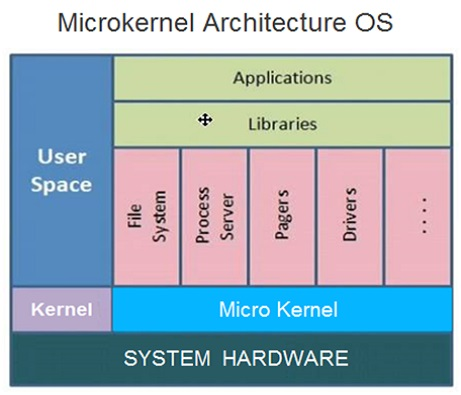

# ** 🎮 Operating System**

> Interview Questions for Operating System

- [**What is Operating System**](#what-is-operating-system)

### **Operating System**

??? question "Click for answers 👇"
    
    The **system software** that controls computer <u>hardware</u> and <u>software</u> resources. 

    - Its main {==**functions**==} include:
        1. <u>Managing resources</u> such as processes, memory, files, and devices;
        2. Providing an <u>interface</u> for user programs;
        3. Ensuring the normal <u>operation</u> of computer systems. 

    

        {width="32.7%"} 
        {width="35%"}  
    

    - The {==**purpose**==} of an operating system is to:
        1. Provide a <u>good user experience</u>;
        2. Enable computer to excute programs <u>efficiently and reliably</u>.