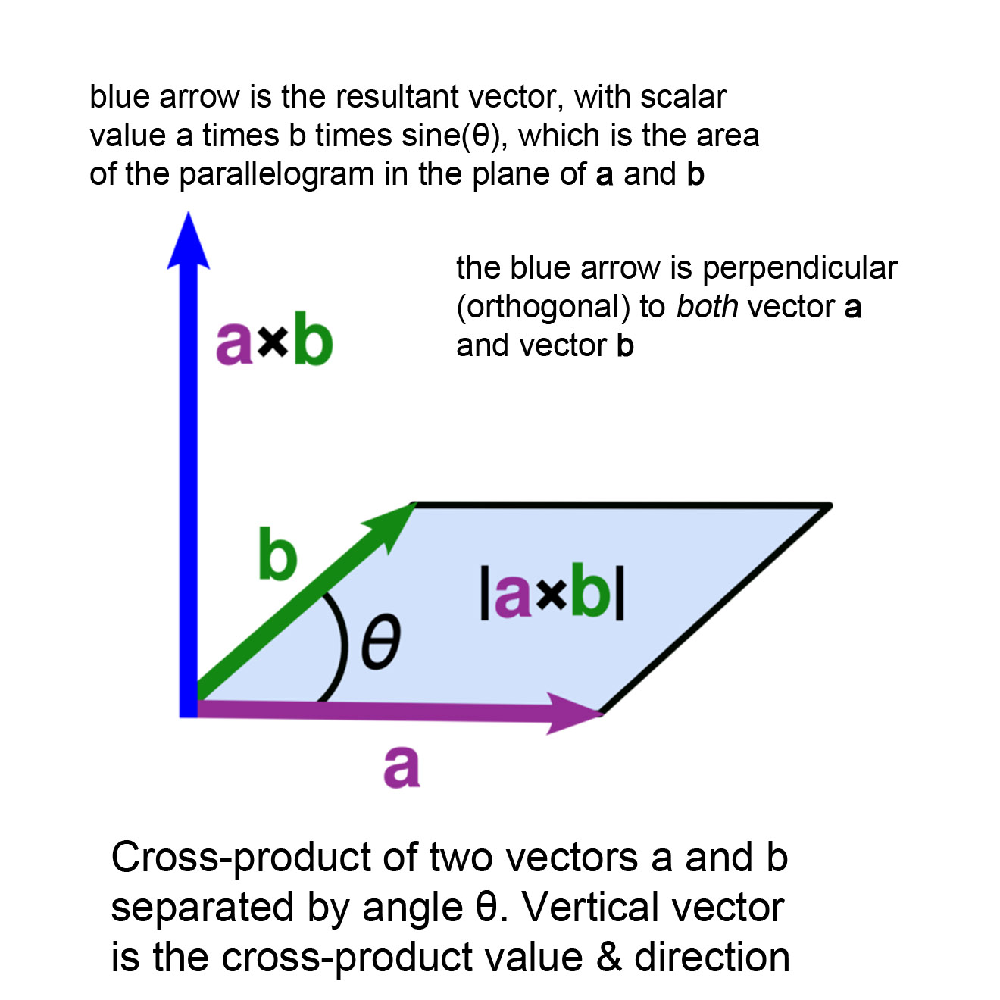
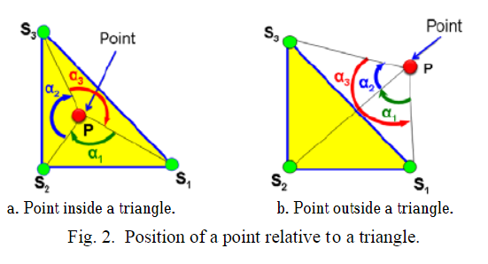
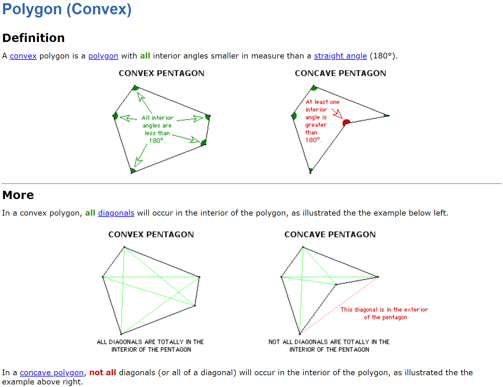

# **🎮 Math Questions**

> This material is for related questions:

## **Convex hull**

???+Note "How to compute the convex hull of a given set of points?"

    **Answer:** We can solve this problem by using [Graham Scan alrorithm](https://www.youtube.com/watch?v=B2AJoQSZf4M).

## **Dot and Cross products**

???+Note "Geometric interpretations of dot and cross products."
    
    **Answer:** 

    - `Dot product` is like light projection:
    {width="40%", : .center}   
    - `Cross product` is for getting the orthogonal vector of the provided vectors. Its symbol also shows the clockwise from one parent vector to another parent verctor:
    {width="40%", : .center} 

## **Point in Tri**

???+Note "How to determine if a point is inside a triangle?"

    **Answer:** Various methods can be used, including:
    
    - Barycentric coordinates ([Link](https://www.geeksforgeeks.org/check-whether-a-given-point-lies-inside-a-triangle-or-not/))
    {width="40%", : .center}  
    - Angle summation ([Link](https://www.researchgate.net/publication/321421519_OPTIMUM_TOOLS_FOR_FINISHING_SCULPTURED_SURFACES_DEFINED_BY_3D_IRREGULAR_CLOUD_OF_POINTS#pf2))
    {width="40%", : .center}
    - Ray intersection ([Link](https://www.baeldung.com/cs/check-if-point-is-in-2d-triangle#1-mathematical-idea-1))
    {width="40%", : .center}
    - Area comparison. ([Link](https://www.geeksforgeeks.org/check-whether-a-given-point-lies-inside-a-triangle-or-not/))
    {width="40%", : .center}

## **Convex polygon**

???+Note "How to determine if a polygon is convex?"

    **Answer:** A polygon is convex if all its interior angles are less than 180 degrees. ([Link](https://www.learnalberta.ca/content/memg/division03/Polygon%20%28Convex%29/index.html))
    {width="40%", : .center}

## **Reflection vector**

???+Note "Given a normal vector and an incident vector, how to compute the reflection vector?"

    Answer: Here below is the formula ([Link](https://www.contemporarycalculus.com/dh/Calculus_all/CC11_7_VectorReflections.pdf)):
    $$ \vec{R} = \vec{I} - 2 \vec{I}\cdot\vec{N}$$
    {width="30%", : .center}

## **Polygon area**

???+Note "Use cross product to calculate the area of a polygon."

    Answer: Refer the [Link](https://www.baeldung.com/cs/2d-polygon-area) Imagine we have three points A, B, and C. The area of the single triangle can be calculated as:
    $$S_{tri}=1/2\cdot\|\vec{AB}\times\vec{AC}|$$
    The area of any polygon can be claculated by:
    $$S_{pol}=1/2\cdot\sum_{i=0}^{n-1}(x_i\cdoty_{i+1}-y_i\cdotx_{i+1}))$$
    {width="30%", : .center}

## ****

???+Note ""
Finding the distance between two lines in 3D space.
Answer: The distance between two lines can be calculated using vector projection and vector subtraction.

## ****

???+Note ""
Closest distance between a point in 3D space and a 3D triangle.
Answer: The closest distance can be found by projecting the point onto the plane of the triangle and measuring the distance.

## ****

???+Note ""
Significance of a determinant being equal to zero.
Answer: A determinant of zero indicates linear dependence of the matrix columns or rows.

What are homogeneous coordinates?
Answer: Homogeneous coordinates represent points in higher-dimensional space and allow for convenient transformations.

What can homogeneous coordinates be used for?
Answer: Homogeneous coordinates simplify transformations, including translations and projective transformations.

How to differentiate between a position and a direction using homogeneous coordinates?
Answer: Points have a non-zero homogeneous coordinate, while directions have a zero homogeneous coordinate.

Why use homogeneous coordinates? What are the advantages?
Answer: Homogeneous coordinates enable concise representation of translations and perspective transformations.

How to determine ray-sphere intersection? Optimization strategies?
Answer: Intersection can be found by solving a quadratic equation. Optimization includes early rejection using bounding spheres.

What is a normal matrix?
Answer: A normal matrix is used to transform normals properly under non-uniform scaling and transformations.

What does the clipping space transformation do?
Answer: Clipping space transformation maps the view frustum to a normalized cube for further perspective projection.

How is a viewing frustum defined?
Answer: The viewing frustum is defined as the volume in world space that is visible through the camera lens.

How many dimensions are typical vectors? And matrices? Why is it 3D for vectors and 4D for matrices?
Answer: Vectors are typically 3D for spatial representations, while matrices are 4D for transformations due to homogenous coordinates.

How is the M matrix derived?
Answer: The M matrix combines translation, rotation, and scaling transformations into a single matrix.

How to determine the order of matrix concatenation?
Answer: Matrix multiplication is non-commutative, so the order of matrix multiplication matters.

Write a rotation matrix and a translation matrix, and explain how to combine them.
Answer: A rotation matrix and a translation matrix can be combined by multiplying them.

Given an M matrix, can it be decomposed into various transformation matrices?
Answer: Yes, an M matrix can be decomposed into translation, rotation, and scaling matrices.

Definition and characteristics of orthogonal matrices.
Answer: Orthogonal matrices are square matrices with orthogonal columns (dot product of columns is zero) and determinant of 1.

Understanding eigenvalues and eigenvectors, along with related equations.
Answer: Eigenvalues and eigenvectors describe the behavior of a linear transformation.

What are the eigenvalues of a rotation matrix?
Answer: The eigenvalues of a rotation matrix are complex numbers with magnitude 1.

How to understand eigenvectors for a 2x2 matrix A?
Answer: Eigenvectors of a 2x2 matrix A are vectors that do not change direction when multiplied by A.

Are you familiar with the least squares method?
Answer: The least squares method minimizes the sum of squared differences between data points and a fitted model.

Do you know about Euler angles? What are they used for? What are their pros and cons?
Answer: Euler angles represent rotations in 3D space and have issues like gimbal lock.

Have you encountered gimbal lock? Why does it occur? How to solve it?
Answer: Gimbal lock occurs when a three-axis rotation representation loses a degree of freedom. It can be solved using other representations.

Are you familiar with quaternions? What are their roles? How can interpolation be performed?
Answer: Quaternions are used to represent rotations. Spherical linear interpolation (slerp) can be used for interpolation.

What is Monte Carlo integration?
Answer: Monte Carlo integration is a numerical method to estimate complex integrals using random sampling.

How can a nonlinear problem be represented as a linear problem?
Answer: Nonlinear problems can be linearized using tangent planes or linear approximations.

Partial differentiation of multivariable functions.
Answer: Partial differentiation computes the rate of change of a function with respect to one variable, holding others constant.

How to find extreme values of a function? Necessary and sufficient conditions?
Answer: Extreme values can be found by analyzing critical points and endpoints. First and second derivative tests provide conditions.

### **Reference**

- [Picture resource 1](https://cdn.kastatic.org/ka-perseus-images/62a0493b8bb7f29f2655190b718be3d029e6750e.png)
- [Picture resource 2](https://mathinsight.org/media/image/image/dot_product_projection.png)
- [Picture resource 3](https://media.cheggcdn.com/media/0fd/0fd5663e-13c8-4c34-accf-ba8b4787ca90/php94XjUH)