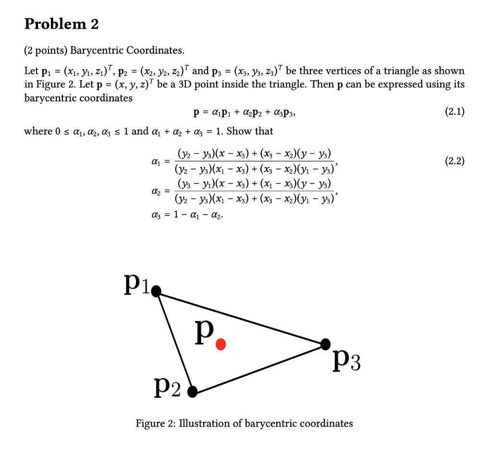

# **🎮 Math Questions**

> This material is for related questions:

## **Convex hull**

???+Note "How to compute the convex hull of a given set of points?"

    **Answer:** We can solve this problem by using [Graham Scan alrorithm](https://www.youtube.com/watch?v=B2AJoQSZf4M).

## **Dot and Cross products**

???+Note "Geometric interpretations of dot and cross products."
    
    **Answer:** 

    - `Dot product` is like light projection:

    {width="40%", : .center}   

    - `Cross product` is for getting the orthogonal vector of the provided vectors. Its symbol also shows the clockwise from one parent vector to another parent verctor:

    {width="40%", : .center} 

## **Point in Tri**

???+Note "How to determine if a point is inside a triangle?"

    **Answer:** Various methods can be used, including:
    
    - Barycentric coordinates ([Link](https://www.geeksforgeeks.org/check-whether-a-given-point-lies-inside-a-triangle-or-not/))

    {width="40%", : .center}  

    - Angle summation ([Link](https://www.researchgate.net/publication/321421519_OPTIMUM_TOOLS_FOR_FINISHING_SCULPTURED_SURFACES_DEFINED_BY_3D_IRREGULAR_CLOUD_OF_POINTS#pf2))

    {width="40%", : .center}

    - Ray intersection ([Link](https://www.baeldung.com/cs/check-if-point-is-in-2d-triangle#1-mathematical-idea-1))

    {width="40%", : .center}

    - Area comparison. ([Link](https://www.geeksforgeeks.org/check-whether-a-given-point-lies-inside-a-triangle-or-not/))

    {width="40%", : .center}

## **Convex polygon**

???+Note "How to determine if a polygon is convex?"

    **Answer:** A polygon is convex if all its interior angles are less than 180 degrees. ([Link](https://www.learnalberta.ca/content/memg/division03/Polygon%20%28Convex%29/index.html))
    {width="60%", : .center}

## **Reflection vector**

???+Note "Given a normal vector and an incident vector, how to compute the reflection vector?"

    **Answer:** Here below is the formula ([Link](https://www.contemporarycalculus.com/dh/Calculus_all/CC11_7_VectorReflections.pdf)):

    $$ \vec{R} = \vec{I} - 2 \vec{I}\cdot\vec{N}$$

    {width="20%", : .center}

## **Polygon area**

???+Note "Use cross product to calculate the area of a polygon."

    **Answer:** Refer the [Link](https://www.baeldung.com/cs/2d-polygon-area) Imagine we have three points A, B, and C. The area of the single triangle can be calculated as:

    $$S_{tri}=1/2\cdot\|\vec{AB}\times\vec{AC}|$$

    The area of any polygon can be claculated by:

    $$S_{pol}=1/2\cdot\sum_{i=0}^{n-1}(x_i\cdot y_{i+1}-y_i\cdot x_{i+1})$$

    {width="30%", : .center}

## **3D two lines' distance**

???+Note "Finding the distance between two lines in 3D space."

    **Answer:** The distance between two lines can be calculated using vector projection and vector subtraction. ([Link](https://www.youtube.com/watch?app=desktop&v=HC5YikQxwZA))

    {width="60%", : .center}

## **Zero determinant**

???+Note "Significance of a determinant being equal to zero?"

    **Answer:** A determinant of zero indicates linear dependence of the matrix columns or rows.
    
    - **Linear Dependence:** If the determinant of a square matrix is zero, it means that the rows (or columns) of the matrix are linearly dependent. In simpler terms, one of the rows (or columns) can be expressed as a linear combination of the other rows (or columns).

    - **Singular Matrix:** A matrix with a determinant of zero is called a singular matrix. Singular matrices do not have an inverse, meaning they are non-invertible. Non-singular matrices, on the other hand, have a non-zero determinant and possess an inverse.

    - **Volume Interpretation:** For a 3x3 matrix, the determinant gives the volume of the parallelepiped spanned by its row or column vectors. A determinant of zero implies that the volume is zero, which means that the three vectors lie in the same plane.

    - **No Unique Solution:** If you're trying to solve a system of linear equations using the matrix form $AX=B$, and matrix $A$ has a determinant of zero, it means that the system either has infinitely many solutions or no solutions (depending on the system). In the context of linear systems, the determinant can help determine the nature of the solutions.

    - **Eigenvalues:** For a square matrix, the determinant of the matrix minus a scalar multiple of the identity matrix gives the characteristic polynomial. The roots of this polynomial are the eigenvalues of the matrix. If the determinant of the matrix itself is zero, then one of the eigenvalues is zero.

    - **Stability in Differential Equations:** In the study of differential equations, particularly systems of linear differential equations, the determinant of the coefficient matrix can play a role in determining the stability and behavior of solutions.

    - **Geometric Interpretation:** For a 2x2 matrix, the determinant gives the area of the parallelogram spanned by its row or column vectors. If the determinant is zero, it means that the area is zero, implying that the vectors are collinear.

    - **Change of Variables in Multivariable Calculus:** The determinant of the Jacobian matrix in a change of variables for multiple integrals gives a scaling factor for integration. A zero determinant can indicate problems in the transformation.

## **Homogeneous coordinates**

???+Note "What are homogeneous coordinates?"

    **Answer:** Homogeneous coordinates represent points in higher-dimensional space and allow for convenient transformations.

    Here are some matrix for two-dimensional transformation in homogeneous coordinate:
    
    {width="60%", : .center}

## **Posit homo v.s. Direct homo**

???+Note "How to differentiate between a position and a direction using homogeneous coordinates?"

    **Answer:** In homogeneous coordinates, the distinction between a position (or point) and a direction (or vector) can be made using the additional coordinate, often referred to as the "w-coordinate."

    - **Position (or Point):** Represented as $(x',y',w)$ in 2D or $(x',y',z',w)$ in 3D. The w-coordinate for a position is usually 1 (or non-zero in a more general sense). When you convert from homogeneous to Cartesian coordinates, you'd divide by w to get the actual point: $x=x'/w,y=y'/w$and in 3D, $z=z'/w$.

    - **Direction (or Vector):** Represented similarly as $(x',y',w)$ in 2D or $(x',y',z',w)$ in 3D. The w-coordinate for a direction vector is 0. This denotes that vectors, being directions, do not have a specific position in space and aren't affected by translations. If you were to convert a direction from homogeneous to Cartesian coordinates (though you typically wouldn't need to), the division by w would lead to a division by zero, which further underscores that the concept of a specific "position" doesn't apply to directions.

    Here's a practical interpretation. Imagine you're working in 3D graphics:

    - If you have the homogeneous coordinate $(2,3,4,1)$, it represents the point $(2,3,4)$ in Cartesian coordinates.

    - If you have the homogeneous coordinate $(2,3,4,0)$, it represents a direction, not a specific point. It might describe, for instance, the direction of a light ray or a vector in space.

## **Benifits of homo**

???+Note "Why use homogeneous coordinates? What are the advantages?"

    **Answer:**

    - **Unified Transformation Matrices:** Homogeneous coordinates allow for a unified matrix representation for multiple transformations (translation, rotation, scaling, and shearing). This makes it possible to concatenate various transformations into a single matrix.

    - **Easier Translations:** In standard Cartesian coordinates, translations are not representable as linear transformations. With homogeneous coordinates, translations become linear, and hence, can be expressed as matrix multiplications.

    - **Perspective Projections:** Homogeneous coordinates make it easy to handle projective transformations, like perspective projection in graphics, which would be more complex in Cartesian coordinates.

    - **Representation of Points at Infinity:** They can represent points at infinity, allowing for the modeling of parallel lines meeting at a "vanishing point" in projective geometry.

    - **Interpolation and Clipping:** In computer graphics, tasks like interpolation and clipping can be performed more efficiently and robustly using homogeneous coordinates.

    - **Compactness:** Using homogeneous coordinates, a sequence of transformations can be represented compactly with a single matrix, simplifying the computation.

    - **Flexibility:** They can seamlessly toggle between representing positions and directions using the same coordinate system.

    - **Robustness in Computer Vision:** Homogeneous coordinates provide a robust framework for dealing with points and transformations in computer vision tasks, such as camera calibration and 3D reconstruction.

## **Ray-sphere intersection**

???+Note "How to determine ray-sphere intersection? Optimization strategies?"

    **Answer:** Intersection can be found by solving a quadratic equation. Optimization includes early rejection using bounding spheres.

    {width="40%", : .center}

## **Normal matrix**

???+Note "What is a normal matrix?"

    **Answer:** 

    - Definition: 
        - A complex square matrix $A$ is normal if it commutes with its adjoint (conjugate transpose). 
        - For real matrices, the adjoint is the same as the transpose. So for a real matrix, a square matrix $A$ is normal if it commutes with its transpose.

    {width="50%", : .center}

    - Application:
        - A matrix is normal if and only if it can be diagonalized by a unitary (or orthogonal, in the real case) matrix.
        - If $\overline{A}$ is normal, then its eigenvalues lie in the complex plane and its eigenvectors can be chosen to be orthonormal.
        - All Hermitian, skew-Hermitian, and unitary matrices are normal.

## **Clipping space transformation**

???+Note "What does the clipping space transformation do?"

    **Answer:** Clipping space transformation maps the view frustum to a normalized cube for further perspective projection. 
    
    In CG, The calculations involved in transforming our vertex positioned in model space into clip space happen in the vertex shader. In fact, the position we set as output, is the position in clip space ([Link](https://carmencincotti.com/2022-05-02/homogeneous-coordinates-clip-space-ndc/)):

    $$out_{position} = projectionMatrix \times viewMatrix \times modelMatrix \times input_{ModelSpacePosition}$$

    {width="30%", : .center}

## **Viewing frustum**

???+Note "How is a viewing frustum defined?"

    **Answer:** The viewing frustum is defined as the volume in world space that is visible through the camera lens.
    
    {width="40%", : .center}
    
    {width="50%", : .center}

## **Dimensions of vectors/matrices**

???+Note "How many dimensions are typical vectors? And matrices? Why is it 3D for vectors and 4D for matrices?"

    **Answer:** Vectors are typically 3D for spatial representations, while matrices are 4D for transformations due to homogenous coordinates.

## **M matrix**

???+Note "How is the M matrix derived?"

    Answer: The M matrix combines translation, rotation, and scaling transformations into a single matrix.

    Given a 4x4 transformation matrix $M$ in 3D graphics, the matrix can be represented as:

    $$
    M=\begin{bmatrix}
    RS & T\\
    0 & 1
    \end{bmatrix}
    $$

    Where:

    - $R$ is a 3x3 matrix representing rotation and possibly scaling.
    - $T$ is a 3x1 matrix (or column vector) representing translation.

## **M matrix decomposation**

???+Note "Given an M matrix, can it be decomposed into various transformation matrices?"

    **Answer:** Yes, an M matrix can be decomposed into translation, rotation, and scaling matrices. The hard point is the Scaling and Rotation Decomposition:

    First, compute the scale factors along each axis as the magnitude of the rows of the 3x3 matrix:

    $$S_x = ||M_{1,:3}||, S_y = ||M_{2,:3}||,S_z = ||M_{3,:3}||,$$

    The scaling matrix $S$ is then:

    $$
    S=\begin{bmatrix}
    S_x & 0 & 0\\
    0 & S_y & 0\\
    0 & 0 & S_z
    \end{bmatrix}
    $$

    To get the pure rotation matrix $R$, you would normalize the rows of the 3x3 matrix in $M$ using the scaling factors:

    $$
    R=\begin{bmatrix}
    \frac{M_{1,:3}}{S_x} \\
    \frac{M_{2,:3}}{S_y}\\
    \frac{M_{3,:3}}{S_z}
    \end{bmatrix}
    $$

    {width="40%", : .center}

    {width="40%", : .center}

## **Order of matrix concatenation**

???+Note "How to determine the order of matrix concatenation?"

    **Answer:** Matrix multiplication is non-commutative, so the order of matrix multiplication matters. 

    Let's use some notation:

    - Let $( M_o )$ be the object's matrix.
    - Let $( M_r )$ be the rotation matrix.
    - Let $( M_t )$ be the translation matrix.

    For the above scenario, the result $M_{result}$ after rotating and then translating is:

    $$ M_{result} = M_t \times (M_r \times M_o) $$

    If you instead wanted to first translate and then rotate the object, you would do:

    $$ M_{result} = M_r \times (M_t \times M_o) $$

## **Orthogonal matrices**

???+Note "Definition and characteristics of orthogonal matrices."

    **Answer:** 
    
    - **Definition:** A square matrix $A$ is said to be orthogonal if its transpose is equal to its inverse. That is, 

        $$ A^T = A^{-1} $$

        or equivalently, 

        $$ A^T A = AA^T = I $$

        where $I$ is the identity matrix of appropriate size.

    - **Characteristics of Orthogonal Matrices:**

        1. Preservation of Dot Product: For an orthogonal matrix $A$ and any vectors $x$ and $y$ in $\mathbb{R}^n$, the dot product of the transformed vectors remains unchanged, i.e., 

            $$ 
            (Ax) \cdot (Ay) = x \cdot y 
            $$

            This means that orthogonal matrices preserve angles between vectors.

        2. Preservation of Norm: For an orthogonal matrix $A$ and any vector $x$ in $\mathbb{R}^n$, the length (or norm) of the transformed vector remains unchanged. That is, 
   
            $$ 
            ||Ax|| = ||x|| 
            $$
        
        3. Determinant: The determinant of an orthogonal matrix is either 1 or -1.

        4. Eigenvalues: The eigenvalues of an orthogonal matrix have an absolute value of 1.

        5. Inverse: As per the definition, the inverse of an orthogonal matrix is its transpose.

        6. Rotation and Reflection: Orthogonal matrices in $\mathbb{R}^2$ and $\mathbb{R}^3$ can represent rotations (if the determinant is 1) or  reflections (if the determinant is -1).

## **Eigenvalues and Eigenvectors**

???+Note "Understanding eigenvalues and eigenvectors, along with related equations."

    **Answer:**

    - **Definitions**

        1. **Eigenvector**: A non-zero vector \( v \) such that when a matrix \( A \) multiplies it, the vector \( v \) only gets scaled (its direction may or may not change). 

        2. **Eigenvalue**: The scalar \( \lambda \) associated with its corresponding eigenvector. 
       
            $$
            Av = \lambda v
            $$

            where \( A \) is a matrix, \( v \) is the eigenvector, and \( \lambda \) is the eigenvalue.

            Eigenvalues indicate the factor by which the eigenvector is stretched or compressed. 

            - If \( \lambda = 1 \), vectors along the direction of the associated eigenvector remain unchanged.
            - If \( \lambda > 1 \), vectors are stretched.
            - If \( 0 < \lambda < 1 \), vectors are compressed.
            - If \( \lambda < 0 \), vectors are inverted and may also be stretched or compressed.

            
        - **Geometric Perspective on linear transformation.**
        
        The number of independent eigenvectors gives information about the dimensionality of the space preserved by the linear transformation.

        Imagine a rubber sheet laid out on a grid. A linear transformation could stretch, compress, skew, or rotate this sheet. The eigenvectors of this transformation would be the directions where the rubber sheet is merely <u>stretched or compressed</u> (no skewing or rotation), and the eigenvalues would tell you by how much.

        For a 2x2 matrix, think of it as two main actions:

        - Stretching or compressing along one direction (first eigenvector).
        - Stretching or compressing along a perpendicular direction (second eigenvector).
    
    - **Determining Eigenvalues and Eigenvectors**

        To find the eigenvalues of a matrix, you need to solve the characteristic equation:
        
        $$
        \text{det}(A - \lambda I) = 0
        $$
        
        Here, \( I \) is the identity matrix of the same size as \( A \), and "det" represents the determinant of a matrix.

        Once the eigenvalues \( \lambda \) are found, you can plug them back into the equation 
        
        $$
        (A - \lambda I)v = 0
        $$ 
        
        to determine the eigenvectors \( v \).

    - **Example**

        Let's take a simple 2x2 matrix to illustrate the process:
        
        $$
        A = \begin{bmatrix} 2 & 1 \\ 1 & 3 \end{bmatrix}
        $$

        To find its eigenvalues:

        1. Subtract \( \lambda \) from the diagonal of \( A \):
        
        $$
        A - \lambda I = \begin{bmatrix} 2-\lambda & 1 \\ 1 & 3-\lambda \end{bmatrix}
        $$

        2. Set the determinant of this matrix to zero and solve for \( \lambda \):
        
            $$
            \text{det}(A - \lambda I) = (2-\lambda)(3-\lambda) - 1(1) = 0
            $$

            Solving this equation will yield the eigenvalues \( \lambda \).

            Once you have the eigenvalues, plug them back into the equation 
        
            $$
            (A - \lambda I)v = 0
            $$ 
        
            to get the respective eigenvectors.

    - **Properties**

        1. For a diagonal matrix, the eigenvalues are simply the diagonal entries.

        2. The sum of the eigenvalues is equal to the trace of the matrix (the sum of its diagonal elements).

        3. The product of the eigenvalues is equal to the determinant of the matrix.

        4. If \( A \) is an \( n \times n \) matrix and \( \lambda \) is an eigenvalue of \( A \) with multiplicity \( k \), then the algebraic multiplicity (how many times \( \lambda \) appears as a root) is always greater than or equal to the geometric multiplicity (the number of independent eigenvectors associated with \( \lambda \)).

## **Rotation matrix eigenvalues**

???+Note "What are the eigenvalues of a rotation matrix?"

    **Answer:** The eigenvalues of a rotation matrix are complex numbers with magnitude 1.

    Given a 2x2 rotation matrix \( R \) that represents a rotation of \( \theta \) degrees (or radians) counter-clockwise around the origin, the matrix is given by:

    $$
    R = \begin{bmatrix}
    \cos(\theta) & -\sin(\theta) \\
    \sin(\theta) & \cos(\theta) \\
    \end{bmatrix}
    $$

    To find its eigenvalues, we need to solve the characteristic polynomial given by:

    $$
    \text{det}(R - \lambda I) = 0
    $$

    where \( I \) is the 2x2 identity matrix.

    Expanding out, we have:

    $$
    \text{det}\left( \begin{bmatrix}
    \cos(\theta) - \lambda & -\sin(\theta) \\
    \sin(\theta) & \cos(\theta) - \lambda \\
    \end{bmatrix} \right) = 0
    $$

    This simplifies to:

    $$
    (\cos(\theta) - \lambda)^2 + \sin^2(\theta) = 0
    $$

    The above equation has complex solutions for all \( \theta \) except for \( \theta = 0 \) and \( \theta = \pi \) (or 0 and 180 degrees). In other words, for a genuine rotation (not identity or a reflection), the eigenvalues are complex.

    The eigenvalues are:

    $$
    \lambda_1, \lambda_2 = \cos(\theta) \pm i\sin(\theta)
    $$

    This is a representation of Euler's formula:

    $$
    e^{i\theta} = \cos(\theta) + i\sin(\theta)
    $$

    So, the eigenvalues for a 2D rotation matrix are complex conjugates lying on the unit circle in the complex plane. The rotation doesn't have any real vectors that only get stretched or compressed, which is consistent with our geometric understanding that all vectors change direction except for those on the axis of rotation.

## **Least squares method**

???+Note "Are you familiar with the least squares method?"

    **Answer:** The least squares method minimizes the sum of squared differences between data points and a fitted model.

    - **Mathematical Background**

        Given a set of \( n \) data points \( (x_1, y_1), (x_2, y_2), \ldots, (x_n, y_n) \) and a function \( f \) that is linear in its parameters, the goal is to find the parameters that minimize the sum of the squared residuals:

        $$
        S = \sum_{i=1}^{n} r_i^2
        $$

        where \( r_i = y_i - f(x_i) \) is the residual.

        In matrix notation, this can be formulated as:

        $$
        \mathbf{A} \mathbf{x} = \mathbf{b}
        $$

        Where:

          - \( \mathbf{A} \) is the design matrix.
          - \( \mathbf{x} \) is the column vector of the parameters we wish to determine.
          - \( \mathbf{b} \) is the column vector of the observed values.

        The solution, when \( \mathbf{A} \) is overdetermined, is typically given by:

        $$
        \mathbf{x} = (\mathbf{A}^T \mathbf{A})^{-1} \mathbf{A}^T \mathbf{b}
        $$

    - **Application: Linear Regression**

        A common application of the least squares method is linear regression. In this context, the goal is to find the best-fitting straight line \( y = mx + c \) to a set of data points.

        For linear regression:

          - \( f(x) = mx + c \)
          - The parameters to be determined are the slope \( m \) and the y-intercept \( c \).

    - **Benefits and Limitations**

        - Benefits:

            1. Provides a best-fitting curve or line to a dataset.
            2. Has a clear mathematical formulation and is computationally efficient for many problems.

        - Limitations:

            1. Sensitive to outliers, as squaring the residuals gives more weight to large deviations.
            2. Assumes a specific form for the underlying model (e.g., linearity for simple linear regression).

## **Euler angles**

???+Note "Do you know about Euler angles? What are they used for? What are their pros and cons?"

    **Answer:** Euler angles represent rotations in 3D space and have issues like gimbal lock.
   
    {width="30%", : .center}

    There are multiple conventions for defining Euler angles, but one common sequence is:

    1. **Roll (\( \phi \))**: Rotation about the body's X-axis.
    2. **Pitch (\( \theta \))**: Rotation about the body's Y-axis.
    3. **Yaw (\( \psi \))**: Rotation about the body's Z-axis.

    The specific order and axes of rotation can vary, leading to different conventions like Yaw-Pitch-Roll, Pitch-Yaw-Roll, etc (total 12 types).

    - **Applications:**

        1. **Aerospace & Robotics**: Used extensively to describe the orientation of aircraft, spacecraft, and robots.
        2. **Computer Graphics**: Used in 3D modeling and animation to set the orientation of objects.
        3. **Physics**: Useful in describing rotations in three-dimensional systems.

    - **Pros:**

        1. **Intuitive Understanding**: Each angle has a clear physical interpretation, making it relatively easy to visualize and understand.
        2. **Compact Representation**: Only three angles are required to describe any orientation.

    - **Cons:**

        1. **Gimbal Lock**: This is a situation where you lose one degree of freedom, and it becomes impossible to represent certain rotations. It happens when the second rotation in a sequence aligns two of the rotational axes.
        2. **Not Unique**: Multiple sets of Euler angles can represent the same orientation.
        3. **Not Always Suitable for Interpolation**: Directly interpolating between two sets of Euler angles might not produce the shortest or most    intuitive rotation.
        4. **Numerical Stability**: Repeated conversions between rotation matrices or quaternions and Euler angles can introduce numerical inaccuracies.

## **Gimbal lock**

???+Note "Have you encountered gimbal lock? Why does it occur? How to solve it?"

    **Answer:** Gimbal lock occurs when a three-axis rotation representation loses a degree of freedom. It can be solved using other representations.

    - **Why Does It Occur?**

        To visualize this, imagine three rings representing the three rotational axes, each nested inside the other. 

        - The **outer ring** represents the first rotation (e.g., yaw).
        - The **middle ring** represents the second rotation (e.g., pitch).
        - The **inner ring** represents the third rotation (e.g., roll).

        When the middle ring (pitch) is rotated by \( \pm 90^\circ \), the outer and inner rings become coplanar. This causes the loss of one rotational degree of freedom, as two of the rotational axes align. Now, any rotation about one axis is indistinguishable from a rotation about the other axis.

    - **How to Solve Gimbal Lock?**

        1. **Avoid \( \pm 90^\circ \) Pitch**: One approach, which might not be feasible in all situations, is to avoid reaching the critical pitch angles where gimbal lock occurs. This, however, limits the range of motion.

        2. **Use Quaternions**: Quaternions are a four-dimensional number system that can represent 3D orientations and rotations without suffering from gimbal lock. In many applications, especially in computer graphics and aerospace, quaternions are preferred over Euler angles for this reason. 

        3. **Use Additional or Redundant Sensors**: In applications like spacecraft attitude control, additional sensors can be used to determine orientation when gimbal lock is encountered.

        4. **Switch Rotation Order**: Temporarily switch to a different sequence of rotations when approaching gimbal lock. However, this can be complex to implement and may not be suitable for all applications.

        5. **Use Rotation Matrices or Axis-Angle Representation**: While they have their own sets of challenges, in some cases, they might offer ways to maneuver around the gimbal lock problem.

## **Quaternions**

???+Note "Are you familiar with quaternions? What are their roles? How can interpolation be performed?"

    **Answer:** Quaternions are used to represent rotations. Spherical linear interpolation (slerp) can be used for interpolation.

    - **Role in 3D Rotations:**

        - Compact Representation: Quaternions provide a compact way to represent 3D orientations and rotations without the `gimbal lock` issue that can arise with Euler angles.

        - Efficient Computation: Quaternion operations can be more computationally efficient than their matrix counterparts.

        - Smooth Interpolations: Slerp (spherical linear interpolation) with quaternions can provide smooth transitions between orientations.

        - Numerical Stability: Quaternions can be renormalized easily to combat numerical drift, ensuring they represent a valid rotation.

    - **Interpolation:**

        Slerp (Spherical Linear Interpolation): This is the most common method of quaternion interpolation. Given two quaternions \( q_1 \) and \( q_2 \), the interpolated quaternion \( q(t) \) at a fraction \( t \) between 0 and 1 is given by:

        $$
        q(t) = \frac{\sin((1-t)\theta)}{\sin(\theta)}q_1 + \frac{\sin(t\theta)}{\sin(\theta)}q_2
        $$

        where \( \theta \) is the angle between \( q_1 \) and \( q_2 \).

## **Monte Carlo integration**

???+Note "What is Monte Carlo integration?"

    **Answer:** Monte Carlo integration is a technique used to estimate the value of a definite integral using random sampling. It is particularly useful when dealing with high-dimensional integrals.

    {width="30%", : .center}

    - **Procedure:**

        1. **Random Sampling**: Generate \( N \) random points \( x_i \) within the domain \( D \).

        2. **Evaluate Function**: Evaluate \( f(x_i) \) at each of the \( N \) points.

        3. **Compute Average**: Calculate the average value of the function over these points:
   
        $$ \bar{f} = \frac{1}{N} \sum_{i=1}^{N} f(x_i) $$

        4. **Estimate Integral**: The integral of \( f(x) \) over \( D \) is approximated as:
   
        $$ \int_D f(x) \, dx \approx \text{volume}(D) \times \bar{f} $$

    - **Advantages:**

        - **Flexibility**: Can handle complex and high-dimensional integrals.
        - **Simplicity**: The algorithm is straightforward.
        - **Parallelism**: Easily parallelizable.

    - **Disadvantages:**

        - **Convergence**: The error decreases as \( O(N^{-1/2}) \).
        - **Inefficiency**: Many samples might be "wasted" in regions where the function varies little.

    - **Variance Reduction:**

        To improve efficiency, various techniques can be employed:

        - **Importance Sampling**: Sampling more from regions where the function has higher values.
        - **Stratified Sampling**: Dividing the domain and sampling uniformly from each.
        - **Antithetic Variates**: Using dependent random variables to reduce variance.

## **Nonlinear to linear**

???+Note "How can a nonlinear problem be represented as a linear problem?" 

    Answer: Nonlinear problems can be linearized using tangent planes or linear approximations.

    One common method for linearization is using a `Taylor series expansion`. 
    
    - **1. One Dimension (Tangent Line)**

        For a single-variable function \( f(x) \), the tangent line at a point \( x_0 \) provides a linear approximation:

        $$
        f(x) \approx f(x_0) + f'(x_0) (x - x_0)
        $$

        This equation represents the linearization of \( f(x) \) about the point \( x_0 \). The term \( f'(x_0) \) is the derivative of the function at the point, which gives the slope of the tangent line.

    - **2. Multiple Dimensions (Tangent Plane)**

        For functions of multiple variables, such as \( f(x, y) \), the tangent plane at a point \( (x_0, y_0) \) provides the linear approximation:

        $$
        f(x, y) \approx f(x_0, y_0) + f_x(x_0, y_0) (x - x_0) + f_y(x_0, y_0) (y - y_0)
        $$

        Here, \( f_x \) and \( f_y \) are the partial derivatives with respect to \( x \) and \( y \) respectively. The tangent plane captures the variations in the function as you move in the \( x \) and \( y \) directions.

### **Reference**

- [Picture resource 1](https://cdn.kastatic.org/ka-perseus-images/62a0493b8bb7f29f2655190b718be3d029e6750e.png)
- [Picture resource 2](https://mathinsight.org/media/image/image/dot_product_projection.png)
- [Picture resource 3](https://media.cheggcdn.com/media/0fd/0fd5663e-13c8-4c34-accf-ba8b4787ca90/php94XjUH)
- [Picture resource 4](https://cs184.eecs.berkeley.edu/public/sp19/lectures/lec-9-raytracing/slides/slide-23.jpg)
- [Picture resource 5](https://www.math.ucdavis.edu/~daddel/MATH22AL/MATH_22AL_New_Website/image/lab10/section_10_14.png)
- [Picture resource 6](https://www3.ntu.edu.sg/home/ehchua/programming/opengl/images/Graphics3D_CameraPerspective.png)
- [Picture resource 7](http://15462.courses.cs.cmu.edu/fall2015/lecture/texture/slide_011)
- [Picture resource 8](https://upload.wikimedia.org/wikipedia/commons/thumb/a/a1/Eulerangles.svg/300px-Eulerangles.svg.png)