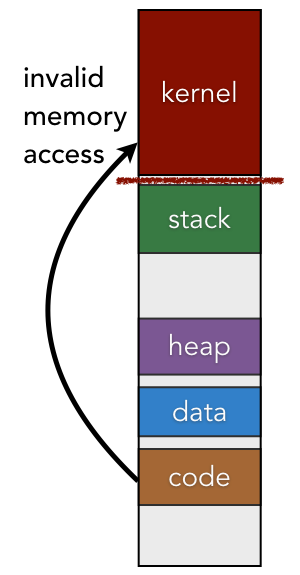
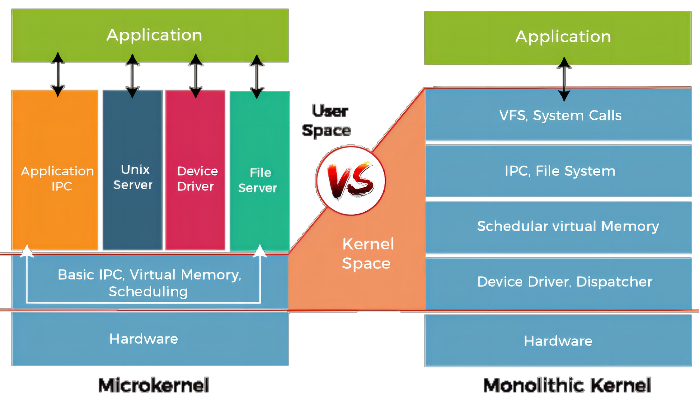

# ** 👨‍💻 Kernel**

> Interview Questions for Kernel

### **Kernel**

!!! note ""

    {width="70%", : .center}

    ???+question "What is a kernel?"

        The kernel is a **program** that runs with full access privileges to the entire computer. 

        - [Resource manager] The kernel controls access to all shared system resources, including physical memory, the file system, and I/O devices. 
        - [Control program] The kernel is also responsible for handling all exceptional system and software events, such as power disruption or the addition of new “plug-and-play” peripheral components. 

        Kernel provides an abstraction of hardwares.

    ???+note "Kernel responsibilities"

        Kernel performs as resource management, process management, and memory management:

        - Resource Management: 
            - Manages the computer's resources, such as CPU, memory, storage, and devices. 
            - Ensures that resources are allocated fairly and efficiently to different programs and processes (enabling them to run smoothly and without conflicts).

        - Process Management
            - Handles tasks like creating, organizing, and ending processes
            - Ensures each process gets enough time to use the computer's resources

        - Memory Management
            - Allocates/deallocates memory to different processes and keeps track of available memory
            - Manages virtual memory for efficient use of the computer's resources (to prevent memory leaks and maintain the overall efficiency of the system.)

### **Kernel Memory Structure**

!!! note ""
 
    {height="30%", : .center}

    The kernel exists as a protected region of virtual memory within the context of every process. Just like a normal user-mode program, the kernel contains:
        - a code segment
        - global data
        - a heap for dynamic memory allocation
        - many stacks (for each user-mode process, the kernel contains at least one stack)

    In general, the kernel interacts with its memory regions the same way as normal programs interact with theirs. The CPU uses the `%rip` register to load the next instruction from the code segment. Dynamically allocated data structures are stored on the **heap** and local variables are stored on the **stack** that is currently in use.
   

### **Monolithic vs. microkernel**

!!! note ""

    {width="70%", : .center}
    
    ???+question "What are monolithic and micro kernels?"

        - `Monolithic Kernel`: combines all OS services and components into a single large kernel.
            - Advantages: 
                - Executes in the same address space, improving performance.
                - Easier inter-process communication due to shared memory.
            - Disadvantages: Less modular, harder to maintain, and less secure, as a bug in one component can crash the entire system.

        - `Micro kernel`: with only essential services, such as inter-process communication and basic memory management.
            - Advantages: 
                - Other OS components run in user space, making it more modular and easier to maintain.
                - Improved security, as a bug in one component won't crash the entire system.
            - Disadvantages: Slower performance due to increased context switches and communication overhead between kernel and user space.

    ???+question "Comparison?" 

        `Monolithic kernels` offer better performance and simpler communication, while `microkernels` provide better modularity, maintainability, and security at the cost of performance.

### **Kernel Protection**

!!! note ""

    Since the kernel contains information about all processes and system resources, user-mode programs must be prevented from tampering with it. 
    
    For instance, you would not want a faulty program to reformat your hard drive or shut off power are random times; only the kernel should be able to perform these actions. 
    
    To prevent tampering from other programs, the kernel configures the CPU to <u>restrict access to the portions of physical memory</u> that are storing the kernel’s virtual memory contents. As a result, if an instruction tries to access a memory location within the kernel while the CPU is set to user mode, the CPU itself will detect this invalid access and trigger an exception.

### **Kernel SCI**

!!! note ""

    `System calls` are **interfaces** used by applications to request services from the kernel. They act as a bridge between user space (where applications run) and kernel space (where the operating system kernel runs). System calls allow applications to access hardware resources, perform I/O operations, manage memory, and handle inter-process communication, among other tasks.

    **Pipeline:**

    - Application makes a system call: When an application needs to access a resource or service managed by the kernel, it initiates a system call by passing the appropriate parameters.

    - Transition from user to kernel mode: Operating systems have different modes of operation, with user mode being less privileged than kernel mode. To execute a system call, the CPU must switch from user mode to kernel mode, ensuring that the application can't directly access sensitive system resources.

    - System call handler: The kernel has a system call handler that receives the call, identifies the requested service, and routes it to the appropriate kernel function.

    - Execution of the kernel function: The kernel function processes the request, accessing the necessary hardware resources or performing the required operation.

    - Return to user mode: After the kernel function is executed, the result is returned to the application, and the CPU switches back to user mode.

    - Application continues execution: The application can now proceed with its normal execution, using the results of the system call as needed.

- [Kernel Basics](https://w3.cs.jmu.edu/kirkpams/OpenCSF/Books/csf/html/KernelBasics.html)