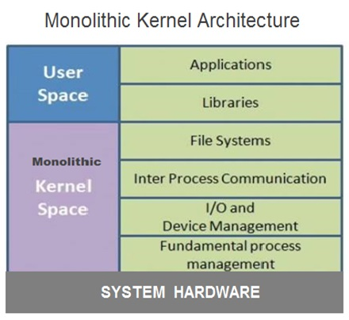
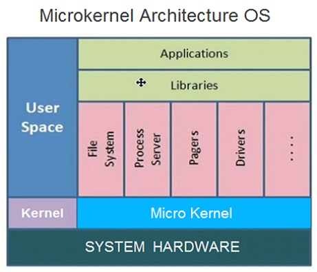

# ** 👨‍💻 Operating System**

> Interview Questions for Operating System

- [**What is Operating System**](#what-is-operating-system)

### **Operating System**

??? question "Click for answers 👇"
    
    The **system software** that controls computer <u>hardware</u> and <u>software</u> resources. 

    - Its main {==**functions**==} include:
        1. <u>Managing resources</u> such as processes, memory, files, and devices;
        2. Providing an <u>interface</u> for user programs;
        3. Ensuring the normal <u>operation</u> of computer systems. 

    

        {width="32.7%"} 
        {width="35%"}  
    

    - The {==**purpose**==} of an operating system is to:
        1. Provide a <u>good user experience</u>;
        2. Enable computer to excute programs <u>efficiently and reliably</u>.
   
### **Classifications of OS**

??? question "Click for answers 👇"

    - **Time-sharing OS:** allows <u>multiple users to share</u> the resources of the single computer system <u>simultaneously</u>.

    - **Batch processing OS:** loads a <u>batchprograms</u>from the user into the computer system to run according to certain rules until all programs are completed.

    - **General purpose OS:** has both the functions of <u>Time-sharing</u> and <u>Batch processing</u>. *E.g* Windows, Linux, MacOS.

    - **Real-time OS:** has <u>high requirements for the response time</u> of the computer system and can complete tasks within a specified time.

    - **Distributed OS:** 
        - <u>distributes</u> the resources of the computer system <u>across multiple computer nodes</u>;
        - <u>cooperates through a network</u> to improve the reliability and performance of the computer system.

    - **Embedded OS:** an operating system designed for <u>devices with small sizes, low power consumption, and high reliability</u>.

### **OS components**

??? question "Click for answers 👇"

    - **`Kernel`:** the core part of the operating system, responsible for <u>managing computer hardware</u> and <u>providing basic functions</u>, such as system calls.

    - **`Process manager`:** responsible for the <u>efficient operation</u> of the computer system, including:
        -  creating, deleting, scheduling, and managing processes.

    - **`Storage manager`:** responsible for <u>managing computer memory</u> resources, including:
        -  memory allocation, recovery, and protection.

    - **`File system`:** responsible for <u>managing files and directories</u> in the computer system, including:
        -  file reading, writing, creation, deletion, and protection.

    - **`Input/output manager`:** responsible for managing <u>data transfer</u> between the computer system and external devices, including: 
        - input/output buffering, device drivers, and interrupt handling.

### **Process and thread**

??? question "Click for answers 👇"

    !!! note "Definition with comparison"

        - **Definition:** 
            - `Process` is an {==instance of a running program==} with its own independent <u>instruction address space</u> and <u>system resources</u> (*program code*, *data*, *stack*, and *process control blocks*). 
            - `Thread` is an {==execution unit in a process==}, sharing resources of the process including <u>address space</u>, <u>file descriptors</u>, <u>signal handlers</u>, and <u>process ID</u>. 

        - **Scheduling:** 
            - `Process` is the <u>basic scheduling unit</u> in an operating system, and the operating system manages processes through process <u>control blocks</u>. 
            - `Threads` are <u>scheduling units</u> within a process, and the operating system schedules threads.

        - **Concurrency:** 
            - `Processes` are <u>independent</u> of each other. Different processes run <u>concurrently</u>, with each process having its own independent address space and resources. 
            - `Threads` within the same process <u>share resources and data</u>. Threads executed on the same CPU are executed *concurrently*, whereas threads executed on different CPUs are executed in *parallel*.

        - **System overhead:** 
            - `Process` switching requires saving and restoring <u>all process states</u>, so process switching incurs a <u>larger system overhead</u>. 
            - `Thread` switching only requires saving and restoring <u>part of the thread state</u>, so thread switching incurs a <u>smaller system overhead</u>.

### **Different states of processes**

??? question "Click for answers 👇"

    Three states: running, ready, or waiting:

    - **Running:** the process has <u>all the resources</u> it needs for execution, and it has been given permission by the OS to use the processor.
    - **Ready:** the process is waiting for <u>permission</u> to use the processor.
    - **Waiting:** the process is waiting for some <u>external event</u> to occur, such as user input or disk access.

    !!! warning ""

        - <u>Only one</u> process can be in the <u>running state</u> at any given time. 
        - The remaining processes are either in a <u>waiting state</u> or a <u>ready state</u>. 
        - In a real operating system, the <u>waiting and ready states</u> are implemented as *queues* that hold the processes in these states.

### **Parameters for process scheduling **

??? question "Click for answers 👇"

    !!! note "Definition with comparison"

        - Moment：
            - **`Arrival Time (AT)`:** Time at which the process <u>arrives in the ready queue</u>.
            - **`Completion Time (CT)`:** Time at which the process completes its execution.
        - Period:  
            - **`Burst Time (BT)`:** Time required by a process for CPU execution.
            - **`Turn Around Time (TAT)`:** Completion Time - Arrival Time 
            - **`Waiting Time (WT)`:** Turn around time -Burst time.

### **Necessity of process**

??? question "Click for answers 👇"

    A typical process involves both I/O time and CPU time. 
    
    In a uniprogramming system like MS-DOS, time spent waiting for I/O is wasted and CPU is free during this time. 
    
    In multiprogramming systems, one process can use CPU while another is waiting for I/O. This is possible only with process scheduling. 

### **Different process scheduling algorithms (PSA)**

??? question "Click for answers 👇"

    - **First Come First Serve (FCFS):** processes are scheduled according to their arrival times.
    - **Shortest Job First (SJF):** processes with the shortest burst time are scheduled first.
    - **Shortest Remaining Time First (SRTF):** processes are scheduled with the shortest remaining time -- amount of time left for a process to complete its execution (preemptive mode of SJF algorithm)
    - **Round Robin (RR) Scheduling:** each process is assigned a fixed time; in a cyclic way.
    - **Priority Based scheduling (Non Preemptive):** processes are scheduled according to their priorities. If priorities of two processes match, then scheduling is according to the arrival time.
    - **Highest Response Ratio Next (HRRN):** processes with highest **response ratio**(Turn around time / Burst time) is scheduled. This algorithm avoids *starvation* (Consider a situation when a long process is there in the ready queue and shorter processes keep coming.).
    - **Multilevel Queue Scheduling (MLQ):** According to the priority of process, processes are placed in the different queues. Generally high priority process are placed in the top level queue. Only after completion of processes from top level queue, lower level queued processes are scheduled.
    - **Multilevel Feedback Queue (MLFQ) Scheduling:** It allows the process to move in between queues. The idea is to separate processes according to the characteristics of their CPU bursts. If a process uses too much CPU time, it is moved to a lower-priority queue.

    !!! warning ""

        - FCFS can cause long waiting times, especially when the first job takes too much CPU time.
        - Both SJF and SRTF algorithms may cause starvation. HRRN can solve it.
        - If time quantum for RRS is very large, then it behaves same as FCFS scheduling.
        - SJF is optimal in terms of average waiting time for a given set of processes. SJF gives minimum average waiting time, but problems with SJF is how to know/predict the time of next job.

### **Objectives of PSA**

??? question "Click for answers 👇"

    - Max CPU utilization (Keep CPU as busy as possible)
    - Fair allocation of CPU.
    - Max throughput (Number of processes that complete their execution per time unit)
    - Min turnaround time (Time taken by a process to finish execution)
    - Min waiting time (Time for which a process waits in ready queue)
    - Min response time (Time when a process produces first response)

### **Critical section problem & solution**

??? question "Click for answers 👇"

    The `critical section problem` arises when <u>multiple processes or threads</u> need to access <u>shared resources simultaneously</u>, such as data structures or hardware devices. Without proper synchronization mechanisms in place, this can lead to unexpected results or unintended behavior, known as race conditions. Here are some concepts you need to know:
    
    - **Critical Section **– The portion of the code in the program where shared variables are accessed and/or updated.
    - **Remainder Section** – The remaining portion of the program excluding the Critical Section.
    - **Race around Condition** – The final output of the code depends on the order in which the variables are accessed.

    A solution for the critical section problem must satisfy the following <u>three conditions</u>:

    - **Mutual Exclusion:** If a process is executing in its critical section, then <u>do not allow</u> other processes to enter into the critical section.
    - **Progress:** If no process is executing in the critical section, then the <u>decision of a process</u> to enter a *critical section* <u>cannot</u> be made by any other process that is executing in its remainder section. The selection of the process cannot be postponed indefinitely.
    - **Bounded Waiting:** There exists a bound on the <u>number of times</u> other processes can enter into the critical section after a process has made request to access the critical section and before the requested is granted.

### **Synchronization Tools**
    
??? question "Click for answers 👇"

     A `Semaphore` is an **integer variable** that is accessed only through two *atomic operations*, `wait()` and `signal()`. An atomic operation is executed in a single CPU time slice without any pre-emption. 
     
    `Semaphores` are of two types:

    - **Binary Semaphore:** It has two states, 0 and 1. It is used for mutual exclusion, where only one process can access the critical section at a time.

    - **Counting Semaphore:** It has a positive integer value that can be incremented or decremented. It is used to control access to a shared resource where multiple processes can access the critical section simultaneously, but the maximum number of processes that can access it at any given time is limited by the value of the semaphore.

### **Deadlock**

??? question "Click for answers 👇"

    A **situation** where a set of <u>processes are blocked</u> because each process is holding a resource and waiting for another resource acquired by some other process. 
    
    Deadlock can arise with four necessary Conditions hold simultaneously:

    - Mutual Exclusion – One or more than one resource are non-sharable (Only one process can use at a time).
    - Hold and Wait – A process is holding at least one resource and waiting for resources.
    - No Preemption – A resource cannot be taken from a process unless the process releases the resource.
    - Circular Wait – A set of processes are waiting for each other in circular form.
    
    There are three ways to handle deadlock:
 
    - **Deadlock prevention or avoidance:** The idea is to not let the system into deadlock state.
    - **Deadlock detection and recovery:** Let deadlock occur, then do preemption to handle it once occurred.
    - **Ignore the problem all together:** If deadlock is very rare, then let it happen and reboot the system. This is the approach that both Windows and UNIX take.

### **Memory Management** 

??? question "Click for answers 👇"

    The techniques allow multiple processes to share the same memory.

    Here are two techniques:

    - **Overlays:** The memory should contain only those instructions and data that are required at a given time.
    - **Swapping:** In multiprogramming, the instructions that have used the time slice are swapped out from the memory.

### **Memory Management Techniques** 
   
??? question "Click for answers 👇"

    (a) `Single Partition Allocation Schemes` – The memory is divided into two parts. One part is kept to be used <u>by the OS</u>, and the other is kept to be used <u>by the users</u>. 

    (b) `Multiple Partition Schemes`: 

    - Fixed Partition – The memory is divided into <u>fixed size</u> partitions.
    - Variable Partition – The memory is divided into <u>variable sized</u> partitions. Variable partition allocation schemes:
        - First Fit – The arriving process is allotted the first hole of memory in which it fits completely.
        - Best Fit – The arriving process is allotted the hole of memory in which it fits the best by leaving the minimum memory empty.
        - Worst Fit – The arriving process is allotted the hole of memory in which it leaves the maximum gap.
    
    !!! warning ""

        - Best fit does not necessarily give the best results for memory allocation.
        - The cause of external fragmentation is the condition in Fixed partitioning and Variable partitioning saying that entire process should be allocated in a contiguous memory location. Therefore *Paging* is used.

### **Paging & Segmentation** 
   
??? question "Click for answers 👇"

    Two techniques used by OS to manage the allocation of memory.
        
    `Paging`: divides memory into logical units called **pages**. Each page represents a fixed-size chunk of memory, often 4KB in size.

    - When a program needs to access a memory location, the operating system maps the virtual address used by the program to a physical address in memory using a <u>page table</u>. This allows programs to access memory without knowing its physical location, and it also allows the operating system to manage physical memory more efficiently by loading pages into memory only when needed.
        
    `Segmentation`: divides memory into logical units called **segments**. Each segment represents a specific part of the program, such as the code, data, or stack. Each segment has a unique size and is assigned a base address and a limit. 
    
    - When a program needs to access a memory location, the operating system maps the logical address used by the program to a physical address in memory using a <u>segment table</u>. This allows programs to access memory more efficiently, as they only need to know the logical location of the data they need to access.

### **Logic memory & Virtual memory**

??? question "Click for answers 👇"

    - `Logical memory` is the memory space that a process sees as its own, and it consists of several segments, such as the code segment, data segment, and stack segment. Each segment contains a different type of data that the process needs to execute.

    - `Virtual memory` on the other hand, is a technique used by operating systems to allow processes to use more memory than is physically available in the computer. It uses a combination of hardware and software to <u>map</u> a process's logical memory to physical memory or to a temporary storage area on disk called the swap file.

### **Page Fault** 

??? question "Click for answers 👇"

    A `page fault` is a type of interrupt, raised by the hardware when a running program accesses a memory page that is mapped into the virtual address space, but <u>not loaded in physical memory</u>. 

### **File System** 

??? question "Click for answers 👇"

    `File System`: A file is a collection of related information that is recorded on secondary storage. Or file is a collection of logically related entities. 

### **File Directories** 

??? question "Click for answers 👇"

    `File Directories`: Collection of files is a file directory. The directory contains information about the files, including attributes, location and ownership. Here are several directory types:

    - **SINGLE-LEVEL DIRECTORY:** In this a single directory is maintained for all the users
    
    - **TWO-LEVEL DIRECTORY:** Due to two levels there is a <u>path name</u> for every file to locate that file.
    
    - **TREE-STRUCTURED DIRECTORY:** Directory is maintained in the <u>form of a tree</u>. Searching is efficient and also there is grouping capability. 

    Here are some file allocation ways:
    
    - **Continuous Allocation:** A single <u>continuous set of blocks is allocated</u> to a file at the time of file creation.
    
    - **Linked Allocation(Non-contiguous allocation):** Allocation is on an individual block basis. <u>Each block contains a pointer to the next block</u> in the chain. 
    
    - **Indexed Allocation:** It addresses many of the problems of contiguous and chained allocation. In this case, the file allocation table contains a <u>separate one-level index</u> for each file
    
### ** Disk time ** 

??? question "Click for answers 👇"

    - `Seek time` is the **time** taken to locate the <u>disk arm</u> to a <u>specified track</u> where the data is to be read or write.

    - `Rotational Latency` is the **time** taken by the <u>desired sector of the disk to rotate</u> into a position so that it can access the read/write heads.

    - `Transfer time` is the time to transfer the data. It depends on the rotating speed of the disk and number of bytes to be transferred. 

    - `Disk Access Time` = Seek Time + Rotational Latency + Transfer Time 

    - `Response Time` is the average of time spent by a request waiting to perform its I/O operation. Average Response time is the response time of the all requests. 
    
### **Buffer**

??? question "Click for answers 👇"

    A `buffer` is a memory area that stores data being transferred between <u>two devices</u> or between <u>a device and an application</u>.

### **Disk Scheduling Algorithms**

??? question "Click for answers 👇"

    - **FCFS:** FCFS is the simplest of all the Disk Scheduling Algorithms. In FCFS, the requests are addressed in the order they arrive in the disk queue.
    - **SSTF:** In SSTF (Shortest Seek Time First), requests having shortest seek time are executed first. So, the seek time of every request is calculated in advance in a queue and then they are scheduled according to their calculated seek time. As a result, the request near the disk arm will get executed first.
    - **SCAN:** In SCAN algorithm the disk arm moves into a particular direction and services the requests coming in its path and after reaching the end of the disk, it reverses its direction and again services the request arriving in its path. So, this algorithm works like an elevator and hence also known as elevator algorithm.
    - **CSCAN:** In SCAN algorithm, the disk arm again scans the path that has been scanned, after reversing its direction. So, it may be possible that too many requests are waiting at the other end or there may be zero or few requests pending at the scanned area. 
    - **LOOK:** It is similar to the SCAN disk scheduling algorithm except for the difference that the disk arm in spite of going to the end of the disk goes only to the last request to be serviced in front of the head and then reverses its direction from there only. Thus it prevents the extra delay which occurred due to unnecessary traversal to the end of the disk. 
    - **CLOOK:** As LOOK is similar to SCAN algorithm, in a similar way, CLOOK is similar to CSCAN disk scheduling algorithm. In CLOOK, the disk arm in spite of going to the end goes only to the last request to be serviced in front of the head and then from there goes to the other end’s last request. Thus, it also prevents the extra delay which occurred due to unnecessary traversal to the end of the disk. 
 

#### **References:**

- [SQL Tutorial](https://www.geeksforgeeks.org/commonly-asked-operating-systems-interview-questions/?ref=lbp)]
- [Last Minute Notes – Operating Systems](https://www.geeksforgeeks.org/last-minute-notes-operating-systems/?ref=lbp)
- [Concurrency vs. Parallelism](https://jenkov.com/tutorials/java-concurrency/concurrency-vs-parallelism.html#:~:text=Thus%2C%20the%20threads%20executed%20on,CPUs%20are%20executed%20in%20parallel.)
- [Image Resource 1](https://www.google.com/url?sa=i&url=https%3A%2F%2Fwww.learncomputerscienceonline.com%2Foperating-system%2F&psig=AOvVaw3VcjEWrCoDpv64FY_LqyrY&ust=1681838404932000&source=images&cd=vfe&ved=0CBAQjRxqFwoTCJCM3ru2sf4CFQAAAAAdAAAAABAb)
- [Image Resource 2](https://www.google.com/url?sa=i&url=https%3A%2F%2Fwww.learncomputerscienceonline.com%2Foperating-system%2F&psig=AOvVaw3VcjEWrCoDpv64FY_LqyrY&ust=1681838404932000&source=images&cd=vfe&ved=0CBAQjRxqFwoTCJCM3ru2sf4CFQAAAAAdAAAAABBM)