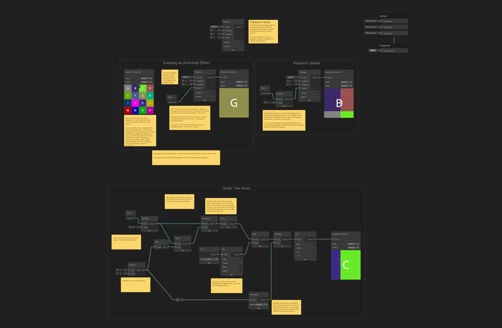
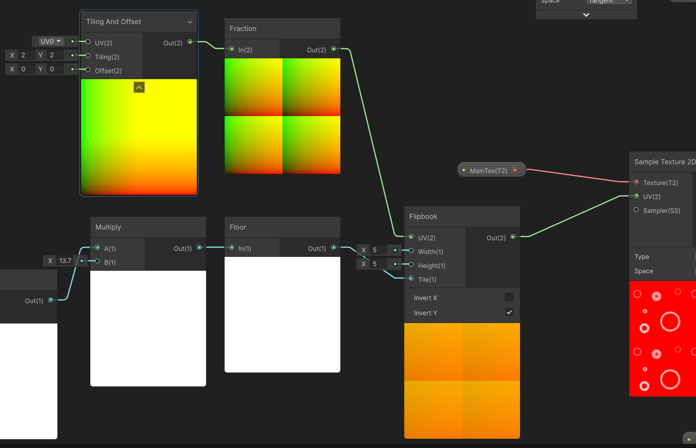
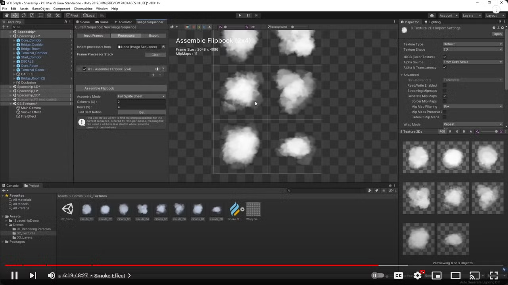

# **Flipbook Node**

In shader graph, The `Flipbook` node generates **UV coordinates** that are used to sample a texture that's divided into frames laid out in a grid pattern. It's most frequently used to playback a <u>series of frames</u> to create an animation.

Here is the example of the `Flipbook` node provided by Unity:

{width="70%", : .center}

???+Node "How to use the `Flipbook` node?"

    Below are the properties of the `Flipbook` node:

      - **UV**: The UV coordinates used to sample the texture.
      - **Width**: The number of frames in the texture's horizontal direction.
      - **Height**: The number of frames in the texture's vertical direction.
      - **Tile**: The amount equal to the number of which the texture is tiled in the horizontal and vertical directions. It will be modedbythe number of **Height** and **Width**. (NOTICE: We should use `Floor` here, since the number must be a integer.)
  
    {width="50%", : .center}

???+Node "How to generate texture for `Flipbook` ?"

    {width="50%", : .center}

    `Image Sequencer` is a tool that allows you to create flipbooks from a sequence of images. Basically what you need is:

      1. Create an animation use shader graph.
      2. Record the animation as a GIF or a sequence of images.
      3. If you have a GIF, you can use online tools to convert it to a sequence of images.
      4. Use `Image Sequencer` to generate the Flipbook texture.

    **Reference videos:**

    

        <iframe width="560" height="315" src="https://www.youtube.com/embed/t6tu-SFaQoE?si=kWcRFQX_zUm_lGvm" title="YouTube video player" frameborder="0" allow="accelerometer; autoplay; clipboard-write; encrypted-media; gyroscope; picture-in-picture; web-share" referrerpolicy="strict-origin-when-cross-origin" allowfullscreen></iframe>
    

    

        <iframe width="560" height="315" src="https://www.youtube.com/embed/5XzxJ7ZJ3GI?si=-hUNoynwquFbe5Ik" title="YouTube video player" frameborder="0" allow="accelerometer; autoplay; clipboard-write; encrypted-media; gyroscope; picture-in-picture; web-share" referrerpolicy="strict-origin-when-cross-origin" allowfullscreen></iframe>    
    

### **Reference**

- [Shader Graph samples](https://docs.unity3d.com/Packages/com.unity.shadergraph@16.0/manual/ShaderGraph-Samples.html)
- [Flipbook Node](https://docs.unity3d.com/Packages/com.unity.shadergraph@17.0/manual/Flipbook-Node.html)