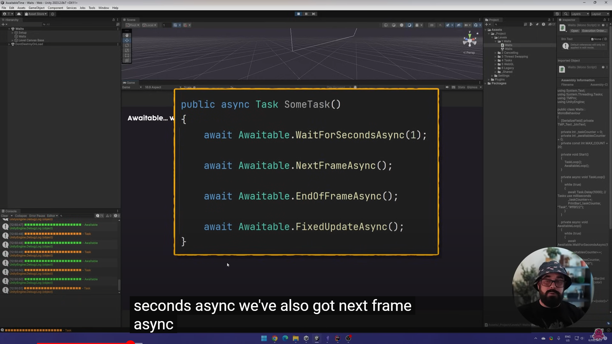
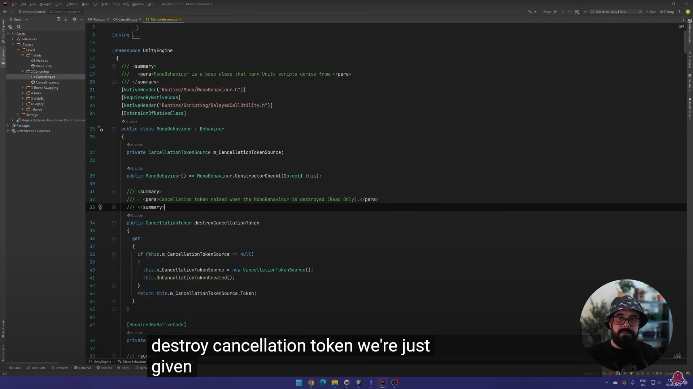
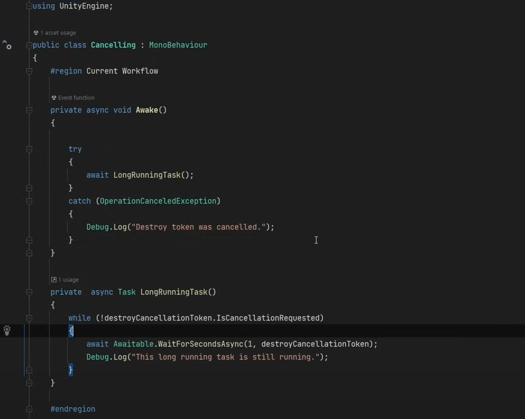
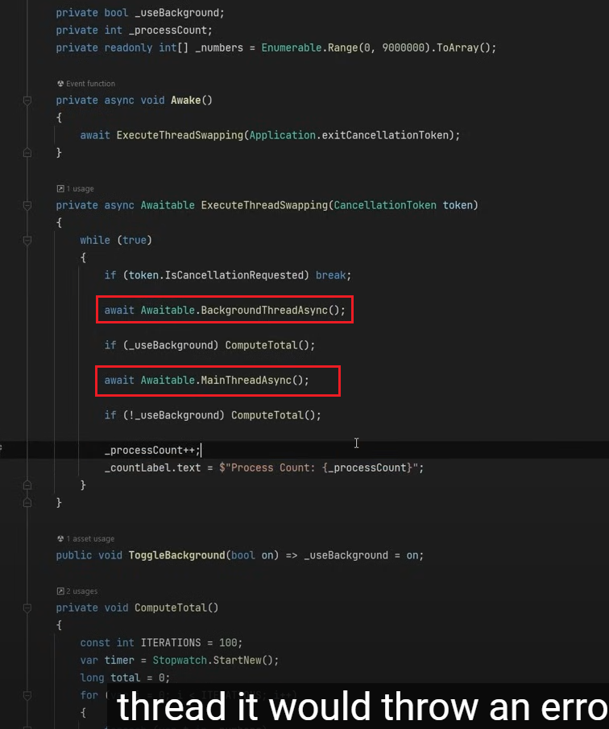
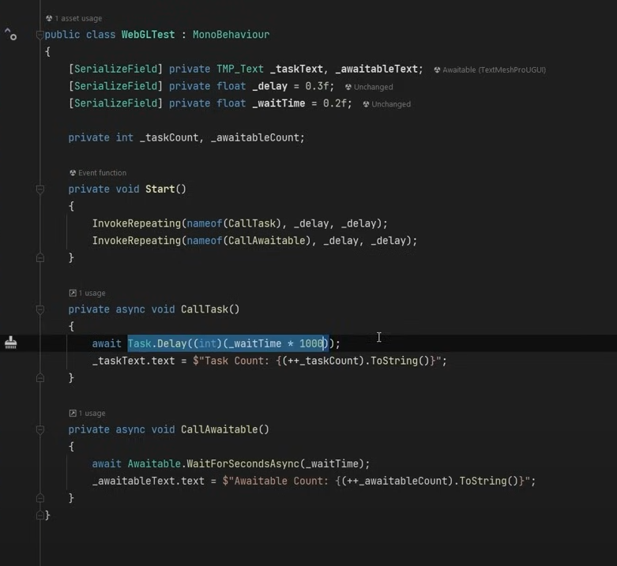

# **Awaitable**

???+note "What is an "Awaitable" in Unity?"

    An `awaitable` is not unique to **Unity**, but rather a general term in **C#** that refers to any object that can be awaited using the `await` keyword. For an object to be `awaitable`, it must implement the `GetAwaiter()` method, which returns an `Awaiter`. This `Awaiter` must implement methods like `IsCompleted`, `OnCompleted(Action continuation)`, and `GetResult()`.

    - In **C#**, tasks (`Task` or `Task<T>`) are the most common `awaitable` objects, meaning you can call `await` on them. When you `await` something, you're telling the program to asynchronously wait for its completion without blocking the main thread.

    - In **Unity**, when we refer to something as `awaitable`, we mean an **object** or **operation** (e.g. frames or physics updates) that can be awaited using `async/await`. Unity traditionally uses coroutines for asynchronous programming, but newer versions (2023.1+) introduced the `Awaitable` class for more efficient async operations.

???+note "Old way of asynchronous programming in Unity"

    Unity **traditionally** uses `coroutines` for asynchronous programming because it was the primary way to handle tasks that needed to occur over time <u>without blocking the main thread prior to the introduction of async/await</u>. `Coroutines` in Unity allow developers to write code that "waits" for certain conditions (like a delay, waiting for a frame, or a physics update) without halting the entire game loop. This made `coroutines` a very flexible tool for tasks like animations, timed events, or other frame-based operations.

???+note "Introducing of Awaitable in Unity"

    In **Unity 2023.1+**, the `Awaitable` class was introduced to provide a more efficient way to handle asynchronous operations. It allows developers to use `async/await` syntax in Unity and designed to optimize `async/await` patterns for Unity's game engine.

???+note "How to use `Awaitable`?"

    

    <iframe width="560" height="315" src="https://www.youtube.com/embed/X9Dtb_4os1o?si=MRq3PbDS1uGAGcDu" title="YouTube video player" frameborder="0" allow="accelerometer; autoplay; clipboard-write; encrypted-media; gyroscope; picture-in-picture; web-share" referrerpolicy="strict-origin-when-cross-origin" allowfullscreen></iframe>
    

    
???+note "Conclusion：Features of `Awaitable`?"

    - the asynchronous calculation can be stopped
        {width="50%", : .center}
    - automatically deconstructed after completion
        {width="50%", : .center}
        {width="50%", : .center}
    - can switch between main thread and background threads
        {width="50%", : .center}
    - **Task delay** cannot be used in WebGL, but awaitable can
        {width="50%", : .center}
    - Awaitable objects are pooled and reused to avoid excessive memory allocations, which helps improve performance in environments like WebGL and mobile platforms​

### **Reference**
- [Awaitable Video](https://www.youtube.com/watch?v=X9Dtb_4os1o)
- [Unity Awaitable Documentation](https://docs.unity3d.com/2023.1/Documentation/ScriptReference/Awaitable.html)