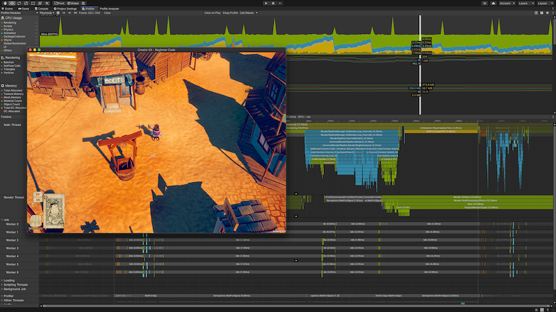

# **Unity Graph Debug**

Here are several tools under the IDE for debugging the CPU and GPU.

## **Memory profiler**

???+Note "When to use **`Memory profiler`?**"

    - Monitors **real-time memory usage** for both **managed** and **native memory**.
    - Identifies memory **allocations** and **leaks** to optimize **RAM** usage.
    - Tracks memory allocation per **object type**, helping pinpoint areas of high **memory consumption**.

## **Profiler**:

???+Note "When to use **`Profiler`?**"

    - Tracks **CPU and GPU performance** in terms of time spent on different tasks.
    - Provides a breakdown of **scripts**, **rendering**, **physics**, and **other processes**.
    - Identifies **bottlenecks** by showing **frame time** and **resource usage**.

{width="50%", : .center}

## **Frame Debugger**:

???+Note "When to use **`Frame Debugger`?**"

    - Allows you to **step through frames** to visualize each **draw call**.
    - Helps understand the **order of operations** in the rendering pipeline.
    - Useful for debugging **overdraw**, **incorrect rendering order**, and other **rendering issues**.

## **Rendering Debugger**:

???+Note "When to use **`Rendering Debugger`?**"

    - Focuses on specific **stages of the GPU pipeline**.
    - Helps debug **shader issues**, **pipeline state**, and **resource binding**.
    - Useful for troubleshooting **rendering artifacts** or **GPU-related bugs**.

## **Rendering Graph Viewer**:

???+Note "When to use **`Rendering Graph Viewer`?**"

    - Visualizes the **rendering pipeline nodes**.
    - Shows how resources like **textures**, **buffers**, and **shaders** are used in each stage.
    - Helps optimize **resource allocation** and **GPU performance**.

### **Reference**

- [Profiler overview](https://docs.unity3d.com/Manual/Profiler.html)
