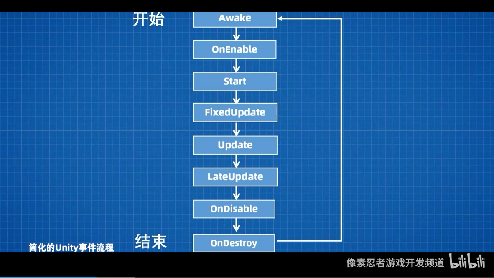
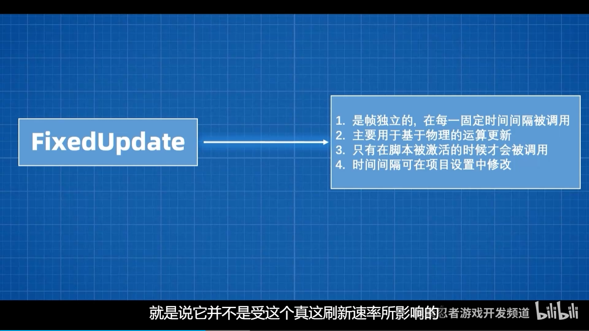
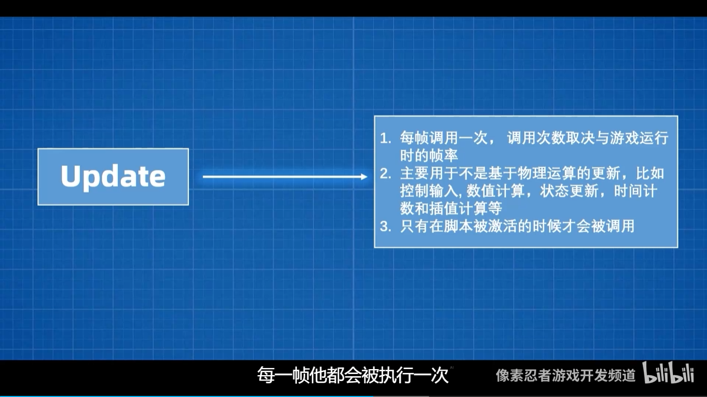
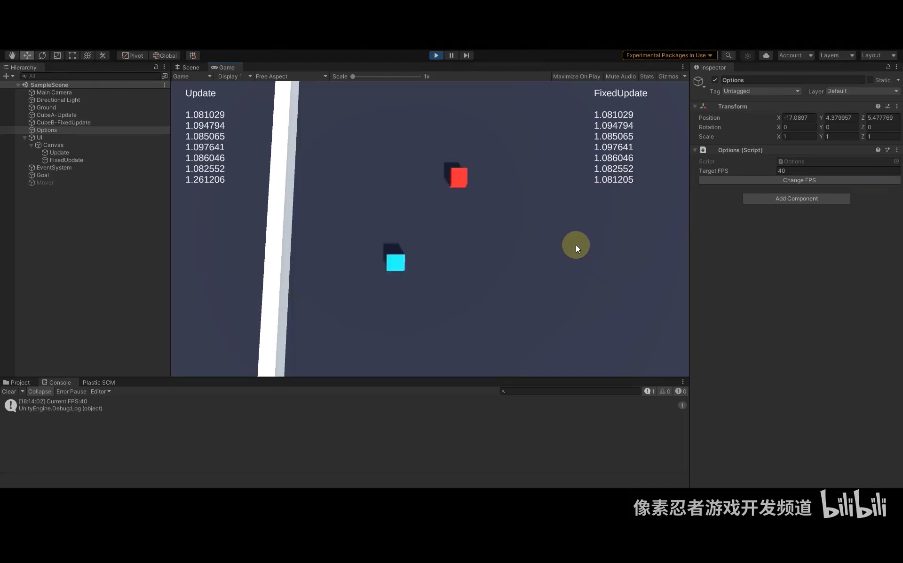
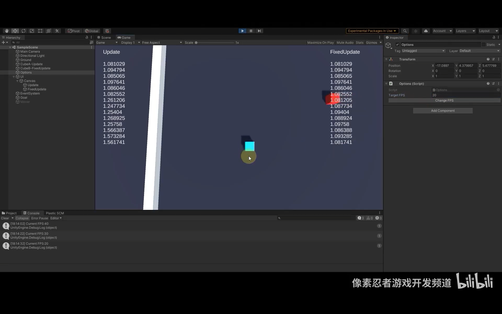
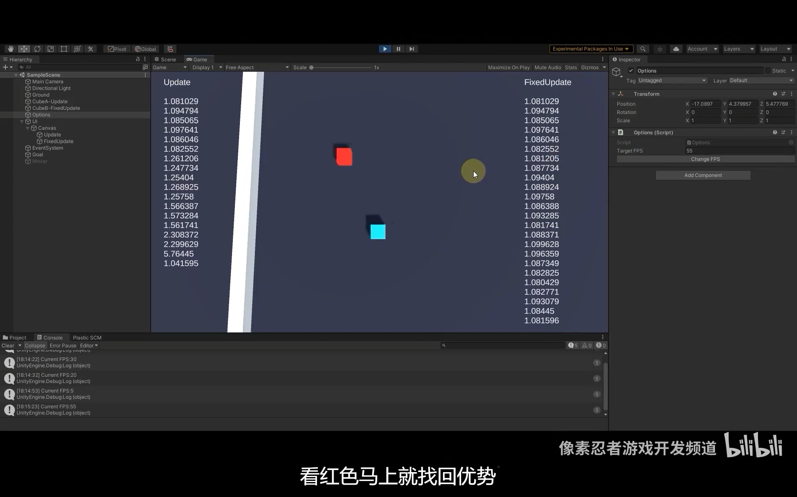

# **:fontawesome-brands-unity: Unity Life Cycle**

Here is the official documentation for Unity **Life Cycle**: 

<iframe width="100%" height="700" src= "https://docs.unity3d.com/Manual/ExecutionOrder.html"></iframe>

???+Node "Simplification of Unity Life Cycle"

    The Unity **Life Cycle** can be simplified as follows:

    {width="50%", : .center}

    - **Awake**: Called when the <u>script instance</u> is being loaded.
    - **OnEnable**: Called when the <u>object</u> becomes <u>enabled</u> and active.
    - **Start**: Called on the <u>frame when a script is enabled</u> just before any of the Update methods are called the first time.
    - **FixedUpdate**: Called every <u>fixed frame-rate frame</u>.
    - **Update**: Called every <u>frame</u>.
    - **LateUpdate**: Called every <u>frame after Update has finished</u>.
    - **OnGUI**: Called <u>multiple times</u> per frame.
    - **OnDisable**: Called when the <u>behaviour becomes disabled</u>.
    - **OnDestroy**: Called when the <u>script instance is being destroyed</u>.
  
???+Node "`FixedUpdate` vs `Update`"

    - **FixedUpdate**: Use FixedUpdate when dealing with <u>physics</u> or <u>other time-dependent operations</u>. It does not depend on the frame rate.

        {width="50%", : .center}

    - **Update**: Use Update when dealing with <u>input</u> or <u>non-physics frame updates</u>. It will be called every frame.
        
        {width="50%", : .center} 

    Here is the example shows the difference between `FixedUpdate` and `Update`:

      {width="50%", : .center}
      {width="50%", : .center}
      {width="50%", : .center}

    Original Video:

    

        <iframe src="//player.bilibili.com/player.html?isOutside=true&aid=323644850&bvid=BV1Aw411p7Y2&cid=1337887950&p=1" scrolling="no" border="0" frameborder="no" framespacing="0" allowfullscreen="true"></iframe>
    

### **Reference**
- [Unity百科之Update和FixedUpdate的区别](https://www.bilibili.com/video/BV1Aw411p7Y2/?spm_id_from=333.999.0.0)