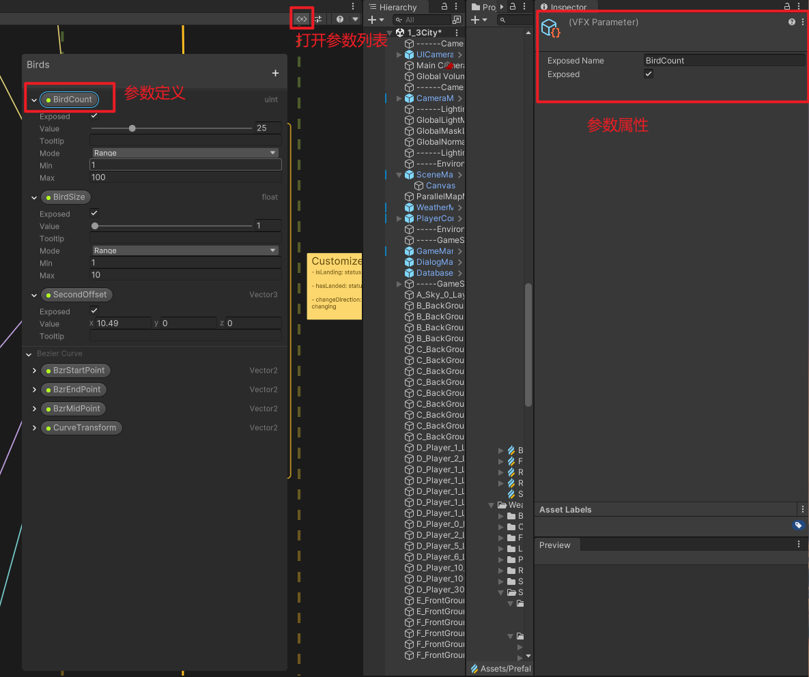
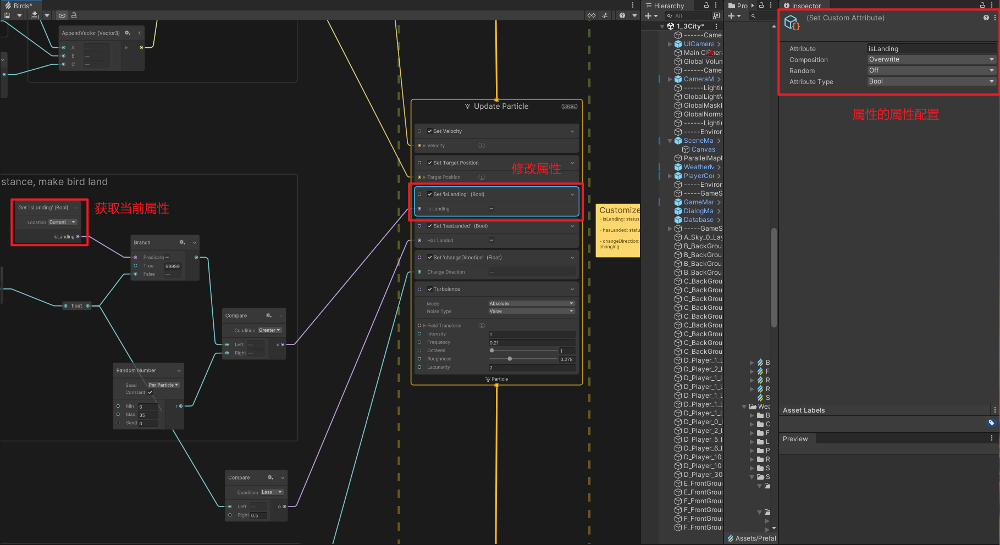

# **Parameter vs. Attribute** in Unity's VFX Graph

> In Unity's VFX Graph, "Parameters" and "Attributes" are two common concepts used to control and adjust particle effects, but they serve different purposes and are used in distinct ways. Here's an explanation of the difference between them

### **Parameters**

???+note "Parameters"

    **Parameters** are variables used to control and adjust the effect from <u>outside of the VFX Graph</u>. Parameters can be exposed in the `Inspector`, allowing you to adjust them directly in the editor or dynamically change their values during runtime through scripts.

    - **Definition**: Defined on the VFX Graph's Blackboard.
    - **Purpose**: To control the VFX Graph from external sources. E.g. particle color, particle speed, emission rate, or dynamically changes the VFX effect during runtime through a script, etc.

    {width="50%", : .center}

### **Attributes**

???+note "Attributes"

    **Attributes** are used to control the properties of individual particles <u>within the particle system</u>. Each particle has <u>its own attributes</u>, which determine its behavior and appearance. Common particle attributes include position, velocity, color, size, etc. User can add "Custom attributes" to create more complex and customized effects.

    - **Definition**: Attributes are defined and used inside the VFX Graph, typically set and read during the Initialize, Update, and Output stages of a particle.
    - **Purpose**: To control the properties and behavior of each particle in the system. E.g. particle's lifespan, initial position, initial velocity, or color over time, etc.

    {width="50%", : .center}

### **Summary of Differences**

1. **Scope**:
    - **Parameters**: Control the <u>entire VFX Graph externally</u> and can be adjusted in the <u>editor</u> or dynamically <u>via scripts</u>.
    - **Attributes**: Control the <u>properties and behavior of individual particles</u> within the <u>VFX Graph</u>.
2. **Definition and Use**:
    - **Parameters**: Defined on the <u>Blackboard</u> and typically exposed for external use.
    - **Attributes**: Defined and used <u>inside the VFX Graph</u> to control specific particle behavior and appearance.
3. **Purpose**:
    - **Parameters**: Used for <u> external interaction and dynamic adjustment</u> of the VFX effect.
    - **Attributes**: Used <u>internally</u> within the particle system to <u>control individual particles</u>.