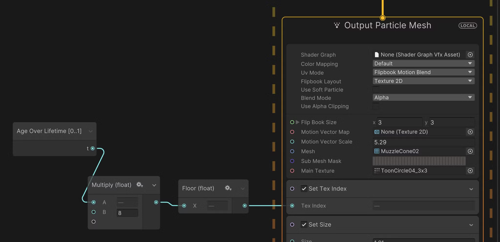

# **:fontawesome-brands-unity: Fog Effect**

`Flip book` is a way to animate a series of images. This technique is used in animation (frame animation), shader ([Flipbook node](../Shader_Graph/Flipbook/Flipbook.md)), and visual effects. Flip book is frequencly used in game development to create visual effects like **fire**, **smoke**, and **water**.

{width="50%", : .center}

???+Note "Fog effect"
    
    Here is a simple example of the **fog effect** created by the flip book technique:

    

    <iframe width="560" height="315" src="https://www.youtube.com/embed/UllkvfMR96s?si=Rm71WgpL5m4Q82Se" title="YouTube video player" frameborder="0" allow="accelerometer; autoplay; clipboard-write; encrypted-media; gyroscope; picture-in-picture; web-share" referrerpolicy="strict-origin-when-cross-origin" allowfullscreen></iframe>
    
