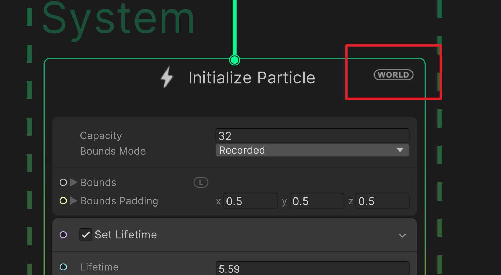

# **Tracing**

`Tracing` is a visual effect that creates a trail of particles behind an object. Remember turn on the `world` space option in the VFX graph to make the particless stay at the old position in the world space.

{width="50%", : .center}

???+Note "`Tracing` effect"
    
    Here is a simple example of creating the **`Tracing` effect**:

    

        <iframe width="560" height="315" src="https://www.youtube.com/embed/vMd5GnP5c8o?si=s5TBqrIOVEtLPDT5" title="YouTube video player" frameborder="0" allow="accelerometer; autoplay; clipboard-write; encrypted-media; gyroscope; picture-in-picture; web-share" referrerpolicy="strict-origin-when-cross-origin" allowfullscreen></iframe>
    
