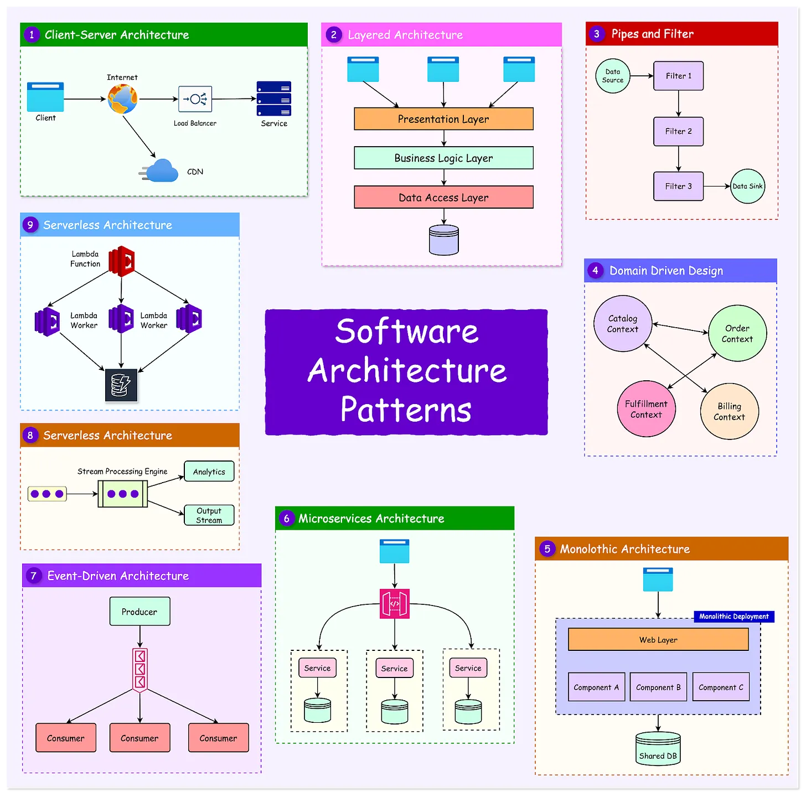

# **:material-head-dots-horizontal: Architecture Styles**

{width="50%", : .center}

### **This chapter is split into below sections:**

1. [MVC](MVC/README.md)
2. [MMVC](MMVC/README.md)
3. [Microservices](Microservices/README.md)
4. [SOA](SOA/README.md)
5. [Event-Driven](Event_Driven/README.md)

#### **References**

- [Software Architecture Patterns](https://blog.bytebytego.com/p/software-architecture-patterns)