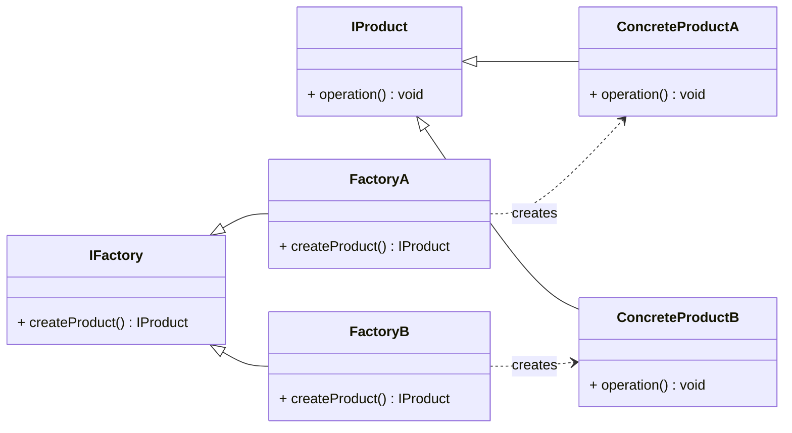

# **:simple-matternet: Factory**



> Let's think about a case that we want to <u>create an array, which can store different types of objects</u>. Both C# and C++ allow this, leveraging **polymorphism**. Let’s explore this concept and incorporate a `factory` pattern to create instances of these subclasses.

???+note ""Heterogeneous Array" Example"

    === "**`List` or `HashSet` in C#**"

        In C#, you can use a collection like `List` or `HashSet` to hold objects of different subclasses implementing the same interface.

        ```csharp
        using System;
        using System.Collections.Generic;

        // Define the interface
        public interface IShape
        {
            void Draw();
        }

        // Subclass: Circle
        public class Circle : IShape
        {
            public void Draw()
            {
                Console.WriteLine("Drawing a Circle.");
            }
        }

        // Subclass: Rectangle
        public class Rectangle : IShape
        {
            public void Draw()
            {
                Console.WriteLine("Drawing a Rectangle.");
            }
        }

        class Program
        {
            static void Main()
            {
                // Store objects of subclasses in a List
                List<IShape> shapes = new List<IShape>
                {
                    new Circle(),
                    new Rectangle()
                };

                // Iterate through the collection and invoke methods
                foreach (var shape in shapes)
                {
                    shape.Draw(); // Polymorphic behavior
                }
            }
        }
        ```

    === "**`Smart Pointers` in C++**"

        In C++, you can use abstract base classes and collections of `pointers` to store objects of different subclasses.

        ```cpp
        #include <iostream>
        #include <vector>
        #include <memory>

        // Define an abstract base class
        class IShape {
        public:
            virtual void draw() const = 0;
            virtual ~IShape() = default;
        };

        // Circle subclass
        class Circle : public IShape {
        public:
            void draw() const override {
                std::cout << "Drawing a Circle." << std::endl;
            }
        };

        // Rectangle subclass
        class Rectangle : public IShape {
        public:
            void draw() const override {
                std::cout << "Drawing a Rectangle." << std::endl;
            }
        };

        int main() {
            // Store objects of subclasses using smart pointers
            std::vector<std::shared_ptr<IShape>> shapes;
            shapes.push_back(std::make_shared<Circle>());
            shapes.push_back(std::make_shared<Rectangle>());

            // Iterate and invoke polymorphic methods
            for (const auto& shape : shapes) {
                shape->draw();
            }

            return 0;
        }
        ```

        ???+info "Heterogeneous Arrays in STL"

            Traditionally C++ use tagged `unions` to create arrays capable of holding different types. However, they are not type-safe and can lead to undefined behavior. 

            Since version **C++17**, C++ use constructs like `std::variant` to create arrays capable of holding different types.

            === "variant"
            ```cpp
            #include <variant>
            #include <vector>

            std::vector<std::variant<int, std::string, double>> heterogeneousArray = { 1, "text", 3.14 };
            ```
            === "union"
            ```cpp
            #include <vector>

            union Variant {
                int i;
                double d;
                char c;
            };

            std::vector<Variant> heterogeneousArray = { 1, 3.14, 'a' };
            ```


> The above example shows that when <u>the client doesn't know the exact type of object it needs to create</u>, the **polymorphic** behavior of the subclasses allows the client to treat them uniformly.

???+ info "Factory Pattern"

    Now let's add a "**factory**" between the <u>client</u> and the <u>abstract base class</u> to dynamically generate objects based on specific criteria.

    ```mermaid
    classDiagram
        direction LR
        class IShape {
            + draw() void
        }

        class Circle {
            + draw() void
        }

        class Rectangle {
            + draw() void
        }

        class ShapeFactory {
            + createShape(type: string) IShape
        }

        IShape <|-- Circle
        IShape <|-- Rectangle
        ShapeFactory ..> IShape : creates
    ```

    The `factory` pattern streamlines object creation by abstracting the logic into a centralized location.

    === "**Factory Pattern in C#**"

        To dynamically create objects based on specific criteria, you can use the Factory Pattern. This design pattern allows you to encapsulate object creation.

        ```csharp
        using System;

        public interface IShape
        {
            string Type { get; }
            void Draw();
        }

        // Circle subclass
        public class Circle : IShape
        {
            public string Type => "Circle";

            public void Draw()
            {
                Console.WriteLine("Drawing a Circle.");
            }
        }

        // Rectangle subclass
        public class Rectangle : IShape
        {
            public string Type => "Rectangle";

            public void Draw()
            {
                Console.WriteLine("Drawing a Rectangle.");
            }
        }

        // Factory to create shapes
        public static class ShapeFactory
        {
            public static IShape CreateShape(string type)
            {
                return type switch
                {
                    "Circle" => new Circle(),
                    "Rectangle" => new Rectangle(),
                    _ => throw new ArgumentException("Unknown shape type.")
                };
            }
        }

        class Program
        {
            static void Main()
            {
                // Create shapes dynamically using the factory
                var shape1 = ShapeFactory.CreateShape("Circle");
                var shape2 = ShapeFactory.CreateShape("Rectangle");

                // Use the shapes
                shape1.Draw();
                shape2.Draw();
            }
        }
        ```

    === "**Factory Pattern in C++**"

        C++ uses abstract base classes and smart pointers to implement the factory pattern.

        ```cpp
        #include <iostream>
        #include <memory>
        #include <string>

        // Abstract base class
        class IShape {
        public:
            virtual void draw() const = 0;
            virtual ~IShape() = default;
        };

        // Circle subclass
        class Circle : public IShape {
        public:
            void draw() const override {
                std::cout << "Drawing a Circle." << std::endl;
            }
        };

        // Rectangle subclass
        class Rectangle : public IShape {
        public:
            void draw() const override {
                std::cout << "Drawing a Rectangle." << std::endl;
            }
        };

        // Factory to create shapes
        class ShapeFactory {
        public:
            static std::shared_ptr<IShape> createShape(const std::string& type) {
                if (type == "Circle") {
                    return std::make_shared<Circle>();
                } else if (type == "Rectangle") {
                    return std::make_shared<Rectangle>();
                } else {
                    throw std::invalid_argument("Unknown shape type.");
                }
            }
        };

        int main() {
            // Create shapes using the factory
            auto shape1 = ShapeFactory::createShape("Circle");
            auto shape2 = ShapeFactory::createShape("Rectangle");

            // Use the shapes
            shape1->draw();
            shape2->draw();

            return 0;
        }
        ```

???+Info "Final Version of Factory Pattern"

    Let's use different concrete factories to create different concrete products.

    ```mermaid
    classDiagram
        direction LR
        class IShape {
            + draw() void
        }
        class Circle {
            + draw() void
        }
        class Rectangle {
            + draw() void
        }
        class ShapeFactory {
            + createShape() IShape
        }
        class CircleFactory {
            + createShape() IShape
        }
        class RectangleFactory {
            + createShape() IShape
        }

        IShape <|-- Circle
        IShape <|-- Rectangle
        ShapeFactory <|-- CircleFactory
        ShapeFactory <|-- RectangleFactory
        CircleFactory ..> Circle : creates
        RectangleFactory ..> Rectangle : creates
    ```

    === "**Factory Pattern in C#**"

        ```csharp
        using System;

        public interface IShape
        {
            string Type { get; }
            void Draw();
        }

        // Circle subclass
        public class Circle : IShape
        {
            public string Type => "Circle";

            public void Draw()
            {
                Console.WriteLine("Drawing a Circle.");
            }
        }

        // Rectangle subclass
        public class Rectangle : IShape
        {
            public string Type => "Rectangle";

            public void Draw()
            {
                Console.WriteLine("Drawing a Rectangle.");
            }
        }

        // Abstract factory
        public interface IShapeFactory
        {
            IShape CreateShape();
        }

        // Circle factory
        public class CircleFactory : IShapeFactory
        {
            public IShape CreateShape()
            {
                return new Circle();
            }
        }

        // Rectangle factory
        public class RectangleFactory : IShapeFactory
        {
            public IShape CreateShape()
            {
                return new Rectangle();
            }
        }

        class Program
        {
            static void Main()
            {
                // Create shapes using the factories
                IShapeFactory circleFactory = new CircleFactory();
                IShapeFactory rectangleFactory = new RectangleFactory();

                var shape1 = circleFactory.CreateShape();
                var shape2 = rectangleFactory.CreateShape();

                // Use the shapes
                shape1.Draw();
                shape2.Draw();
            }
        }
        ```
    === "**Factory Pattern in C++**"

        ```cpp
        #include <iostream>
        #include <memory>
        #include <string>

        // Abstract base class
        class IShape {
        public:
            virtual void draw() const = 0;
            virtual ~IShape() = default;
        };

        // Circle subclass
        class Circle : public IShape {
        public:
            void draw() const override {
                std::cout << "Drawing a Circle." << std::endl;
            }
        };

        // Rectangle subclass
        class Rectangle : public IShape {
        public:
            void draw() const override {
                std::cout << "Drawing a Rectangle." << std::endl;
            }
        };

        // Abstract factory
        class IShapeFactory {
        public:
            virtual std::shared_ptr<IShape> createShape() = 0;
            virtual ~IShapeFactory() = default;
        };

        // Circle factory
        class CircleFactory : public IShapeFactory {
        public:
            std::shared_ptr<IShape> createShape() override {
                return std::make_shared<Circle>();
            }
        };

        // Rectangle factory
        class RectangleFactory : public IShapeFactory {
        public:
            std::shared_ptr<IShape> createShape() override {
                return std::make_shared<Rectangle>();
            }
        };

        int main() {
            // Create shapes using the factories
            std::shared_ptr<IShapeFactory> circleFactory = std::make_shared<CircleFactory>();
            std::shared_ptr<IShapeFactory> rectangleFactory = std::make_shared<RectangleFactory>();

            auto shape1 = circleFactory->createShape();
            auto shape2 = rectangleFactory->createShape();

            // Use the shapes
            shape1->draw();
            shape2->draw();

            return 0;
        }
        ```