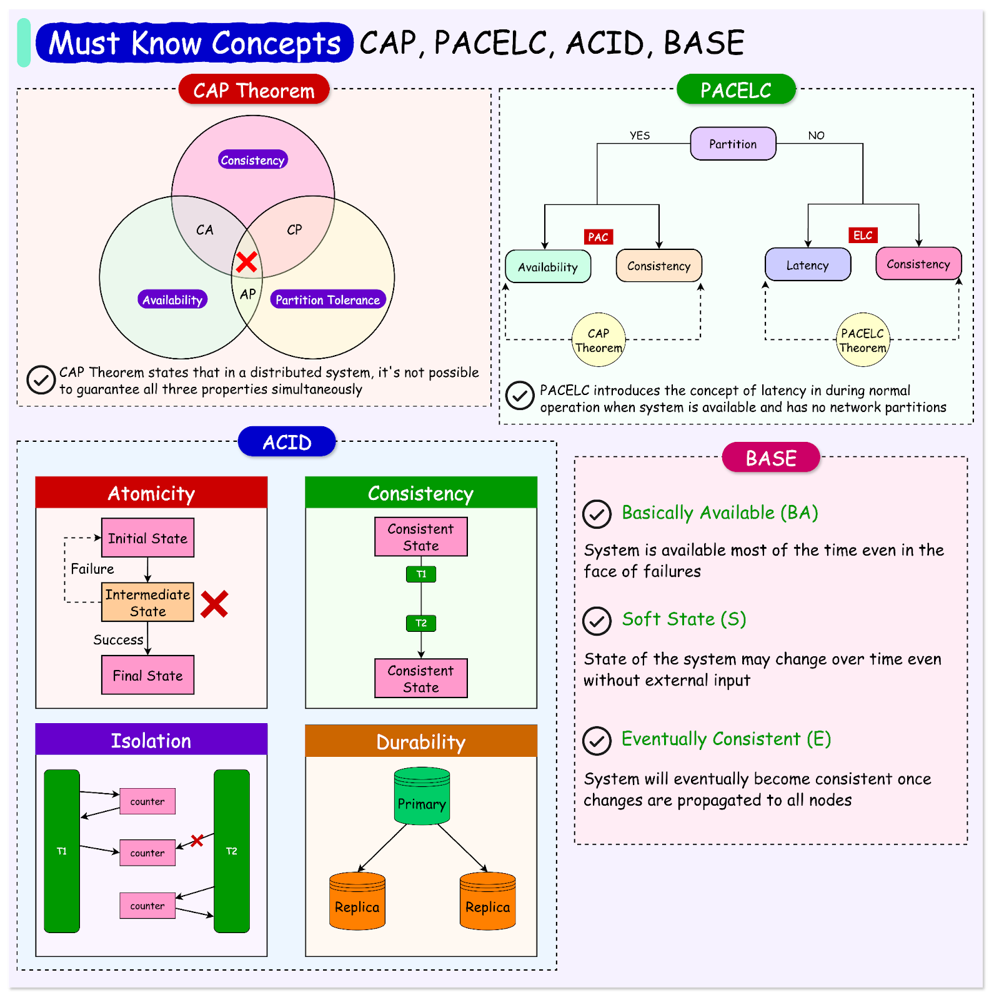

# **:material-head-dots-horizontal: Distribute Systems Theorems**

{width="50%", : .center}

### **This chapter is split into below sections:**

1. [CAP Theorem](CAP/README.md)

#### **Reference**

- [CAP, PACELC, ACID, BASE - Essential Concepts for an Architect's Toolkit](https://substackcdn.com/image/fetch/f_auto,q_auto:good,fl_progressive:steep/https%3A%2F%2Fsubstack-post-media.s3.amazonaws.com%2Fpublic%2Fimages%2F732e86b8-f57e-4e0a-941f-5c6e15c2a53d_1591x1600.png)