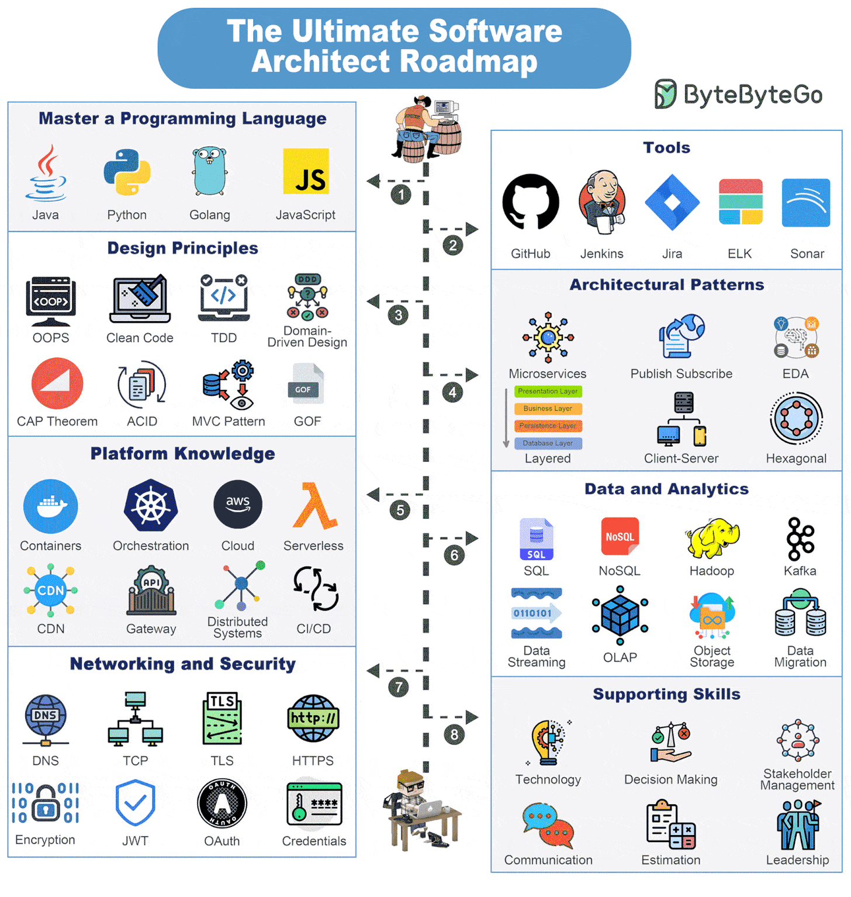

# **👷🏻‍♂️Software Architecture**

{width="60%", : .center}

### **This chapter is split into below sections:**

1. [Principles](Principles/README.md)
2. [Design Patterns](Design_Patterns/README.md)
3. [Architecture Styles](Arch_Styles/README.md)
4. [Distribute Sys Theorem](Distribute_System/README.md)

#### **References**

- [The Ultimate Software Architect Knowledge Map](https://blog.bytebytego.com/i/148597223/the-ultimate-software-architect-knowledge-map)