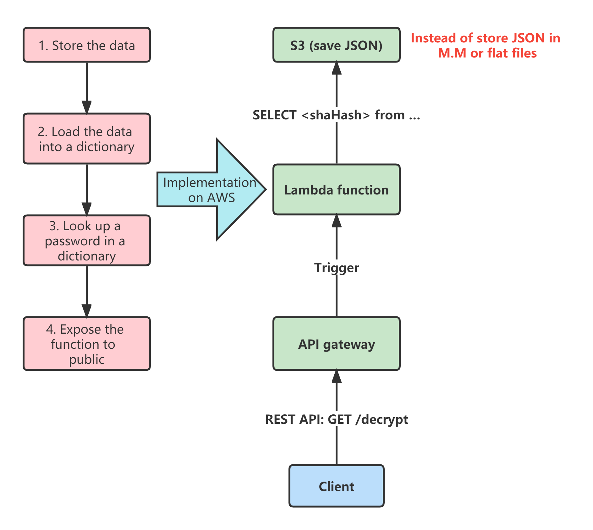

# **:simple-amazonaws: Application 1: a `Decrypter` service**

???+ question "Situation"

    Now, you want to make a `Decrypter` service. And below is the pipeline. {==How could you make it using AWS components?==}:

    1. Store the data somewhere (e.g. on disk).

    2. Load the data from somewhere (e.g. from disk) into a dictionary (hopefully just once).
   
    3. Look up a password in a dictionary (each time someone wants to decrypt).

    4. Expose the functionality through a public API.
   
???+ success "Solution"  

    The picture below shows the efficient way to simulate the Decrypter service on AWS.

    {width="80%", : .center}
 
???+ success "Details in the Solution" 

    Remember [`ECS` with `Load Balancer`](./../Basic/picture/ECS_withbalancer.png) structure. Let's draw the details between `Lambda` and `Database` parts:

    {width="80%", : .center}

