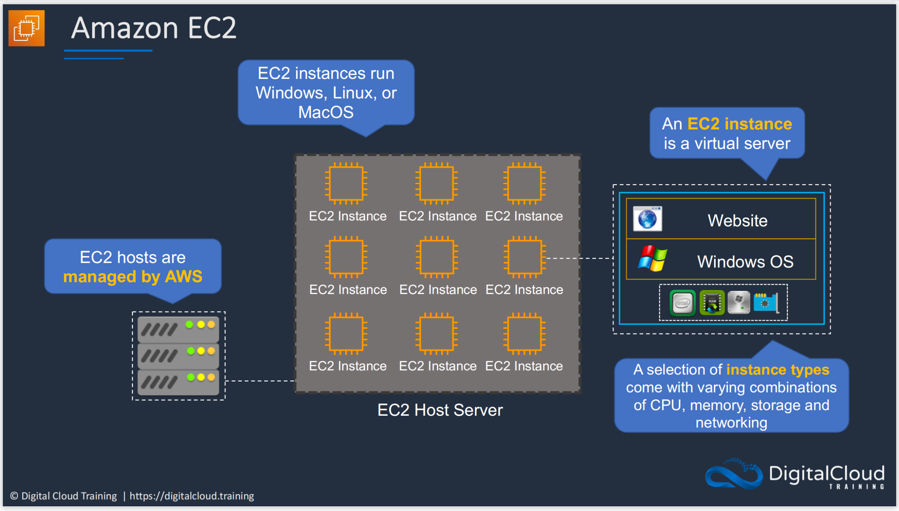
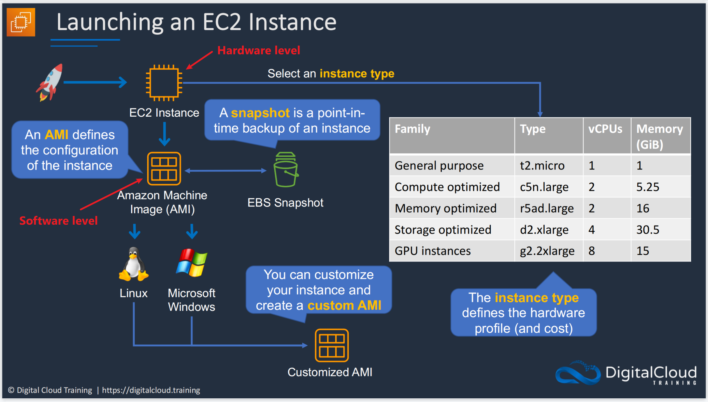
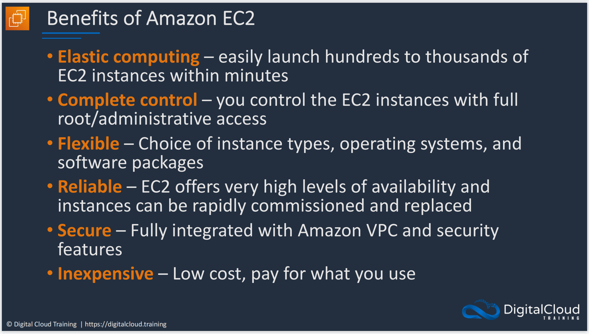

# **:simple-amazonec2:{.e_swift} EC2**

???+ question "What?"

    `EC2` is {++Amazon Elastic Compute Cloud++}. `EC2` allows you to run **virtual servers** in the cloud.
    
The concept of `EC2` can be seen in the picture below:
    
{width="80%", : .center}

The pipeline of launching an `EC2` instance:

{width="80%", : .center}

???+ question "Why do we choose `EC2`?"

    **Fast**, **high administration**, **DIY combination**, **robust**, **safe**, and **cheap**!

    {width="80%", : .center}  

### **References:**

- [Digital Cloud Training](https://digitalcloud.training/)
