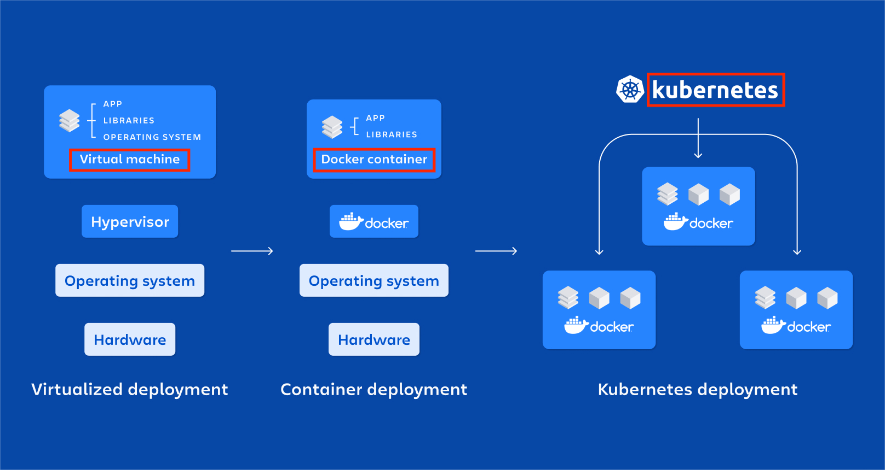

# **:simple-amazonecs:{.e_swift} Docker Containers and ECS**

???+ question "What is `Docker Container` and What is `Kubernetes`?"

    - `Docker Container` is an alternative to traditional virtual machines. It can be understood as the [Light-weight VM](../../Docker/README.md) that we can run our applications with {==fewer underlying resources and dependencies==}. `Docker Container` is very {==quick to start up==} and very {==good for `microservices`-based applications==}.

    - `Kubernetes` is a platform for running and managing `container`s from many container runtimes.

    The relationship between **Virtual Machine**, **Container**, and **Kubernetes** can be seen in the picture (which comes from "*Docker or Kubernetes: Which one is right for you?*" in [Kubernetes vs. Docker](https://www.atlassian.com/microservices/microservices-architecture/kubernetes-vs-docker)), as shown below :

    {width="80%", : .center}    

???+ question "Do you remember `EC2`? What are `ECS` and `EKS`?"

    `EC2`, the {++Amazon Elastic Compute Cloud++} we discussed in the [previous section](./EC2.md), is actually a `virtual machine`.

    `ECS` is {++Amazon Elastic Container Service++} for you to use `container` in the AWS cloud. It also provides a **fully** managed serverless platform or **partially** self-managed platform for users.
    
    `EKS`, the {++Amazon Elastic Kubernetes++}, is also offered by AWS to use `Kubernetes` in the cloud.

Below is the structure of ECS service:

{width="80%", : .center}    

Here is the definition of each concept shown in the picture above:

{width="80%", : .center}  

ECS `EC2 Cluster` v.s. ECS `Fargate Cluster`:

{width="80%", : .center}    

ECS with `Load Balancer`:

{width="80%", : .center}  

### **References:**

- [Digital Cloud Training](https://digitalcloud.training/)

- [Kubernetes vs. Docker](https://www.atlassian.com/microservices/microservices-architecture/kubernetes-vs-docker)