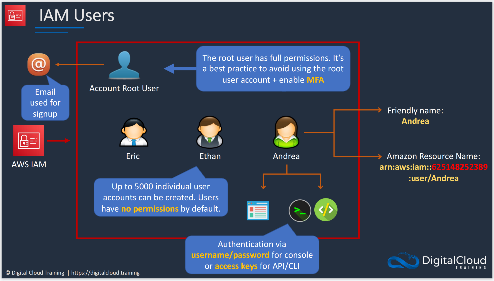
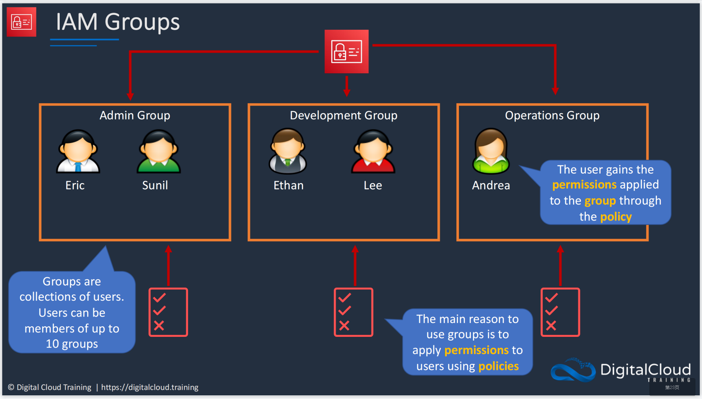
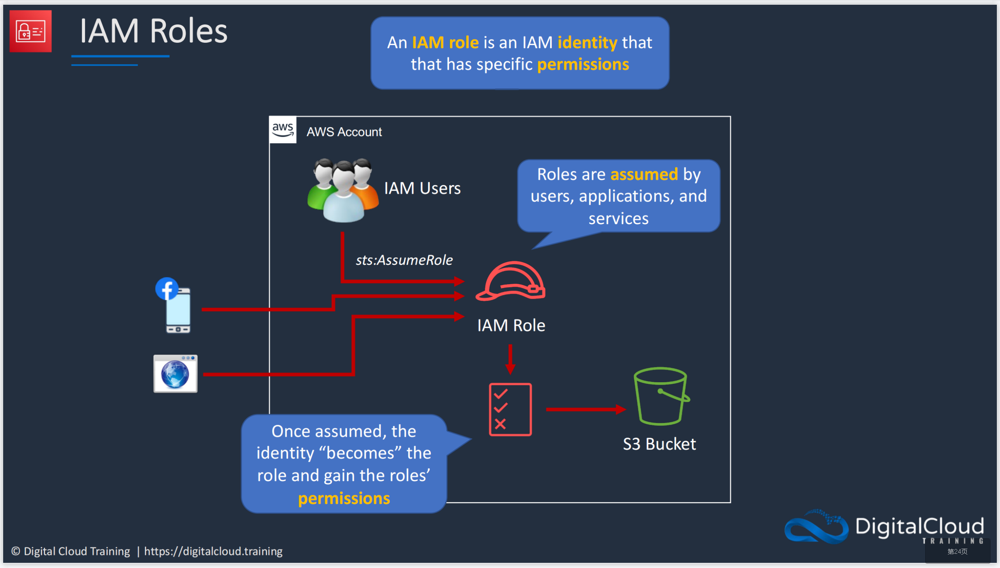
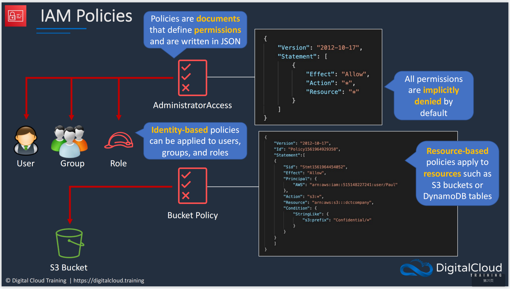

# **IAM**

???+ question "What?"

    `IAM` is {++Identity and Access Management++}.
    
IAM can be used to create `user`, `groups`, `roles`, and `policies`, to AVOID using the `Root` account to access to AWS resources. The relations between the four concepts can be seen in the picture below:
    
{width="80%", : .center}

{width="80%", : .center}  

{width="80%", : .center}  

{width="80%", : .center}  

### **References:**

- [Digital Cloud Training](https://digitalcloud.training/)
