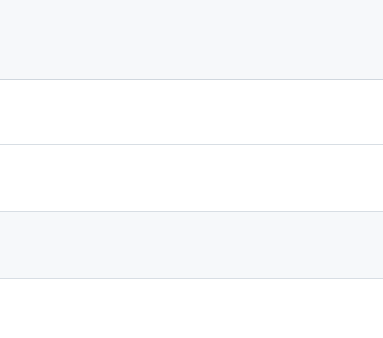

# **IAM**

???+ question "What and For?"

    `IAM` is {++Identity and Access Management++}.
    
    IAM can be used to create `user`, `groups`, `roles`, and `policies`, to AVOID using the `Root` account to access to AWS resources. The connections between the four concepts can be seen in picture below:
    
      

### **References:**

- [Digital Cloud Training](https://digitalcloud.training/)
