# **Elastic Load Balancing and Auto Scaling**

???+ question "What demand?"

    - How can we make sure that our applications have enough capacity and enough EC2 instances available?

    - How can we distribute incoming connections to those EC2 instances?

???+ success "How?"

    - `Auto Scaling` helps to make sure that you have the right number of EC2 instances to service the demand of your application.

    - Then, put `Elastic Load Balancing` in front of your application. `ELB` will distribute incoming connections across the pool of instances that are managed by the `Auto Scaling Group`.

    All in all, those two technologies above enable you to have **elastic** and **fault-tolerant** applications.
    
## **Elasticity: Scaling Up v.s. Out**

Assume that we have an `EC2` instance for our application now:

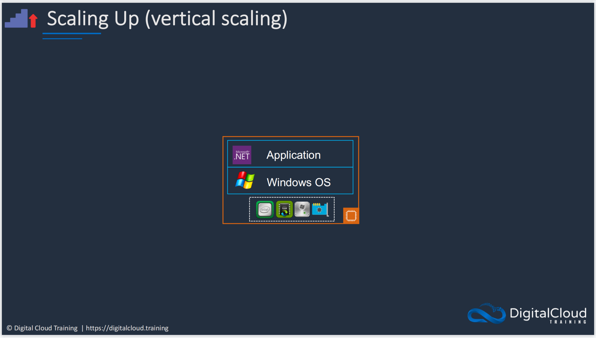{width="80%", : .center}  

Let's see what is `Scaling Up` (`Vertical Scaling`):

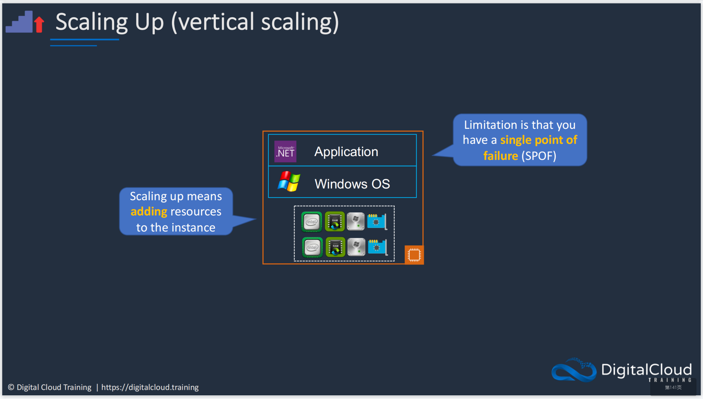{width="80%", : .center}

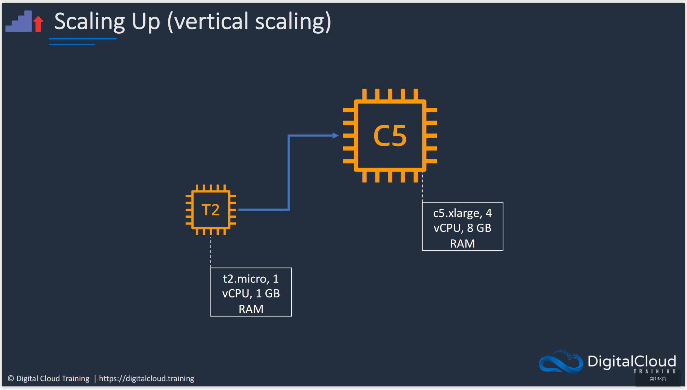{width="80%", : .center}  

Let's see what is `Scaling Out` (`Horizontal Scaling`):

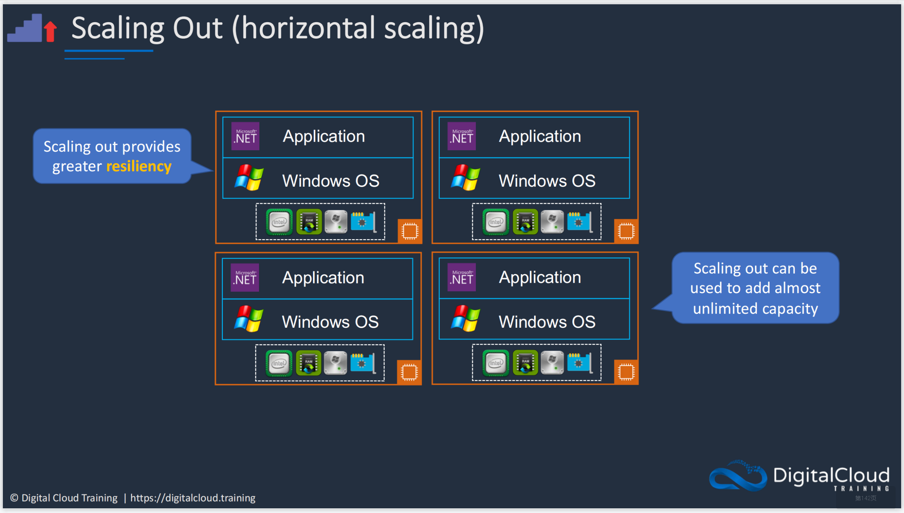{width="80%", : .center}  

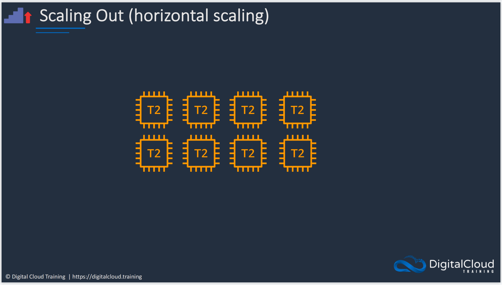{width="80%", : .center}  

## **Amazon EC2 Auto Scaling**

Amazon `EC2 Auto Scaling` is **horizontal scaling** (scales out), which dynamically launches and terminates instances. `CloudWatch metrics` and `EC2 status checks` will process the responsed information from `EC2 Auto Scaling`. The pipeline to realize the **elasticity** and **scalability** can be seen below：

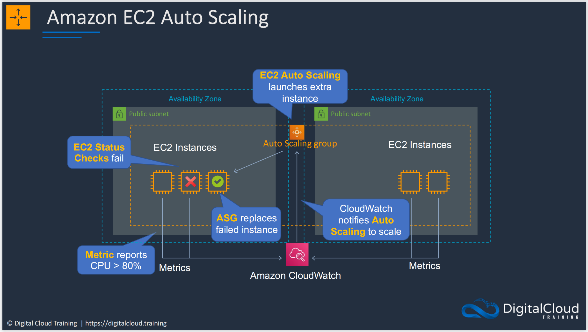{width="80%", : .center}    

## **Load Balancing and High Availability**

From `EC2 Auto Scaling`, we end up with lots of different `instances` of the same application. 

???+ question "How?"

    How do we direct traffic to those `instances`?

???+ success "Load Balancer"

    As you can see in the pictures below, 
    
    - `Load Balancer` can not only provide `high availability` (Availability Zones) if some server is in the crash.

    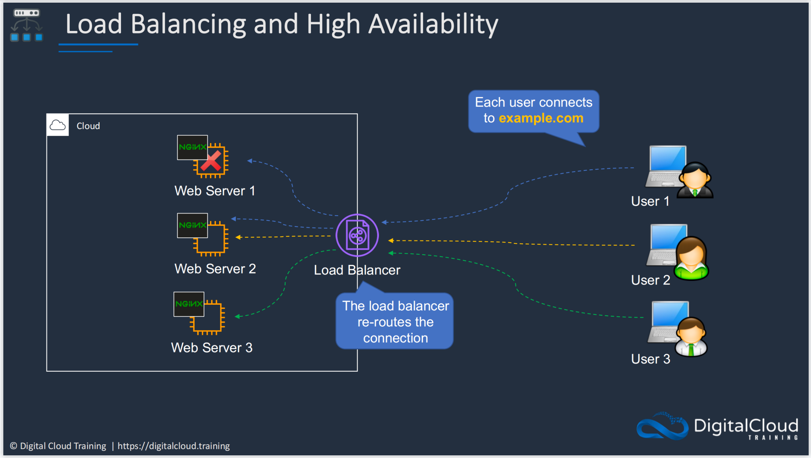{width="80%", : .center}  

    - `Load Balancer` can also increase `fault tolerance` when the system has **redundant components** (more than one server or more than one hardware).

    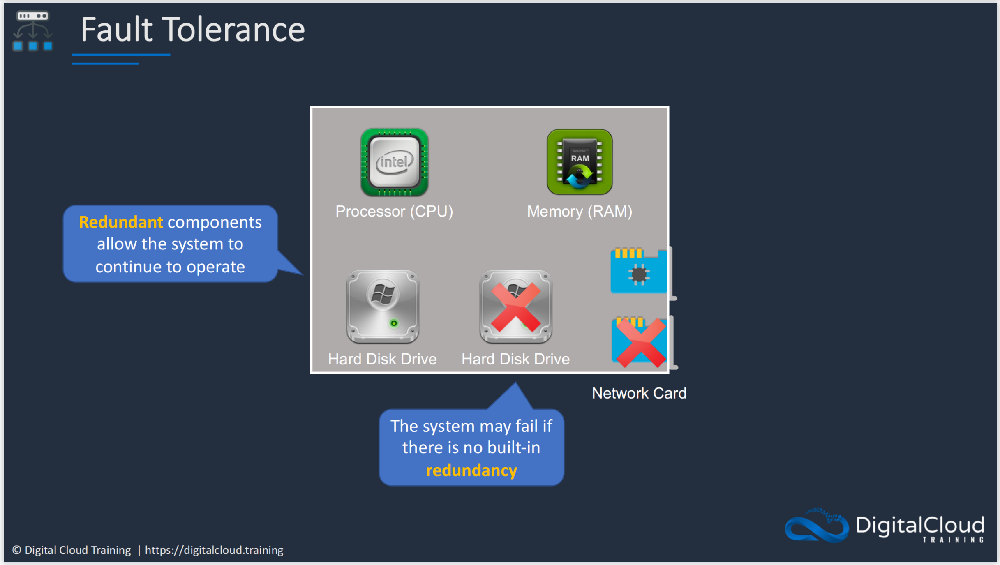{width="80%", : .center}  

Let's see the case we combine `EC2 Auto Scaling` and `Load Balancer` together:

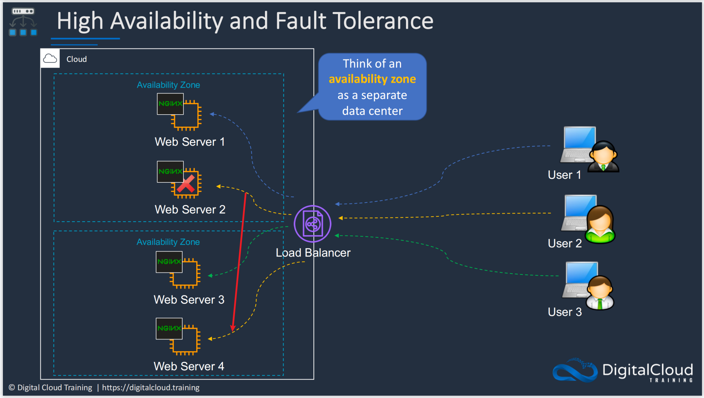{width="80%", : .center}
    
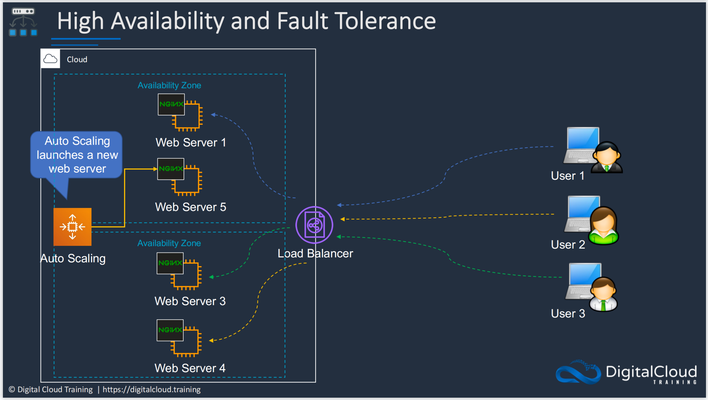{width="80%", : .center}  

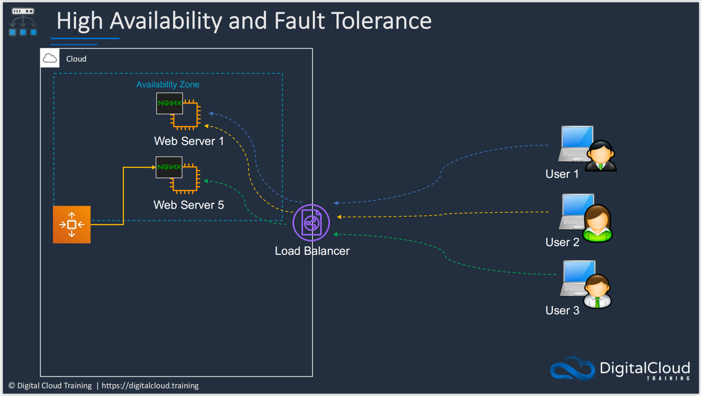{width="80%", : .center}  

## **Types of Elastic Load Balancer**

There are four types of `Elastic Load Balancer`:

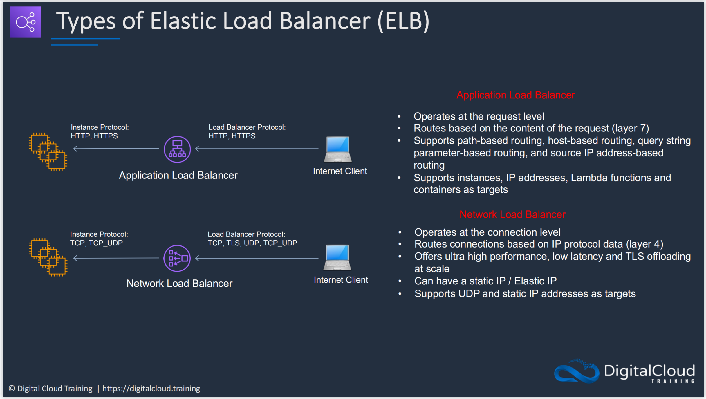{width="80%", : .center}   

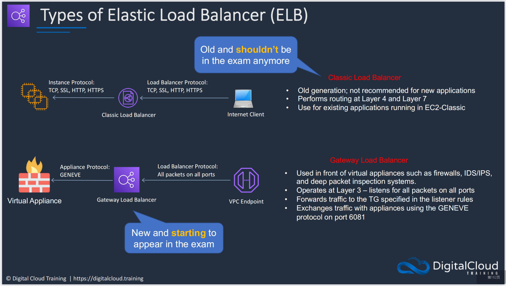{width="80%", : .center}   

Here are some use cases for different types of `ELB`:

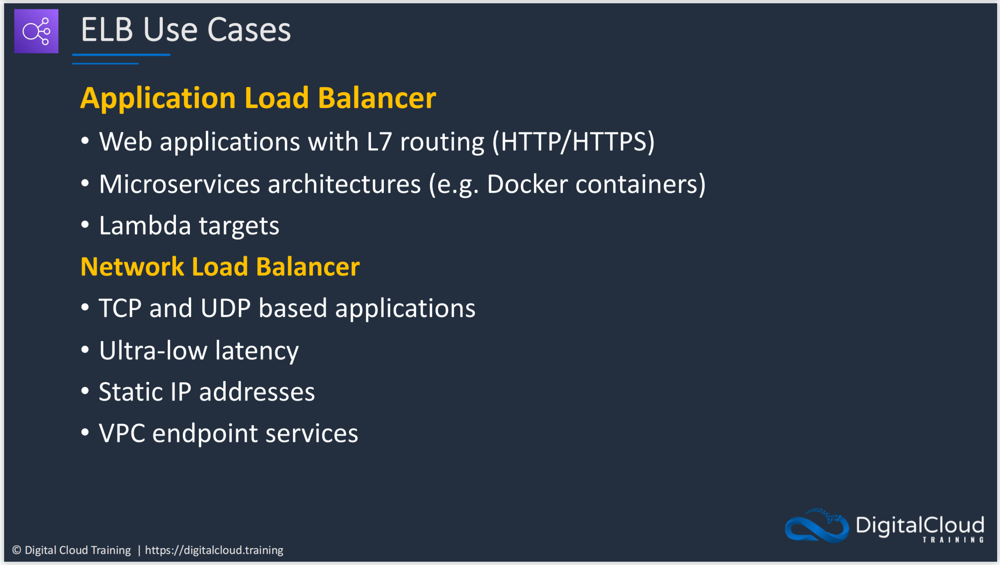{width="80%", : .center}   

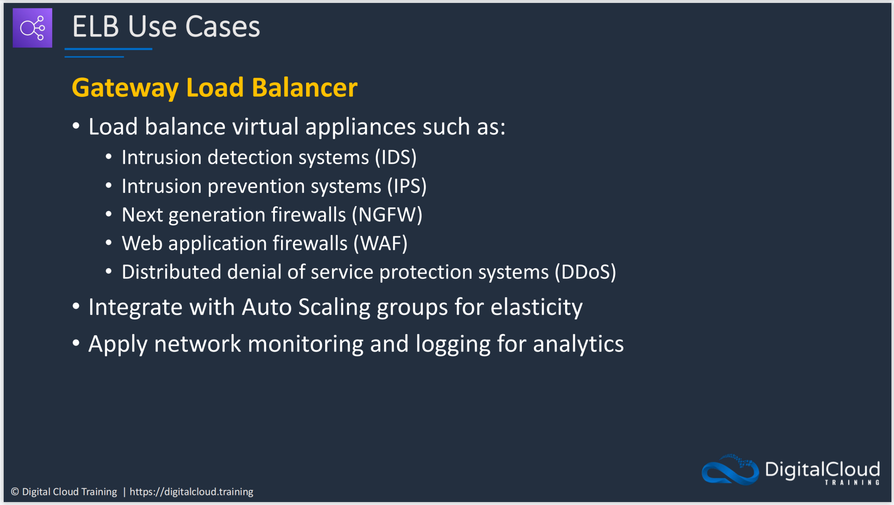{width="80%", : .center}   

The details about `ALB` and `NLB` focus on the {==**URL**==} they use:

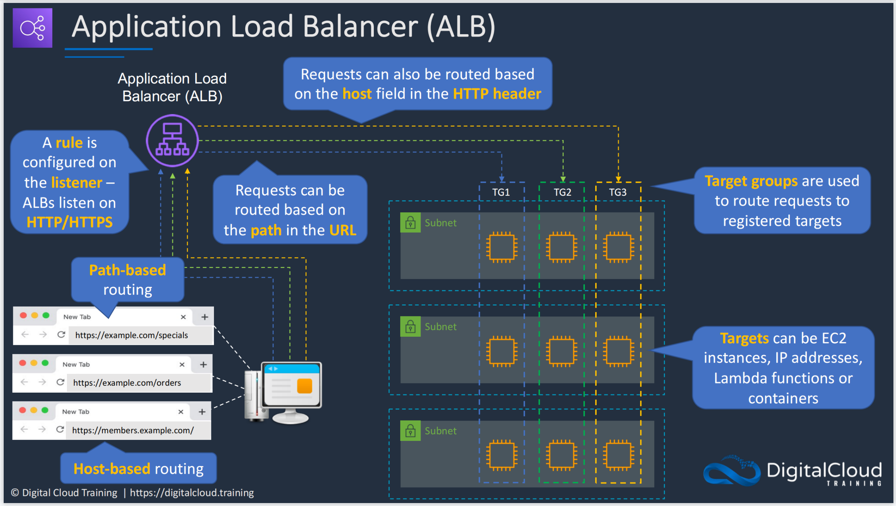{width="80%", : .center}   

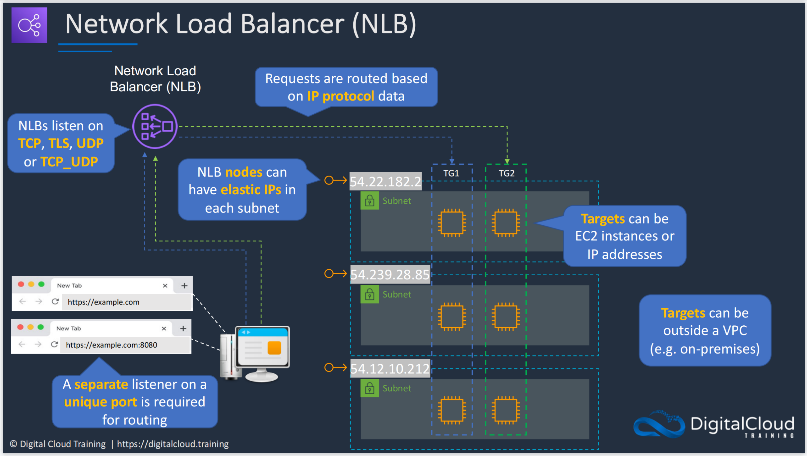{width="80%", : .center}   

### **References:**

- [Digital Cloud Training](https://digitalcloud.training/)
