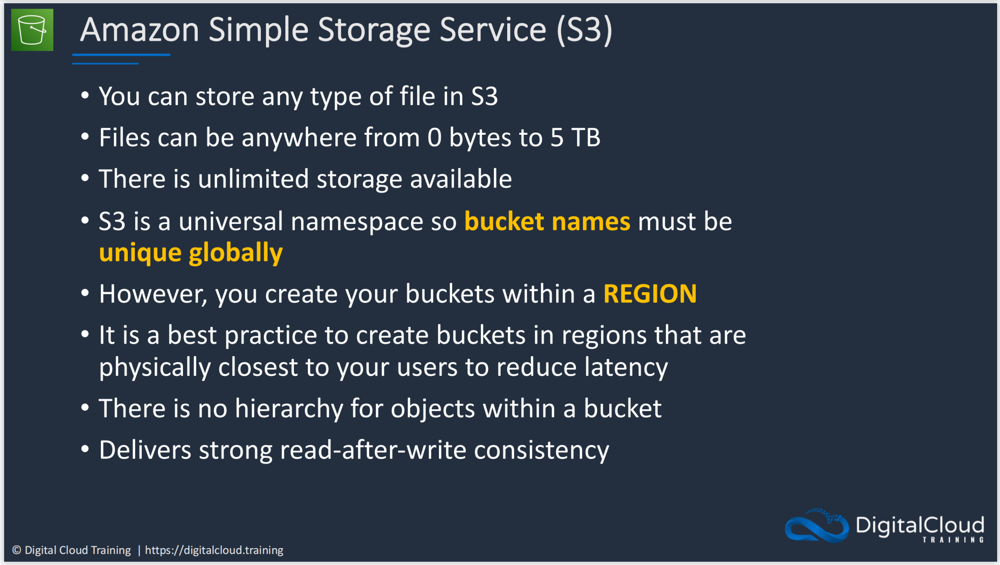
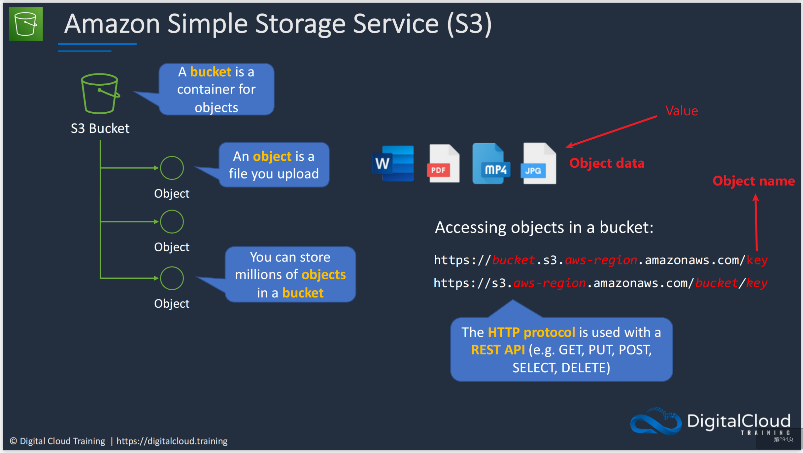
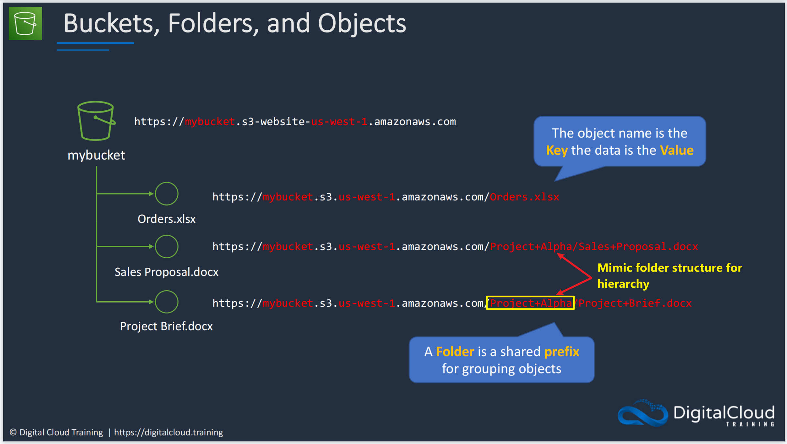
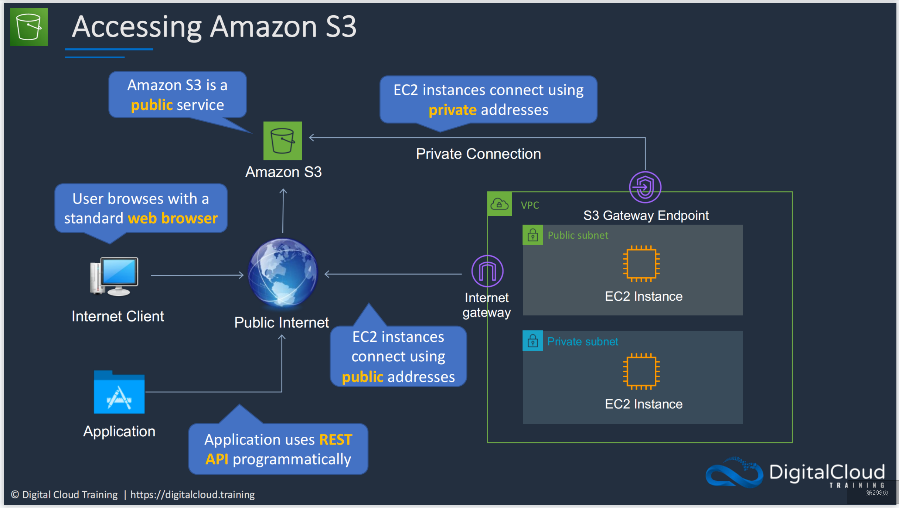
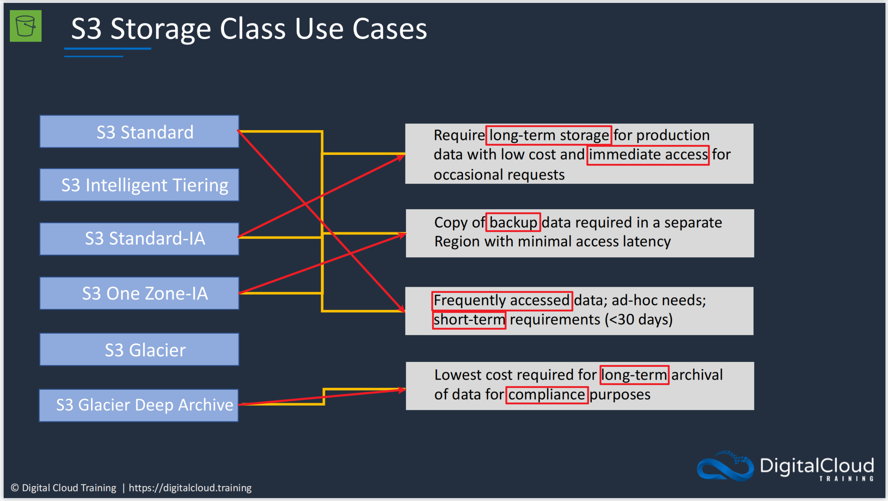
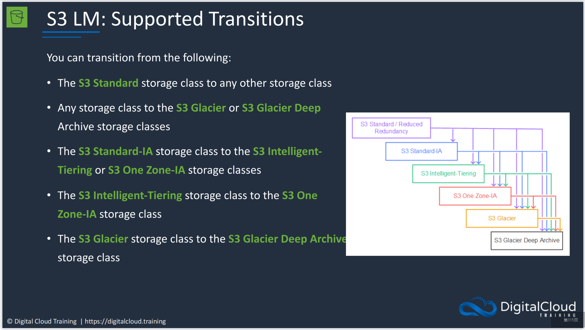

# **:simple-amazons3:{.e_swift} S3**

???+ question "What and For?"

    `S3` is {++an object-based storage system++}.
    
    You can use API to access the objects S3 bucket (container) storage. Below are the characters of the storage service:

    {width="80%", : .center}

The basic structure of S3 bucket:

{width="80%", : .center}  

To reach the `objects` in the bucket by using the URL:

{width="80%", : .center}  

To reach the `bucket` by using the URL:

  

Different types of `S3 storage classes`:

  

If you want to transfer one object from one S3 class into the other class, you should follow the following hierarchy:

  

### **References:**

- [Digital Cloud Training](https://digitalcloud.training/)
