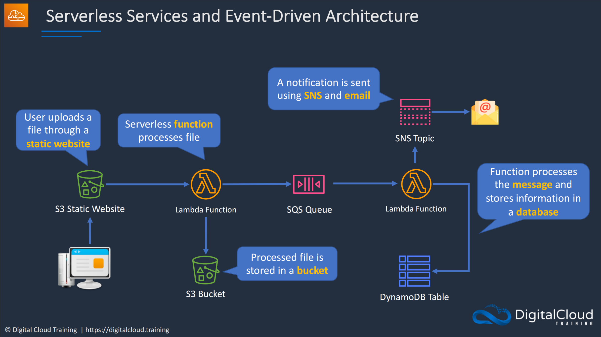

# **:simple-awslambda:{.e_swift} Serverless Application**

## **Serverless Services**

???+ question "What are `serverless` technologies?"

    {++**Definition**++}: AWS offers `Serverless` technologies for <u>running code</u>, <u>managing data</u>, and <u>integrating applications</u>, all {==**without** managing servers==}.     
    
    `Serverless` technologies feature (**[Iff](https://en.wikipedia.org/wiki/If_and_only_if#:~:text=In%20logic%20and%20related%20fields,true%20or%20both%20are%20false.) conditions**):
    
      - no server management
      - automatic scaling
      - built-in high availability
      - pay-for-use billing model (to increase agility and optimize costs)
    
    Also, `Serverless` <=> `Fully Managed`.
    
???+ question "What should I do with `serverless` services?"

    - **All you have to **do** is:** start <u>using the service</u> and <u>writing code that serves your customers</u>. 
    
    - **You really **don't** have to:** manage anything underneath the platform at all (**e.g.** you don't need to manage EC2 instances, and you don't have to install patches, do provisioning or update software). 
 

???+ question "Who are AWS `serverless` services?"

    Remember the architecture in [**Application 1: a `Decrypter` service**](./../Application/README.md/#idea)? According to that implementation pipeline, we classify the `serverless` services into **three** classes:

    **I. Data store:**

    - AWS :simple-amazons3: `S3`, [Amazon Simple Storage Service](./S3.md), a serverless, fully elastic **file system** for builders that makes it easy to set up, scale, and cost-optimize highly available shared storage. {++(`S3` is not a **database**, `S3` is object storage—it stores files. (It does not block storage though, so not quite that low level.) So in a sense, it’s a “lightweight database” the way Docker is a “lightweight virtual machine”.)++}

    - AWS :simple-amazondynamodb: `DynamoDB`, a **key-value** and document database service, delivering single-digit millisecond performance at any scale.

    - AWS :simple-amazonrds: `RDS proxy`, a managed database **proxy** for Amazon Relational Database Service (RDS) that makes applications more scalable and secure.

    **II. Compute:**

    - AWS :simple-awslambda: `Lambda`, allows you to run your code as compute functions.

    - AWS :simple-awsfargate: `Fargate`, a <u>serverless compute engine</u> that works with Amazon [Elastic Container Service (ECS)](./ECS.md) and Amazon Elastic Kubernetes Service (EKS).

    **III. Application integration:**

    - AWS :simple-amazonapigateway: `API Gateway`, a fully-managed service that allows you to be able to connect to an application via **REST** API or **HTTP** API.

    - AWS :simple-amazonsqs: `SQS`, Amazon** Simple Queue Service** is a message queuing service enabling you to decouple and scale microservices, distributed systems, and serverless applications.

    - AWS `SNS`, Amazon **Simple Notification Service** is a fully managed messaging service for both application-to-application (A2A) and application-to-person (A2P) communication.

    **For more, check [Serverless on AWS](https://aws.amazon.com/serverless/).**

## **An example of using Serverless Services**

{width="80%", : .center}   

### **References:**

- [Digital Cloud Training](https://digitalcloud.training/)

- [Serverless on AWS](https://aws.amazon.com/serverless/)