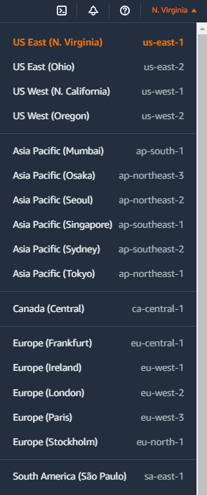
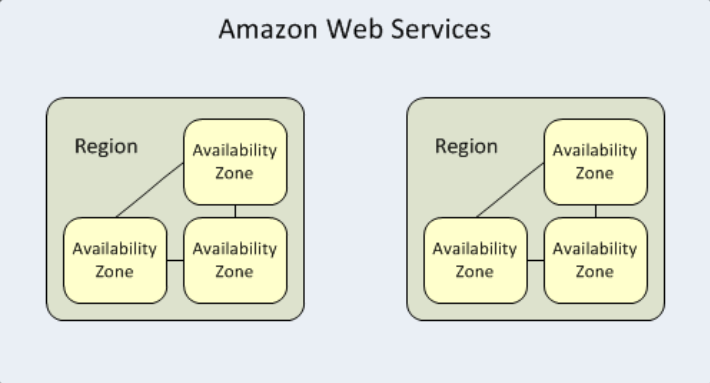

# **:material-map-marker-path:{.e_swift} Availability Zone and Region**

    
???+ question "What is `Region`?"

    A `region` in AWS represents a separate geographic area. If you have used AWS before, you must have seen this picture:
    
    {width="20%", : .center}   

    Each AWS `region` is <u>isolated</u> and <u>operates independently</u> from other `regions`. 

???+ question "What is `Availability Zone`?"

    `Availability zones` are highly available **data centers** within each AWS `region`. Each `availability zone` has <u>independent power</u>, <u>cooling</u> and <u>networking</u>.

    The `availability zones` within each `region` are connected via **low-latency links** to provide {==replication==} and {==fault tolerance==}.

The relationship between `Region` and `Availability Zone` can be seen in the [picture](https://bluexp.netapp.com/hubfs/aws_regions-1.png) below:

{width="50%", : .center}  

### **References:**

- [AWS Availability Zones, Regions, & Placement Groups Explained](https://bluexp.netapp.com/blog/aws-availability-zones-architecture-how-to-select)