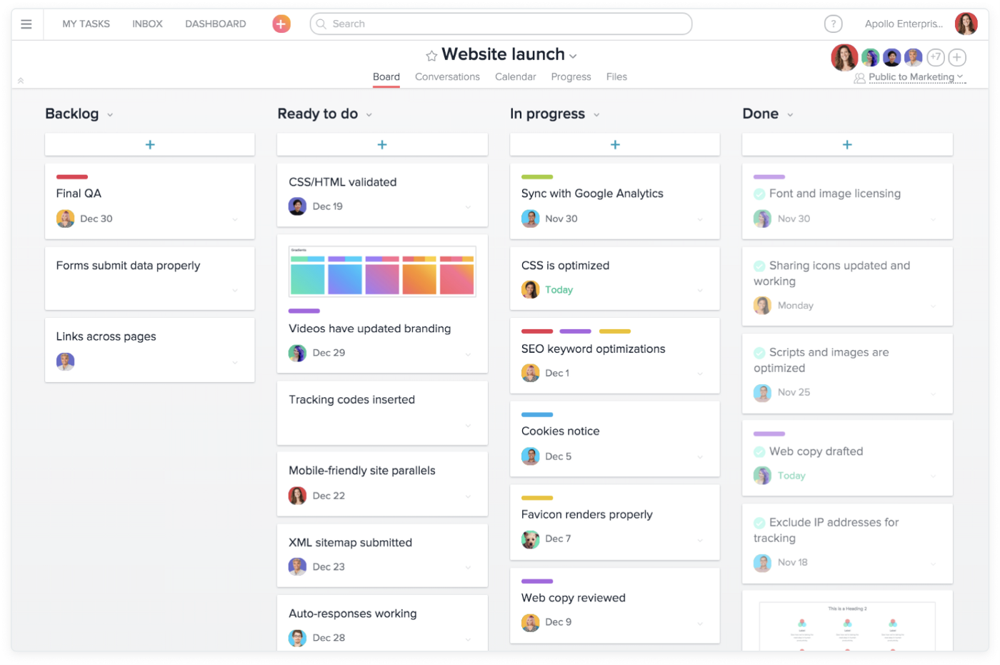
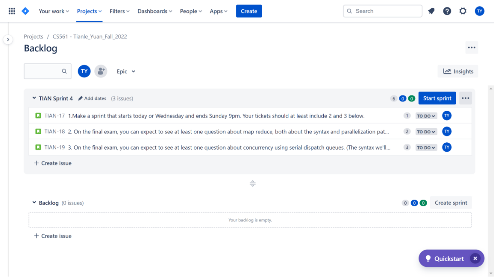
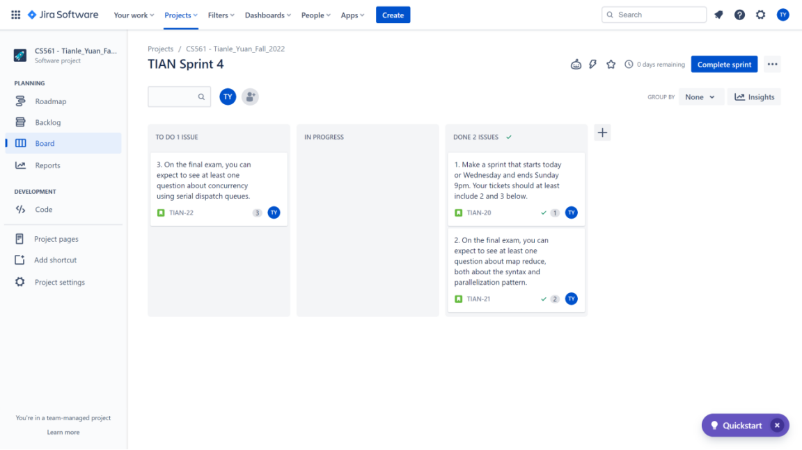
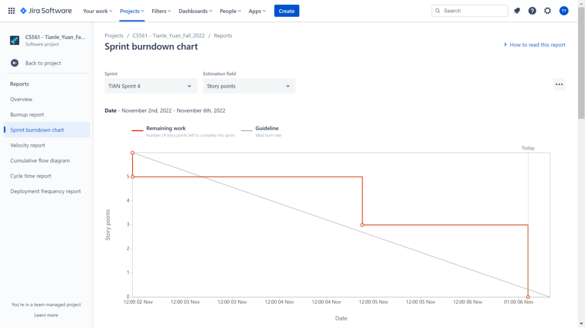

# **:octicons-terminal-16: Agile introduction**

> Nowadays, especially in **project management**, `Agile` has becomes a famous **interactive processes** for developing software.

## **Definition**

???+question "What is `Agile`"

    A **interactive processes** for developing software.

???+question "Why not `Waterfall`?"

    ???+note "What is `Waterfall`?"

        - **Definition:** Every stage depends on the previous stage.

        - **Diagram of phases:**

            ``` mermaid
            graph LR
            A[Requirement] --> B[System Design]; 
            B --> C[Implementation]; 
            C --> D[Testing];
            D --> E[Deployment];
            E --> F[Matainence];
            ```
        - **Advantage:** clear, productive, good time management, and available progress tracing.
        - **Disadvantage:** no variation, adaptability, or other error once a waterfall project is set in motion.

    ???+success "Why choose Agile?"
        
        Compared with the **linear** model `Waterfall`, `Agile` is more like **Fibonacci**, which has better *flexibility*, *adaptivity*, and *error tolerance*.

## **Visulization**

There are two ways to visualize Agile: 

  - `Kanban`
  - `Scrum`

???+example "`Kanban`"

    The famous software for `Kanban board` is [Asana](https://app.asana.com/):

    {width="80%", : .center}

???+example "`Scrum`"

    The good software for `Scrum board` is [Jira](https://www.atlassian.com/software/jira?&aceid=&adposition=&adgroup=136973859330&campaign=18440774103&creative=632787634547&device=c&keyword=jira%20software&matchtype=e&network=g&placement=&ds_kids=p73335831615&ds_e=GOOGLE&ds_eid=700000001558501&ds_e1=GOOGLE&gclid=CjwKCAiAp7GcBhA0EiwA9U0mtmRRuJPSZVEFSlt9SAD838u_p3Gom2qMVoz-RVfMGsirEMim9wctoRoCLJsQAvD_BwE&gclsrc=aw.ds):

    One `scrum board` is for one **sprint**, which typically set {==two weeks==} as period. There are typical **three stages**:
      
      1. **Initialize:** in `Backlog`, set points for each {++story/task++}. Try to assign the points to the story with the number in {++Fibonacci series++} such as: `1,2,3,5...`:
        {width="80%", : .center}  
      2. **Start:** in scrum board, there are three {++swim lanes++}: `To do`, `In progress`, `Done`:
        {width="80%", : .center}  
      3. **End:** when you finish the scrum board in the corresponding sprint, you will get a `"burn down" chat`:
        {width="80%", : .center}  


### **References:**

- [Picture Resource 1](https://miro.medium.com/max/1400/0*sxuvr3J7VpGYIZVs.png)