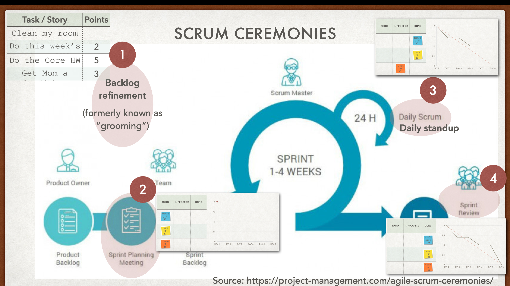

# **:octicons-terminal-16: Agile Scrum Concepts**

> Let's see the concepts that belongs to Agile Scrum. Click tab for unfolding.

{width="60%", : .center}

## **Roles**

???+note "Roles"
    
    ???example "**`Product Owner`**"

        - **Definition:** maxmize the return the {==business==} get on <u>investments</u>. Including: *salary*, *company renting fee*, *facilities*, *software*, and *maintenance*.

        - **E.g.:**
          
            * **WAY 0:** set priority in `backlog`.
            * **WAY 1:** make the team towards the **most valuable** work.
            * **WAY 2:** guarantee team fully understand **requirement from user story**.

    ???example "**`Scrum Master`**"

        - **Definition:** coach, who guide team to {==over-high level==} of <u>cohesiveness</u>, <u>self-organization</u>, and <u>performance</u>.

        - **E.g.:** 
          
            - Help the team learn.
            - Apply scrum.
            - Agile practice. 
            - Remove roadblocks.

        ???+warning "**Notice**"

            `Scrum Master` is NOT a **boss** but just a **peer**.
          
    ???example "**`Team Member`**"

        - **Definition:** how work done. What {==tech and tool==} to use. Who does which {==task==}.

        - **E.g.:** 

            - Doing the job of the team.
            - What is getting done.
            - Focus on result
          

## **Backlogs**

???+note "Backlogs"

    ???example "**`Product Backlog`**"

        **Definition:** list of {==deliverables==} for a **product**:    

          - features
          - bug fixes
          - changes
          - anything valuable for the product

    ???example "**`Sprint Backlog`**"
    
        **Definition:** {==TODO list==} for a **sprint**: 
            
          - stories: has been **committed** to deliverin  this sprint and associating their tasks.

## **Rythms**

???+note "Rythms"

    **Definition:** the sprint cicle. {==Table of meetings==} in a week. 

## **Ceremonies**

???+note "Ceremonies"

    ???example "**`Sprint Planning Meeting`**"

        **Time Frequency:** {==1\~2 hrs/week==}

        **Topics:**

          - **What will we do?**: Identify what must be complete to deliver.
          - **How will we do it?**: Commit a set of deliverables (**stories**) for the sprint in the backlog.
    
    ???example "**`Daily Scrum (stand-up meeting)`**"

        **Time Frequency:** {==less 15 mins/workday==}

        **Topics:**

          - What has been completed
          - Expects to complete
          - Obstacles slowing me down
          - {==DON'T==} solve problem

    ???example "**`Story Time Meeting`**"

        **Time Frequency:** {==1 hr/week==}

        **Topics:** 

          - Discuss and improve stories from the product backlog to the sprint backlog:
            
            - **Story sizing (estimation):** how much work will be required per story.
            - **Story splitting (estimation):** big --> small
          - De/Refine acceptance criteria.

    ???example "**`Sprint Review Meeting`**"

        **Time Frequency:** {==1\~1.5 hrs/week==}

        **Topics:** 

          - End of sprint, show accomplishment (finished stories)
          - {==NOT==} decision making meeting

    ???example "**`Retrospective Meeting`**"

        **Time Frequency:** {==1\~2 hrs/week==}

        **Topics:** 

          - What learned (only **1 or 2 strategic changes** make in the next sprint)
          - {==NOT==} decision making meeting

## **Abnormal Sprint Termination**

???note "Abnormal Sprint Termination"

    **Definition:** Because of *market*, *bussiness*, *competitor*, team need to {==terminate==} the sprint. Go back to the **early sprint** to avoid troubles from halfway done work.

## **Inspect and Adapt**

???note "Inspect and Adapt"

    **Definition:** Learn from customer, team, market. <==> another `CI` (continuous improvement).

### **References:**

- [A breathtakingly Brief and Agile Introduction (2012)](https://agilelearninglabs.com/resources/scrum-introduction/)