# **:simple-git: Git Basic Commands**

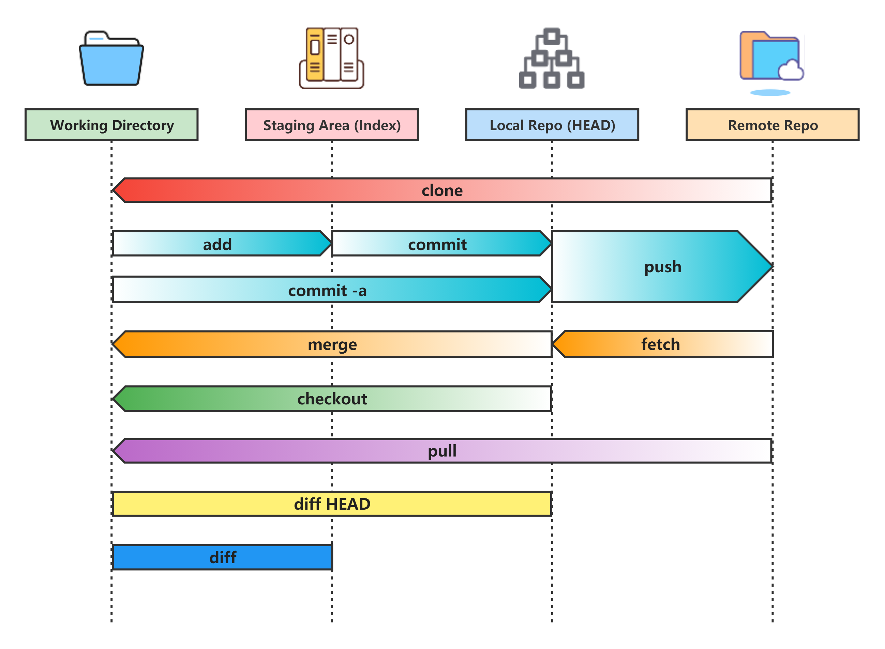{width="50%", : .center} 

## **Initialize Git repo**

Initialize local repository by using: `git init`

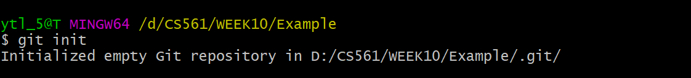{width="50%", : .center} 

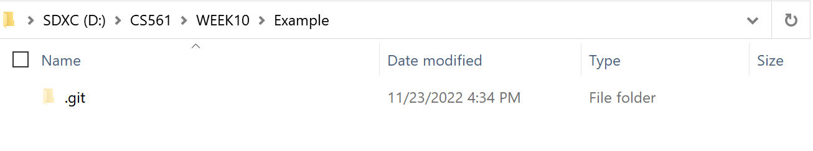{width="50%", : .center}    

## **Check status**

Create a README.md file:

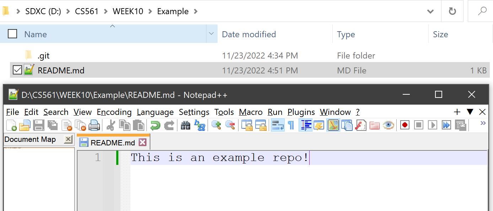{width="50%", : .center}  

Check the status of the local repo by using: `git status` 

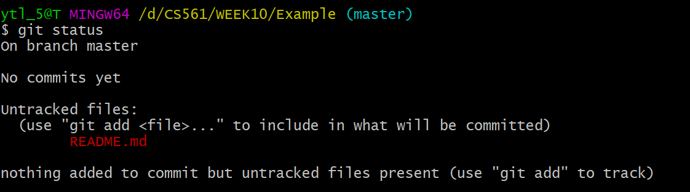{width="50%", : .center}  

## **Add changes**

Add changes into staging area by using: `git add .` or `git add *`

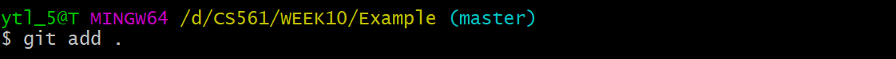{width="50%", : .center}   

Check the status again: 

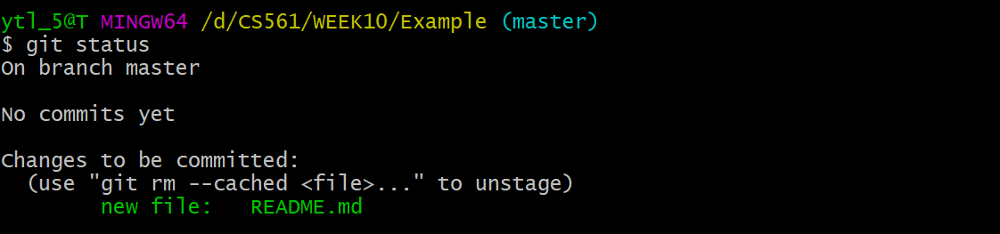{width="50%", : .center}   

## **Commit to the local repo**

Commit the new snapshot to the local repo:

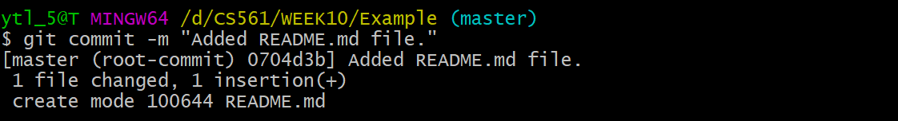{width="50%", : .center}  

Check the status again: 

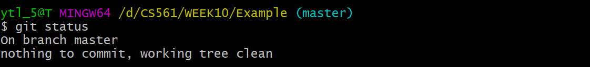{width="50%", : .center}  

## **Rename branch name**

Rename the **main branch** named from `master` into `main` by using: `git branch -m master main`

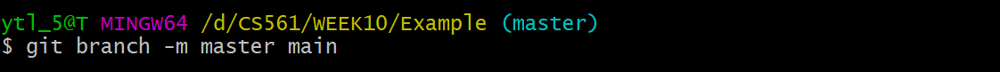{width="50%", : .center}  

Check the status again: 

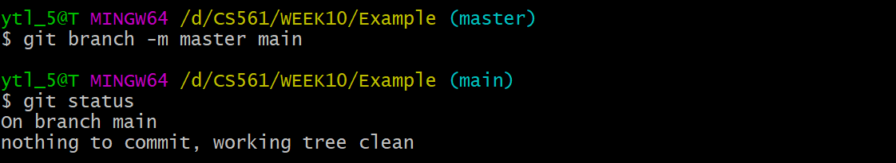{width="50%", : .center}  

## **Create a branch and switch**

Create a **new branch** by using: `git branch m_branch_1`

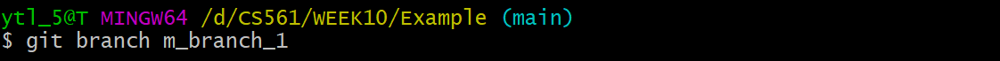{width="50%", : .center}  

Then switch to the **new branch**: `git checkout m_branch_1`

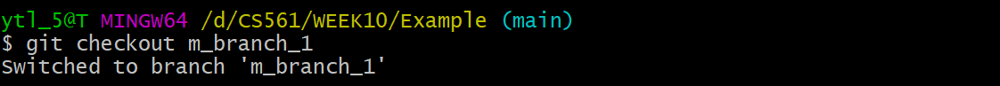{width="50%", : .center}  

Or you can do one step instead of the above to command lines: `git checkout -b m_branch_1`

Check the status again: 

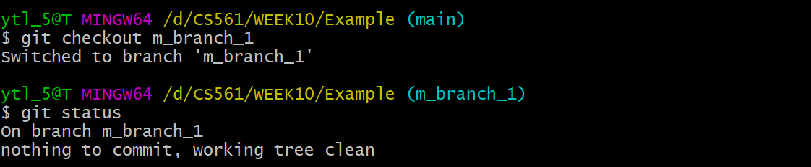{width="50%", : .center}  

## **Merge changes into main**

Edit the README.md file by: `vim README.md`

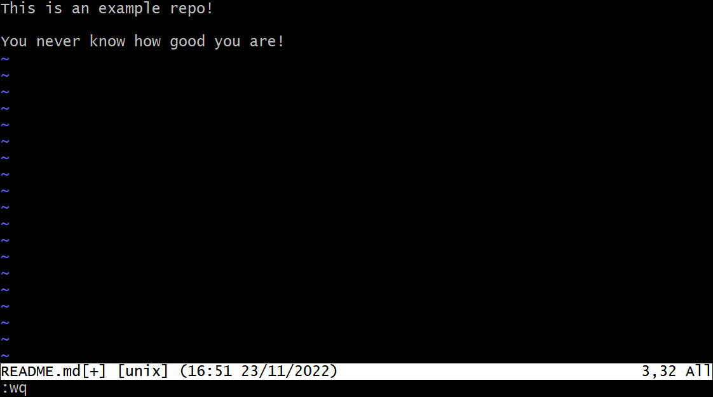{width="50%", : .center} 

Commit the **new branch**: `git commit -a -m 'Added encourage sentence'`

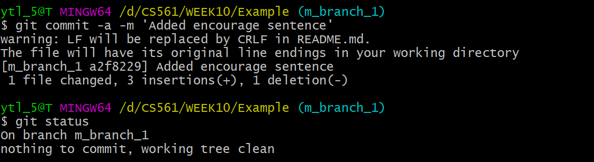{width="50%", : .center}  

Switch back to the main branch and merge the **new branch** into the **main branch**: `git merge m_branch_1`

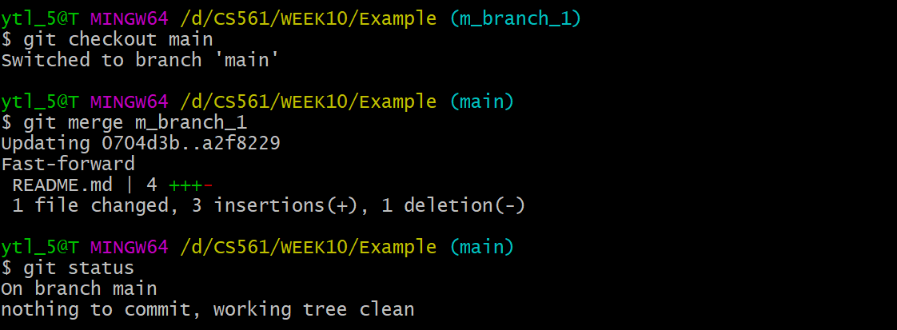{width="50%", : .center}  

## **Check the commit history**

Take a look at git log: `git log`

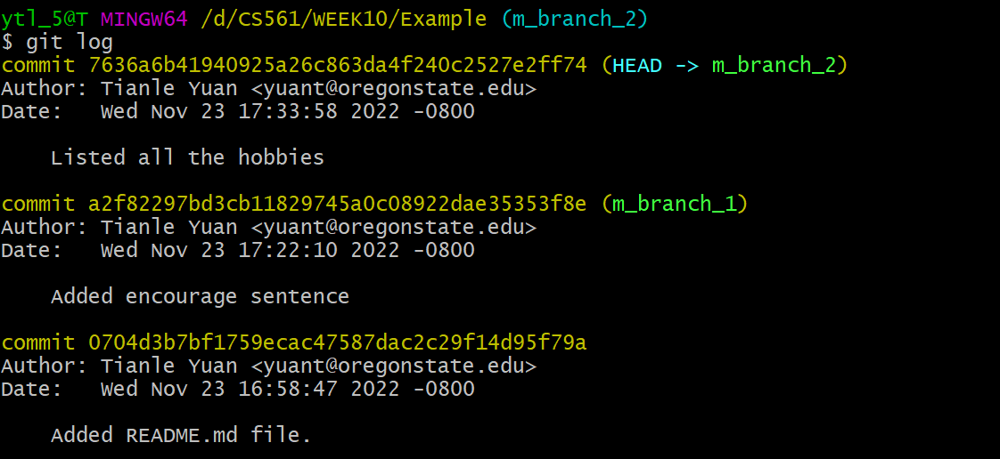{width="50%", : .center}  

Use graph selection in git log: `git log --graph --oneline --decorate --all`

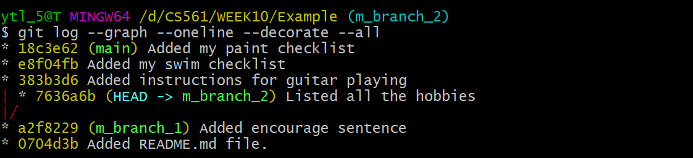{width="50%", : .center}  

More details: `git log --graph --abbrev-commit --decorate --date=relative --all`

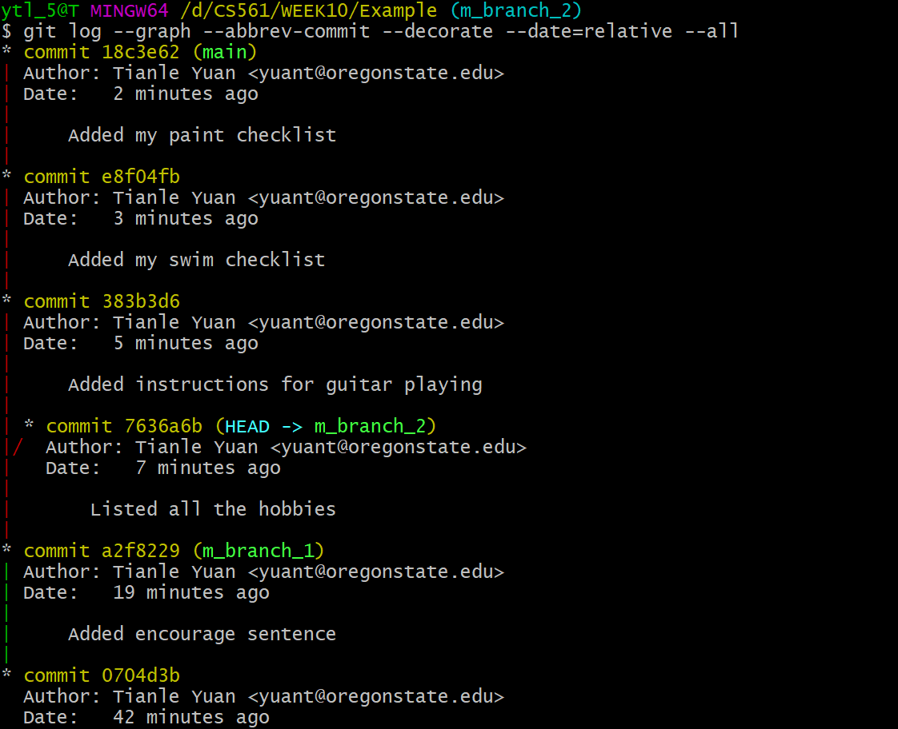{width="50%", : .center}  

In `Sourcetree`:

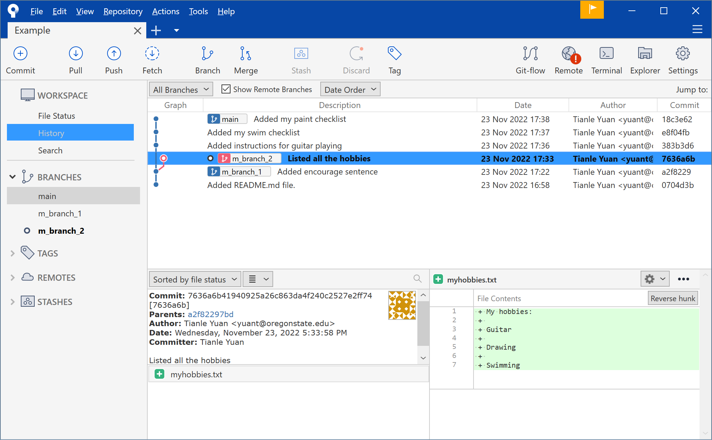{width="80%", : .center}  

## **Rebase branch**

We rebase **main branch** into **m_branch_2**: `git rebase m_branch_2`

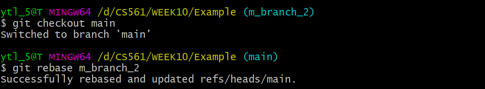{width="50%", : .center}   

Check the folder in different branches:

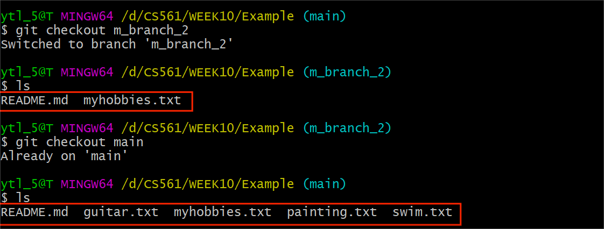{width="50%", : .center}   

???+ Warning

    Even though we rebase <u>the **main branch** `onto` (or `on top of`) **m_branch_2**</u>, since we cannot delete the **main branch**, there is {==NO DIFFERENCE WITH==} rebasing <u>**m_branch_2** onto the **main branch**</u>:

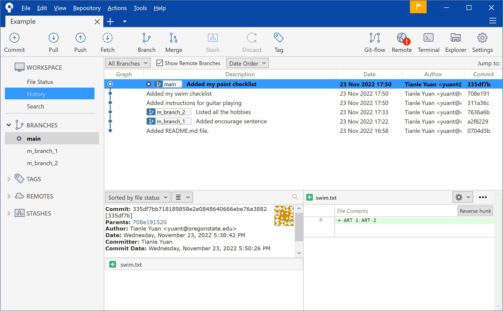{width="80%", : .center}   
