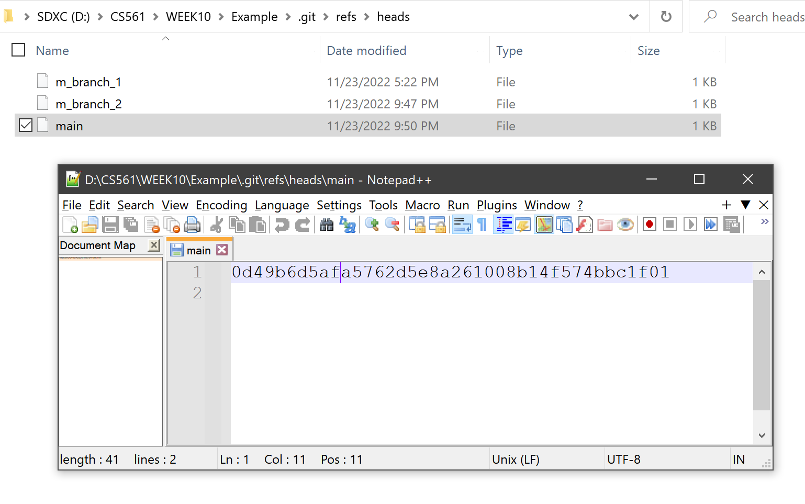
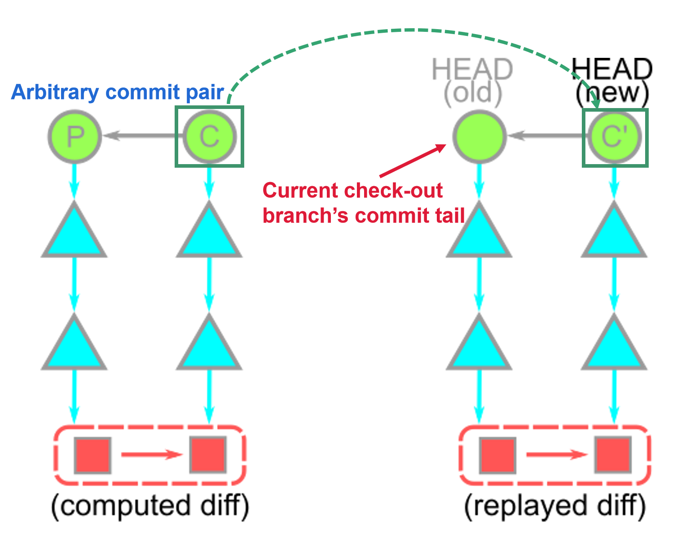
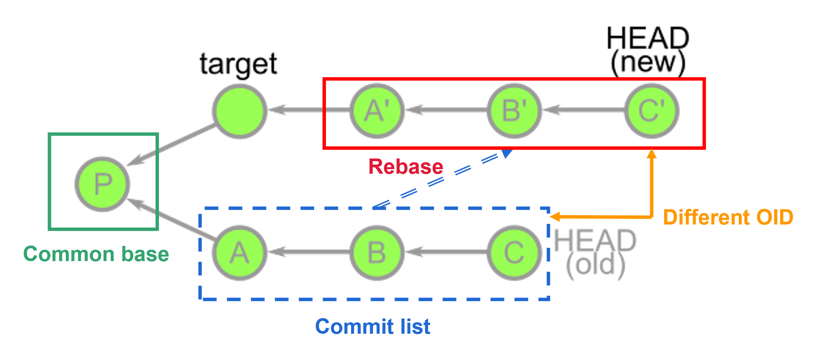
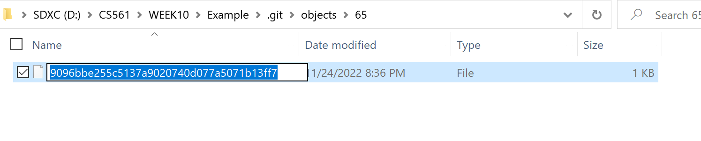

# **:simple-git: Git Theory**

> When you are first using Git, you must feel confused about the questions shown below

>???+Question
    - How does Git help us do version control?
    - What is `commit` essentially?
    - What is `branch` essentially?
    - What is `diff` essentially?
    - Does `committing` equal `patching`?
    - What is `rebase` essentially?

> I hope this section can help you to understand Git behaviors deeply. :santa:

## **Git objects**

Git repository is constructed by `Git objects`. Git references each object by using their `object ID` (OID for short). 

???+note

    `Git objects` has three types: `blob`, `tree`, and `commit`. They have below functions:

    -  :material-square:{.git_square} `blob` :material-ray-start-arrow: file contents 
    -  :material-triangle:{.git_triangle} `tree` :material-ray-start-arrow: directory listings 
    -  :material-circle:{.git_circle} `commit` :material-ray-start-arrow: snapshots

???+example "Commands and commit history that we will use"

    - The command that we can **retrieve** the `OID` of `Git objects`: **`git rev-parse <ref>​`**
    
        - **`<ref>`** will be the parameters below: 
        
            - `HEAD`: the **currently** checked-out branch's **latest** commit.
            - `HEAD^{tree}`: the **root tree** of the **currently** checked-out branch's **latest** commit.
            - `HEAD:<file path>`: the file content at the moment of the **currently** checked-out branch's **latest** commit.

    - The command that we **decrypt** the `OID` SHA-1 hash into plain-text files: **`git rev-parse <ref>​`**
    - In the commit history, please focus on the commit hash:
        
        {width="70%", : .center}  

### **:material-square:{.git_square} Git file content storage: blob**

`blobs` contain **file contents**. 

Let's use the command lines: 

 **`git rev-parse HEAD:README.md` and `git cat-file -p <OID> | head -n 8`**

{width="60%", : .center}  

The {++contents at `HEAD:README.md`++} matches the {++**README.md** file contents in the current working directory++}:

{width="70%", : .center}  

### **:material-triangle:{.git_triangle} Git directory: tree**

We should notice that `blobs` only contain file contents. However, `trees` record **files' names** and their **directories**. The concept can be seen in the graph as shown below:

{width="50%", : .center}    

Let's use the command lines: 

 **`git rev-parse HEAD^{tree}` and `git cat-file -p <OID> | head -n 15`**

As shown below, a `tree` is an ordered column list of: **file modes**, **paired with object types**, the **OID**, and **path entries** for the object at that path. 

{width="60%", : .center} 

???+Warning "Reminding"

    The objects shown in the list are all `blobs`. But the objects can also be `trees`. When some objects in the tree are `trees`, they are `subdirectories`. 
    
    Trees can point to other trees! 😎

### **:material-circle:{.git_circle} Git history snapshot: commit**  

The `tree` itself doesn’t know where it exists within the repository; that is the role of the objects pointing to the tree. The object role is the `commit`!

To understand the `commit` more straightforward, firstly, let's use the command lines: 

 **`git rev-parse HEAD`** and **`git cat-file -p <OID>`**

{width="60%", : .center}  

Combining the concept map below, each `commit` contains:

- A pointer to its **root tree**, representing the state of the working directory at that time.
- A **list of parent commits** corresponding to the previous snapshots (commits). A commit with no parents is a root commit, and a commit with multiple parents is a merge commit. Commits also contain 
- **Metadata** describing the snapshot. Such as:
    - Author and committer's name, email address, and date
    - A commit message. The commit message is an opportunity for the commit author to describe the purpose of that commit with respect to the parents.

{width="50%", : .center}  

All in all, we call `commit` a `snapshot` in time. Remember the [commit history](#git-objects) from `Sourcetree`. The `snapshot` is a <u>"slice"</u> of your local repo at some node point in time. `Snapshot` is to a repository, as a screenshot is to a video.

## **Git branch**

In Git, we use `branches` as pointers to the commits to move around the Git history and make changes instead of directly referring to OIDs most of the time.

In other words, the `branch file` contains the OID of a commit.

Don't believe me? Let's see what is a `main branch` in the working directory: **`.git/refs/heads`**:

Directory | {width="80%"}
:-: | :-:
**Sourcetree** | {width="80%"}

Familiar with the OID `0d49b6d5afa5762d5e8a261008b14f574bbc1f01`? Check the OID shown in the terminal of [Git history snapshot: commit](#git-history-snapshot-commit)!

Yes, right now `main branch` points to the {==same OID==} that `HEAD` points to:

{width="60%", : .center}  

{width="60%", : .center}  

???+tip 

    `Branches` are significantly **different** from `Git objects` we talked before:
    
      - `Commits`, `trees`, and `blobs` CANNOT change their contents once created (immutable).
      - `Branches` can be moved to track a specific commit branch (like the "`tail`" of the `link list`). 
        
        - **E.g:** if we update the current branch by creating new commits, both `HEAD` and the branch `main` will update to point to that new commit!

## **Big graph**

From what we have learned from [Git objects](#git-objects) and [Git branchs](#git-branch), we can treat the `local repo` as the **objects** diagram shown below:

{width="70%", : .center}  
  
???+success "**Hierarchy**"

    - :material-source-branch: branches :material-ray-start-arrow: :material-circle:{.git_circle} commits
    - :material-circle:{.git_circle} commits &nbsp;:material-ray-start-arrow: :material-circle:{.git_circle} other commits :material-plus: :material-triangle:{.git_triangle} their root trees
    - :material-triangle:{.git_triangle} trees &emsp;&emsp;:material-ray-start-arrow: :material-triangle:{.git_triangle} other trees :material-plus: :material-square:{.git_square} blobs
    - :material-square:{.git_square} blobs &emsp;&ensp;&nbsp;:material-ray-start-arrow: :no_entry_sign: nothing. 
  
???+info "**Important conclusions**"

    - {==Time==} moves from <u>left to right</u>.
    - {==Commit dependencies==} are from <u>right to left</u>.
    - {==Each commit==} has a <u>single root tree</u>.
    - {==Same blobs==} are reachable from <u>multiple root trees</u>. 
    - Since these trees {==reference==} trees and blobs by their OID, these snapshots <u>DON'T need multiple copies</u>. of the same data.

## **Git diff**  
> So far, we know that Git stores {++series of `commits`++}. But why doesn't Git store data as a series of <u>changesets</u> or <u>differences</u>? In fact, sometimes the `commits` use the function of the `diff`, but not all the time.

According to [Derrick Stolee](https://github.blog/author/dstolee/)'s favorite analogies, think of commits as having a [wave/partical duality](https://www.thirtythreeforty.net/posts/2020/01/the-wave-particle-duality-of-git-commits/) in physics, where {++sometimes they are treated like `snapshots`++} and {++other times they are treated like `diffs`++}. Simply, we can have following formula:

$$
commits =  diffs \cup snapshots
$$

???+question "So, what is the `diff`?"
    
    The `diff` is dynamically generated from the snapshot data (blobs) by comparing the root trees of the commit and its parent. 
    
Git can **compare** ANY two snapshots in time, not just adjacent commits. The comparison starts with the **root trees**, which are always different. The Git performs a **depth-first-search (DFS)** on the subtrees by **following pairs** when {==paths==} for the current tree have {==different OIDs==}.

Take the diagram as an example shown below:

{width="55%", : .center}   

???+example "Let's do DFS following pairs!"

    - The root trees have different values for the `docs`, so we recurse into those two trees. 
      
        - Those trees have different values for `M.md`:
         
            - so those two `blobs` are compared **line-by-line**;
            - and that `diff` is shown. 
        - Still, within `docs`, `N.md` is the same, so that is skipped, and we pop back to the root tree.  
    - The root tree then sees that the things directories have equal OIDs as well as the `README.md` entries.

In the diagram above, we notice that the things tree is never visited, and so none of its reachable objects are visited. This way, the **cost of computing a diff** is relative to {==the number of paths with different content==}.

???+warning "Notice!&emsp;:white_check_mark: commit, ❌ patch"

    With `commit`, parent information, including differences, has been stored. That's why Git **does not** choose the `patch` as the functional implementation. 
    
    `Patch` only implements the `diff` part but cannot traverse commit history. `Snapshots` record the commit history in time.

## **Two commands implementing `diff`**

### **git cherry-pick**

- **Brief description:** A commit is accidentally made to the **wrong** branch. You can switch to the correct branch (now it is `HEAD` branch) and `cherry-pick` the commit to where it should belong in this `HEAD` branch.

- **Technical details:** The `git cherry-pick <OID>` command creates a new commit with an identical diff (arbitrary diff between two neighbor commits) to the new commit whose parent is the current commit. 

???+example "Steps of `cherry-pick`:"

    1. Compute the `diff` between the commit <oid> and its parent.
    2. Apply that `diff` to the current HEAD.
    3. Create a new `commit` whose root tree matches the new working directory and whose parent is the commit at HEAD.
    4. Move the ref at `HEAD` to that new commit.
   
    {width="55%", : .center} 

    ???+warning "Important!"

        We {==didn’t “move” the commit==} to be on top of our current HEAD; We {==created a new commit==} whose diff matches the old commit.

### **git rebase**

The `git rebase` command in the most basic form is like a series of `git cherry-pick` commands, replaying `diffs` on top of a different commit.

???+example "Steps of `rebase`:"

    1. In default, `git rebase <target>` will discover {==the list of commits==} that are <u>reachable from `HEAD`</u> but <u>not reachable from `<target>`</u>.
        - **[Example]: the common base P is computed to determine the commit list `A`, `B`, and `C`.**

    2. Then, the `rebase` command navigates to the `<target>` location and performs `git cherry-pick` commands on this <u>commit list</u>, starting from the oldest commits.
        - **[Example]: then cherry-picked on top of the target to construct new commits in sequence: `A'`, `B'`, and `C'`.**

    {width="60%", : .center}  

    ???+warning "Important!"

        The commits `A'`, `B'`, and `C'` are {==brand new==} commits that share a lot of information with `A`, `B`, and `C`, but are {==distinct==} new objects (their OIDs are totally different). 
        
        In fact, the old commits still exist in your repository <u>until garbage collection runs</u>.

## **git add and git commit**

> Known the basic theory of Git, let's go back to the two basic Git command: **`git add` and `git commit`**. The diagram shown below is the design of them two.

{width="60%", : .center}   

### **git add**

???+question "What do `git add` do?"

    `git add` create `blobs` for newly added files and append index for both creating and editing blob.

Let's directly create a new file named `intro.txt` in the **main branch** and `git add .`:

{width="60%", : .center} 

{width="60%", : .center}   

If we directly check the `index` file under `./.git`, it shows messy code. We use the command line to check what is in the index: **`git ls-files --stage`**

{width="70%", : .center}   

We can see; now an OID has been added to the **index list** for **mapping** `intro.txt`.

Let's check the OID: `659096bbe255c5137a9020740d077a5071b13ff7` 

{width="60%", : .center}  

Oh yeah! It is the new file's content! 

Combining the knowledge in [Git blob](#git-file-content-storage-blob), you are 100% sure: The OID (or hash index/key) was appended in the `index folder` because we have also created a `blob` file when we do `git add`. 

???+example "Explore OID: `659096bbe255c5137a9020740d077a5071b13ff7`"

    Let's check the folder: `./.git/objects`.

    {width="70%", : .center}  

    REMEMBER: OID above is `65`+`9096bbe255c5137a9020740d077a5071b13ff7`

    We select the folder named `65` since 

    {width="70%", : .center}  

    We see the file with the hash of the second part of the OID: `9096bbe255c5137a9020740d077a5071b13ff7`

In fact, we can directly use the **first 7 digits** of the OID to check the object's type and content:

{width="60%", : .center}  

### **git commit**

???+question "What do `git commit` do?"

    `git commit` based on the `blobs` in the local repo, furtherly create a new `commit` and it's root `tree` for them.

Let's `git commit -m "added intro.txt"`:

{width="60%", : .center}    

Go into the `./.git/objects` folder. We can see the two created folders:

{width="70%", : .center}    

`ce` | 
:-:|:-:
`b9` |  

Now you are 100% sure: there is one object `tree` and another `commit`.

???+example "Explore folder `ce` and `b9`"

    By combining the contents in the fold file's hash, we can get two OIDs:

    - OID1: `ce` + `bc14637e116de809cfb39fc6d021f5ba54d015` = `cebc14637e116de809cfb39fc6d021f5ba54d015`
    - OID2: `b9` + `56ad5fbafbfc0050d73a7289661ceb764f5a8f` = `b956ad5fbafbfc0050d73a7289661ceb764f5a8f`

    As we concluded at the end of [git add](#git-add), we only use the first 7 digits and use `git cat-file -t <OID>` and `git cat-file -p  <OID>`:

    {width="60%", : .center}    

    Yeah! `cebc146` is the `commit` object!

    {width="60%", : .center}    

    Yeah! `b956ad5` is the `tree` object!

> **Git functions looks easy but there are some concepts are confusing. I have spent a whole week figuring out what was going on in deep. Then I spent two days for the conclusion in this section. If you check this article in details, I believe, you will treat Git in different angle! 🏖️🍻**

> **Also don't forget to check if you can answer the questions at the start of this article. 💯🤴**

### **References:**

- [Commits are snapshots, not diffs](https://github.blog/2020-12-17-commits-are-snapshots-not-diffs/)