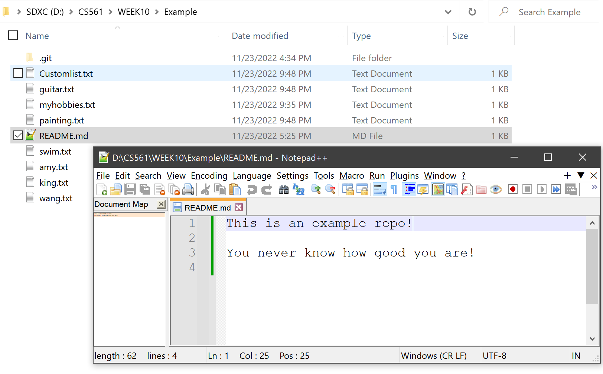
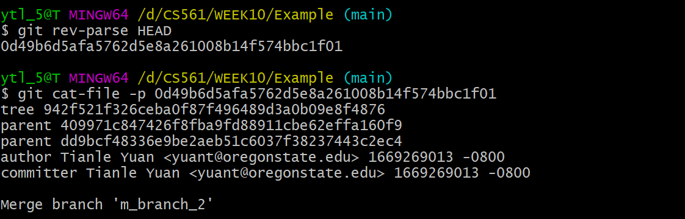
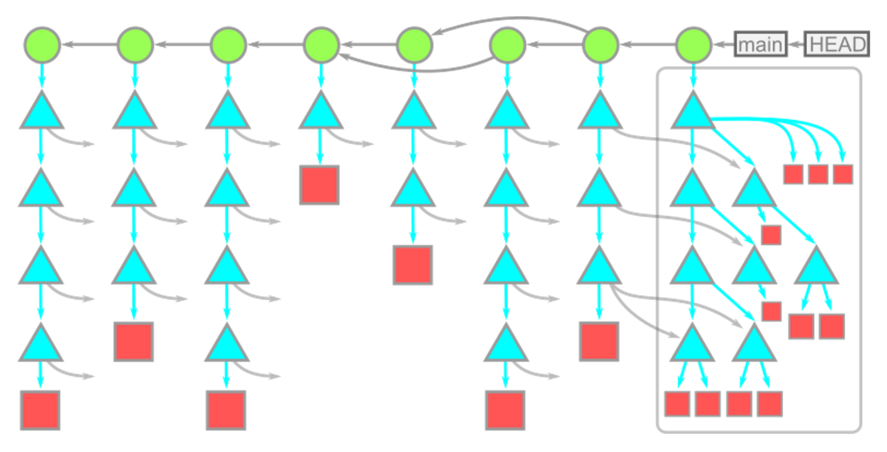

# **:simple-git: Git Theory**

> When you are first using Git, you must feel confused about the questions shown below

>???+Question
    - How does Git help us do version control?
    - What is `commit` essentially?
    - What is `branch` essentially?
    - What is `diff` essentially?
    - Does `committing` equal `patching`?
    - What is `rebase` essentially?

> I hope this section can help you to understand Git behaviors deeply. :santa:

## **Git objects**

Git repository is constructed by `Git objects`. Git references each object by using their `object ID` (OID for short). 

???+note

    `Git objects` has three types: `blob`, `tree`, and `commit`. They have below functions:

    -  :material-square:{.git_square} `blob` :material-ray-start-arrow: file contents 
    -  :material-triangle:{.git_triangle} `tree` :material-ray-start-arrow: directory listings 
    -  :material-circle:{.git_circle} `commit` :material-ray-start-arrow: snapshots

???+example "Commands and commit history that we will use"

    - The command that we can **retrieve** the `OID` of `Git objects`: **`git rev-parse <ref>​`**
    
        - **`<ref>`** will be the parameters below: 
        
            - `HEAD`: the **currently** checked-out branch's **latest** commit.
            - `HEAD^{tree}`: the **root tree** of the **currently** checked-out branch's **latest** commit.
            - `HEAD:<file path>`: the file content at the moment of the **currently** checked-out branch's **latest** commit.

    - The command that we **decrypt** the `OID` SHA-1 hash into plain-text files: **`git rev-parse <ref>​`**
    - In the commit history, please focus on the commit hash:
        
        {width="70%", : .center}  

### **:material-square:{.git_square} Git file content storage: blob**

`blobs` contain **file contents**. 

Let's use the command lines: `git rev-parse HEAD:README.md` and `git cat-file -p <OID> | head -n 8`

{width="60%", : .center}  

The {++contents at `HEAD:README.md`++} matches the {++**README.md** file contents in the current working directory++}:

{width="70%", : .center}  

### **:material-triangle:{.git_triangle} Git directory: tree**

We should notice that `blobs` only contain file contents. However, `trees` record **files' names** and their **directories**. The concept can be seen in the graph as shown below:

{width="50%", : .center}    

Let's use the command lines: `git rev-parse HEAD^{tree}` and `git cat-file -p <OID> | head -n 15`

As shown below, a `tree` is an ordered list of: **file modes**, **paired with object types**, the **OID**, and **path entries** for the object at that path. 

{width="60%", : .center} 

???+Warning "Reminding"

    The objects shown in the list are all `blobs`. But the objects can also be `trees`. When some objects in the tree are `trees`, they are `subdirectories`. 
    
    Trees can point to other trees! 😎

### **:material-circle:{.git_circle} Git history snapshot: commit**  

The `tree` itself doesn’t know where it exists within the repository; that is the role of the objects pointing to the tree. The object role is the `commit`!

To understand the `commit` more straightforward, firstly, let's use the command lines: `git rev-parse HEAD` and `git cat-file -p <OID>`

{width="60%", : .center}  

Combining the concept map below, each `commit` contains:

- A pointer to its root tree, representing the state of the working directory at that time.
- A list of parent commits corresponding to the previous snapshots (commits). A commit with no parents is a root commit, and a commit with multiple parents is a merge commit. Commits also contain 
- Metadata describing the snapshot. Such as:
    - Author and committer's name, email address, and date
    - A commit message. The commit message is an opportunity for the commit author to describe the purpose of that commit with respect to the parents.

{width="50%", : .center}  

All in all, we call `commit` a `snapshot` in time. Remember the [commit history](#git-objects) from `Sourcetree`. The `snapshot` is a <u>"slice"</u> of your local repo at some node point in time. `Snapshot` is to a repository, as a screenshot is to a video.

## **Big graph**

From what we have learned from [Git objects](#git-objects), we can treat the local directory as the objects diagram shown below:

{width="70%", : .center}  

## **Git branch**

## **Git diff**  

`Git` does NOT **store** data as a series of {--changesets--} or {--differences--}, but instead as a {++series of++} `snapshots`.

## **Git rebase**

### **References:**

- [Commits are snapshots, not diffs](https://github.blog/2020-12-17-commits-are-snapshots-not-diffs/)