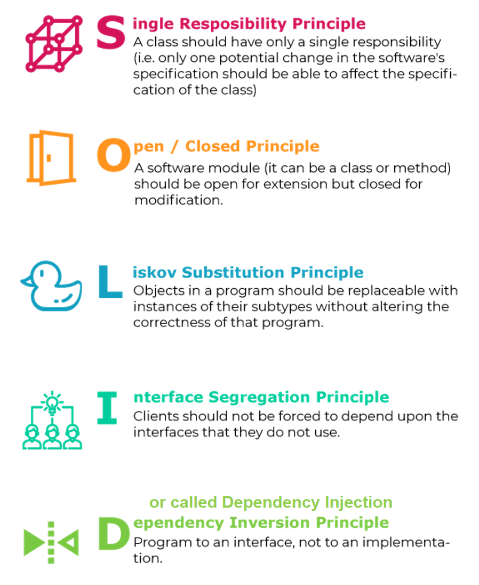
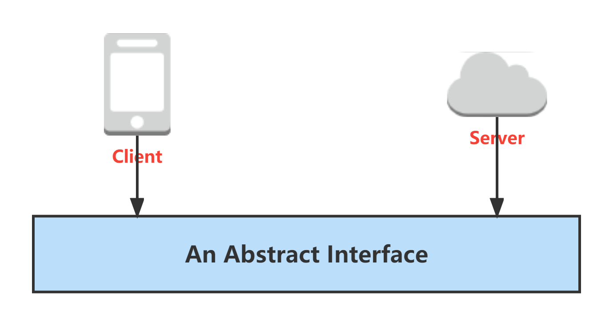

# ** :office_worker: Engineer Principles**

## **SOLID princiles**

If we are doing `OOD` (Object-Oriented Design), we should follow the `SOLID` principles:

{width="50%", : .center} 

???+Warning "More resources for learning!"

    Check SOLID [principles for OOP design](../../../3_C%2B%2B/Design_Pattern/basic/#solid-principles) to learn more in real cases.

## **Abstract Interface**

For the last one, `Dependency Inversion` principle, we can use the concept of `abstract interface` as an implementation.

{width="60%", : .center} 

???+question "Why do we care?"

    1. Decouple components -- loosely coupled
    2. Mock
    3. Unit test
    4. Develop in parallel
    5. Do user-centered design and iterate cheaper. Yeah, [BFFs](#bffs)!

### **REST APIs**

Check [REST APIs](../../5_FullStack/API/rest_api.md).

## **BFFs**

`BFF`: Backend for Frontend. `Backend For Frontend` is a design pattern created with not only the developer but, more importantly, the **user and their experience in mind**. 

### **References:**

- [Picture Resource 1](https://devopedia.org/images/article/177/8101.1558682601.png)
