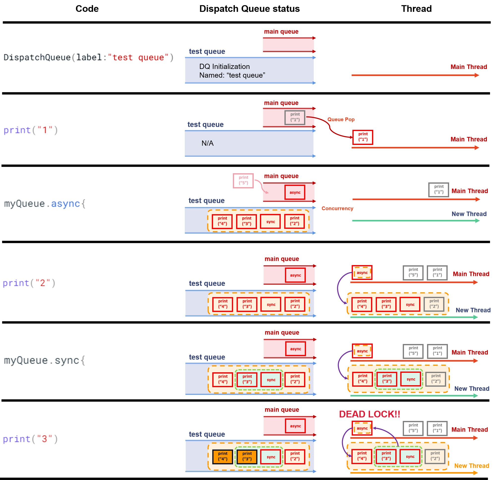
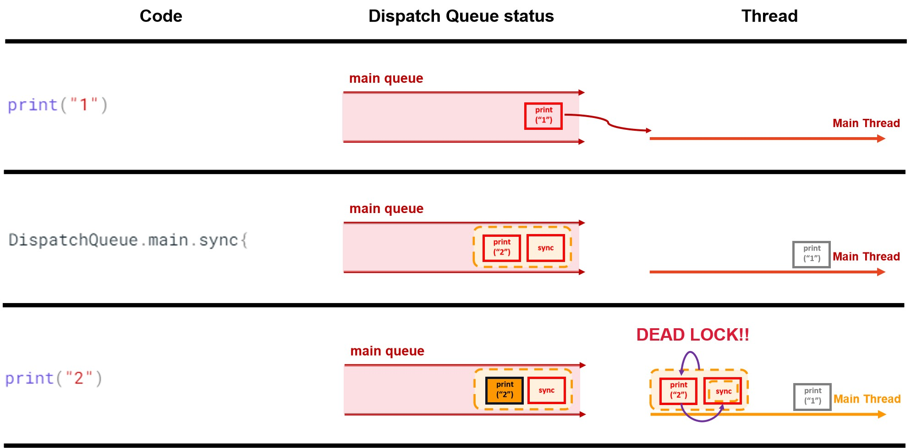

# **Dispatch queue and Dead lock**


## **I. Dispatch queue (from Prof. Will Braynen, OSU)**

### **1️⃣ What?**

* A dispatch queue is an **object-like structure** that **manages the tasks** you submit to it. All dispatch queues are **first-in, first-out (FIFO)** data structures. Thus, the tasks you add to a queue are always started in the same order that they were added.” (source: [Apple documentation](https://developer.apple.com/library/archive/documentation/General/Conceptual/ConcurrencyProgrammingGuide/OperationQueues/OperationQueues.html)). That’s important.

### **2️⃣ For?**

* Well, it’s a way to **run multi-threaded code** without using threads directly. It’s **not** as low level as working with threads. 

### **3️⃣ Diff with threads?**

* A **dispatch queue** can manage its own **pool thread**, etc, and ultimately the point of a dispatch queue is to keep track of what instruction to execute next while giving you a **higher-level API** instead of dealing with threads directly

* Whereas you can think of a **thread** as where **instructions actually execute**; for example, a thread might have `start`, `stop`, and `sleep` methods. A thread is **short for a thread of execution** and is **the smallest sequence of programmed instructions** that can be managed independently by a scheduler, which is typically [but not always] **a part of the operating system**” ([wikipedia](https://en.wikipedia.org/wiki/Thread_(computing))).  


## **II. Serial queue, Concurrent queue, Main dispatch queue and Thread**

### **🤏 Grammar and Properties** 

* The table below shows how to use the dispatch queue, and in what situation:
  
| DQueue type | Grammar | Properties | 
| :---------- | :----------------------------------- | :----------------------------------- |
| Serial queue | `DispatchQueue(lablel:"..").sync/.async { … }` | Private, conccurrent |
| Concurrent queue | `DispatchQueue(lablel:"..", attributes: .concurrent).sync/.async { … }` | Global, parallel |
| Main dispatch queue | `DispatchQueue.main.sync { … }` | Global, conccurrent |

### **👯‍♀️ Dispatch Queue v.s. Thread** 

* The table below concludes the relationship between:
  
| D.Queue type / Thread | Main thread | Other thread | Task Processing Type |
| :---------- | :---------------|:--------------- |:--------------- |
| Serial queue |  `sync`: main thread <br /> N/A | N/A <br /> `async`: multiple threads  |[{++serial++}] <br />[{++concurrent++}]|
| Concurrent queue | N/A  | multiple threads |[{++parallel++}] |
| Main dispatch queue | main thread  | N/A |[{++serial++}]|

* **Q&A**

???+ question "If it is the first time your call `let myQueue = DispatchQueue(label:"test queue")` and `sync`, how many queues will app have? Which queue will tasks in `sync` code block be queuing?"

    Two. One is main queue. Another one is private queue created by `let myQueue = DispatchQueue(label:"test queue")`. Tasks in `sync` code block will be queuing in the new created private queue.
  
???+ question "What `queue` will tasks in `sync` block be on?"

    When you call `let myQueue = DispatchQueue(label:"test queue")`, you will send the code in the block of `sync` to some other queue besides existing queue (such as main queue).

    No matter in serial, concurrent or parallel processing, you can always have multiple queues (* but not for threads).

???+ question "What `thread` will tasks in `sync` block be on?"

    Remember: **Context-switching between threads is expensive. Cheaper to stay on the same thread if you can.**

    Anytime you call `sync`, even if you do not do `DispatchQueue.main.sync { … }`(to send the work to the main dispatch queue) and instead synchronously dispatch to some other queue, even a private queue you created, the task you submitted might still execute on the main thread.

???+ question "What `queue` and `thread` will tasks in `DispatchQueue.main.sync { … }` block be on?"

    Main queue. Main thread.

???+ question "Deadlock condition?"
    
    `Same thread` & `serial queue` & `sync` ---> deadlock.


## **III. Dead lock in dispatch queue**

To understand dead lock happends in dispatch queue processing, we firstly need to know what is the [Concurrency](../../Others/Concurrency.md).

### **Dead lock case 1 (dispatch queue)**

**Code**

```swift title="dl_1.swift"
import Foundation

let myQueue = DispatchQueue(label:"test queue")

print("1")

myQueue.async{
    print("2")

    myQueue.sync{
        print("3")
    }

    print("4")
}

print("5")
```

**Output**

```
1
5
2
```

**Explaination Picture**

{width="100%", : .center}

### **Dead lock case 2 (serial queue)**

**Code**

```swift title="dl_2.swift"
import Foundation

print("1")  

DispatchQueue.main.sync{
    print("2")
}

print("3")
```

**Output**

```
1
```

**Explaination Picture**

{width="100%", : .center}


### **No dead lock case (serial queue with `sync`)**

**Code**

```swift title="ndl.swift"
import Foundation

let myQueue = DispatchQueue(label:"test queue")

print("1")

myQueue.sync{
    print("2")
}

print("3")
```

**Output**

```
1
2
3
```

**Explaination Picture**

{width="100%", : .center}

