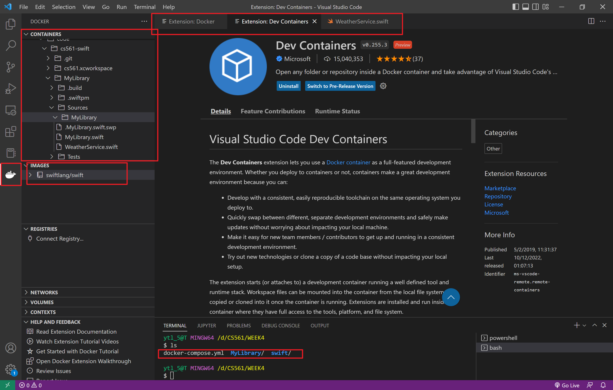
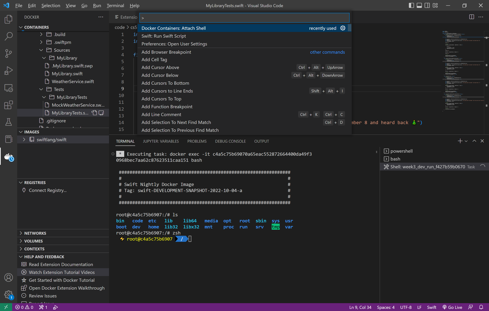
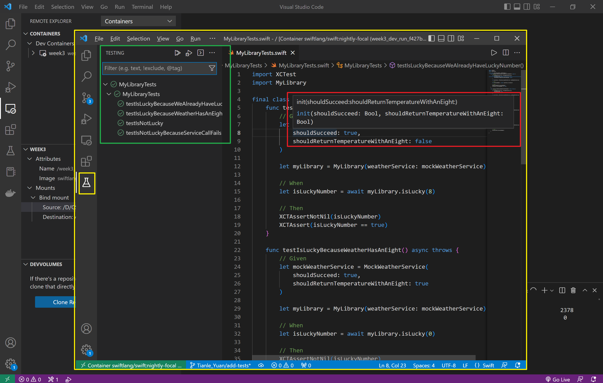

# **TL;DR**

VS Code + Docker. Especially useful on Windows, but can be handy on MacOS too. For a step-by-step guide, see [VS Code-Docker for editing Swift on Win10](VS_Code_Docker_for_a_nice_Swift_edition_on_Windows10.md) .

Here is Tianle Yuan’s own summary from Slack.

1.  Install the extensions of the swift, docker, and dev containers in vs code.
    
2.  run docker
    
3.  run vs code and click the docker logo on the left sidebar.
    
4.  run the image in vscode terminal and open the swift image in the container as u did in the docker desktop
    

For testing ur swift code:

1.  `ctrl` + `shift` + `p`
    
2.  in command window at the top, enter: docker containers: attach shell
    
3.  swift test in your terminal
    

For example:

Moreover, you can even get the following instead, which looks more like what you get in Xcode:

See [VS Code - Docker for a nice Swift edition on Windows10](VS-Code---Docker-for-a-nice-Swift-edition-on-Windows10_74350771.html) for more details.
