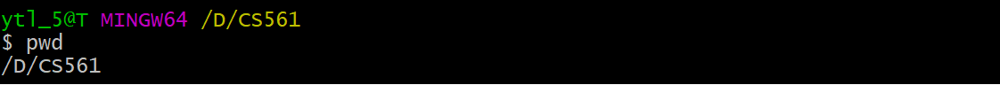
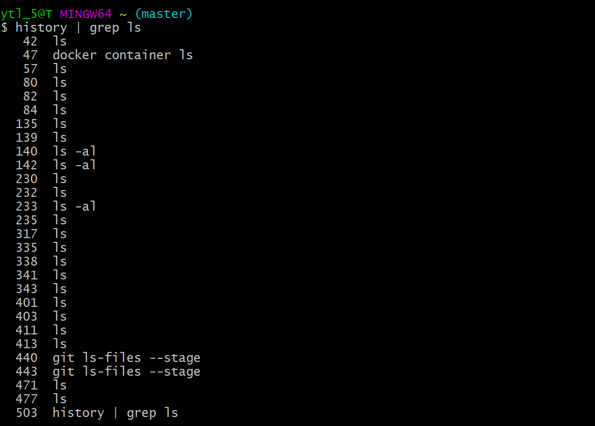

# **:octicons-terminal-16: Bash Commands**

> Use this sheet to test yourself! Click the box for unfolding. :100:

## **ls**

???note "`ls`"

    Check the components in the current directory.

    {width="80%", : .center} 

???note "`ls -a`"

    Check the components in the current directory; with **hidden components**.

    {width="80%", : .center}   

???note "`ls -l`"

    Check the components in the current directory; with **detailed information**. The authority meaning of the first column:

    
 [{==dicrectory==}][{==Owner==}][{==Group==}][{==Other==}]

    {width="80%", : .center}   

## **cd**

???note "`cd`"

    (default) Go back to `root` directory

    {width="80%", : .center}  

???note "`cd ~`"

    Go to the `root` directory

    {width="80%", : .center}  

???note "`cd .`"

    Go to the `present working` directory.  

    {width="80%", : .center}    

???note "`cd ..`"

    Go to the `parent` directory.  

    {width="80%", : .center}  

## **pwd**

???note "`pwd`"

    Present working directory.

    {width="80%", : .center}  

## **grep**

???note "`grep`"

    Search a `string` in a `given file`.

    {width="80%", : .center}  

???note "`grep -i`"

    Search a `string` in the `file` directory, with **case-insensitive**. The output will mix both `up & low -case` results.

    The case below will search: `What`, `WhaT`, `wHAt`, `wHat`, .etc.

    {width="80%", : .center}  

???note "`grep -r`"

    Search a `string` from all files in the `current directory` (or in a `given file` if send the parameter) and in all of its `subdirectories`.

    {width="80%", : .center}  

## **chmod**

???note "`chmod`"

    Set `authority` for the given file. 

    Note that: there are two ways to use chmod.  For example, `chmod 644 <filename>` and `chmod u+rw <filename>`

    {width="80%", : .center} 

    === "Digit cheating sheet"

        user | group| other
        :-:|:-:|:-:
        6|4|4
        110| 100| 100
        rwx | rwx | rwx

    === "Alphabet cheating sheet"

        
[{==Person==}][{==Verb==}][{==Behavior==}]

        Person | u|g|o
        :-:|:-:|:-:|:-:
        meaning | user|group|other

        Verb| - | +
        :-:|:-:|:-:
        meaning | add|remove

        Behavior | r|w|x
        :-:|:-:|:-:|:-:
        meaning | read|write|excute

## **find**

???note "`find . name <filename>`"

    Find `file` with the given `name` in the `current directory`.

    {width="80%", : .center}   

## **history**

???note "`history`"

    Check command `using history`.

    {width="80%", : .center}  

    
:fontawesome-solid-ellipsis:

    
    {width="80%", : .center}   

## **Pip (|)**

???note "`|` -- pip operator"

    Combine **two or more** commands.

    **e.g.** I want to use `history` and `grep ls` in sequence. I use `history | grep ls`

    {width="80%", : .center}     

## **Output Redirect (>)**

???note "`>` -- output redirection operator"

    `Redirect` the contents of a command/file to another by `overwriting` it.

    **e.g.** 
    
    I want to use `history` and `grep ls` in sequence.

    {width="80%", : .center}     

    Then I want to save the output of `history | grep ls` in the file `output.log`. I use `history | grep ls > output.log`.

    {width="80%", : .center}   

## **cat**  

???note "`cat`"

    `Print` the content of a `file` onto the standard output stream.

    === "Cat output"
        
        {width="80%", : .center}   

    === "Vim editor comparison"

        {width="80%", : .center}   

## **man**  

???note "`man`"

    The function of `man` is like `--help`(in GitBash). It shows the `manual pages` for a command.

    **e.g.** I want to check `less` command using manu:

    {width="80%", : .center}   

    {width="80%", : .center} 

## **more, less, most**

???note "`more, less, most`"

    The three commands are used to view the text files in the command prompt, displaying one screen at a time in case the file is large (For example log files). 

    === "`more`"

          - Support `forward navigation` and `limited backward navigation`.

    === "`less`"

          - Support both `forward navigation` and `backward navigation`.
          - Has `search` options. 
          - Can go to the `beginning` and the `end` of a file instantly. 
          - Can switch to an `editor` (like opening the file in `vi` or `vim`). 
    
        It is {==noticeably quicker than editor==} when the file is large.

    === "`most`"

          - Has `all` the features of `more` and `less`.
          - Can also open `multiple files`, close 1 file at a time when you have multiple files open.
          - Allows `locking` and `scrolling` of the open windows.
          - Allows for `splitting` of open windows.

## **alias**  

???note "`alias`"

    Create a `shortcut` that references a command.

    **e.g.** Create a shortcut for `ls -la` as `ll`: `alias ll="ls -la"`

    {width="80%", : .center}    

## **unalias**  

???note "`unalias`"

    Remove alias.

    ???+warning "Note"

        `unalias` not only remove the `alias` from the current session but also remove them permanently from `shell's configuration file`.

## **echo**

???note "`echo`"

    A built-in Linux feature that prints out arguments as the `standard output`. Example see in [PATH](#path).

## **which**

???note "`which`"

    Use to identify the `location` of `executables`.
    
    {width="80%", : .center}    

## **PATH**  

???note "`PATH` display"

    By using `echo $PATH`.

    {width="80%", : .center}   

???note "`PATH` edit"

    **Q:** How to make scripts execute from the present working directory without having to type a `./` before the script's name (**e.g.** `hello` instead of `./hello`)?

    **A:** ./ executes files that are not in $PATH, “.” means it directly execute file in the current directory. Thus, we need to **add** hello’s absolute directory in $PATH, such as:
    
    
`PATH DEFAULT=${PATH}:/path/to/hello`

## **ln**  

???note "`ln -s`"   

    Create a `soft link` for an existing file.

    {width="80%", : .center}     

## **Background Processing (&)**

???note "`&`"  

    For example, launching node.js using `node app.js &` vs. `node app.js`

    Use the `background process` can help to keep the process running without terminal effects. However, a `foreground process` will be killed when we close the terminal.

## **code**

???node "`code`"

    Open `VS Code` to edit some file.

## **.bash_profile vs .bashrc**

???node "`.bash_profile` v.s. `.bashrc`"

    When invoked, `Bash` **reads** and **excutes** commands from a set of startup files, which is read depending on whether `shell (command explainer)` is invoked as {==\[interactive/non-interactive\]==} or {==\[login/non-login\]==} shell.

    Shell type | interactive|non-interactive|login|non-login
    :-:|:-:|:-:|:-:|:-:
    Example| terminal (shell read, write)| non-terminal (execute a script)| remotely (via ssh)| locally

    === "`.bash_profile`"

        {==Interactive==} {++log-in++} shell.

    === "`.bashrc`"

        {==Interactive==} {++non-login++} shell.

## **Shebang (#!)**

???note "`#!`"  

    `Bash` commands can be used not only in command lines but also in scripts. The head of `Bash script` should mention using **Bash shell** with `#!`.
    
    **e.g:** `#!/bin/bash`.

## **sha1sum**

???note "`sha1sum`"

    `sha1sum` is a **cryptographic hash function**. The algorithm transfer data into `Checksum`, which is convenient for **confirming** if your copy is the same as the original one.

    {width="80%", : .center}  

