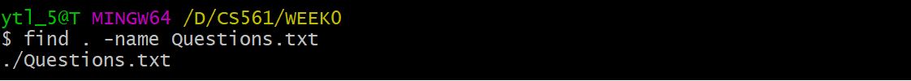
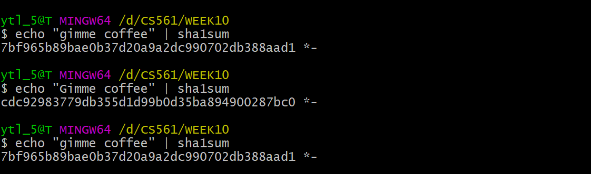
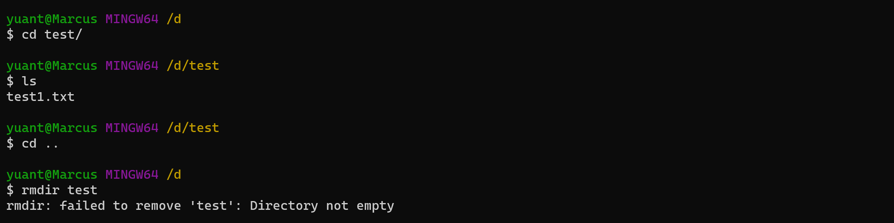
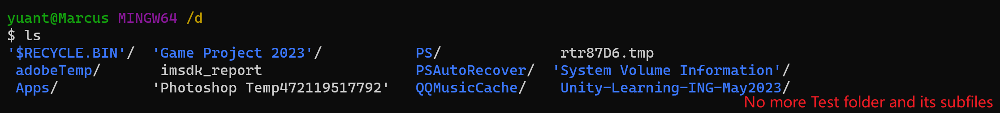
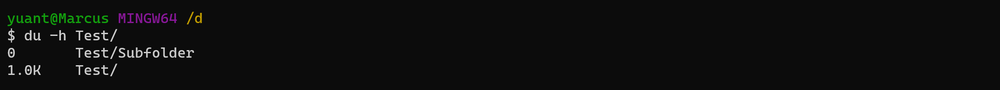
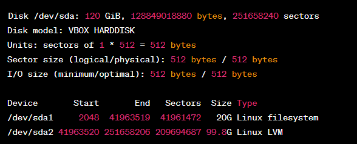
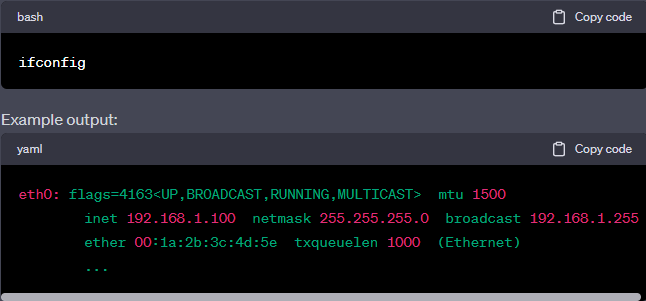
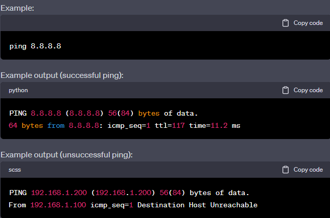
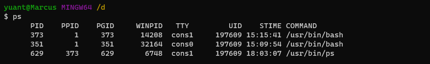
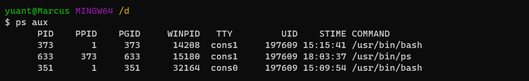

# **:octicons-terminal-16: Bash Commands**

> Use this sheet to test yourself! Click the box for unfolding. :100:

## **ls**

???note "`ls`"

    Check the components in the current directory.

    {width="80%", : .center} 

???note "`ls -a`"

    Check the components in the current directory; with **hidden components**.

    {width="80%", : .center}   

???note "`ls -l`"

    Check the components in the current directory; with **detailed information**. The authority meaning of the first column:

    
 [{==dicrectory==}][{==Owner==}][{==Group==}][{==Other==}]

    {width="80%", : .center}   

## **cd**

???note "`cd`"

    (default) Go back to the `root` home directory of the **current user**.

    {width="80%", : .center}  

???note "`cd ~`"

    Go to the `root` home directory of **the current user**.

    {width="80%", : .center}  

???note "`cd /`"

    Takes you back to the root directory of the **current drive**.
    {width="80%", : .center}

???note "`cd .`"

    Go to the `present working` directory.  

    {width="80%", : .center}  

???note "`cd ..`"

    Go to the `parent` directory.  

    {width="80%", : .center}  

## **pwd**

???note "`pwd`"

    Present **working directory**.

    {width="80%", : .center}  

## **grep**

???note "`grep`"

    Search a `string` in a `given file`.

    {width="80%", : .center}  

???note "`grep -i`"

    Search a `string` in the `file` directory, with **case-insensitive**. The output will mix both `up & low -case` results.

    The case below will search: `What`, `WhaT`, `wHAt`, `wHat`, .etc.

    {width="80%", : .center}  

???note "`grep -r`"

    Search a `string` from all files in the `current directory` (or in a `given file` if send the parameter) and in all of its `subdirectories`.

    {width="80%", : .center}  

## **chmod**

???note "`chmod`"

    Set `authority` for the given file. 

    Note that: there are two ways to use chmod.  For example, `chmod 644 <filename>` and `chmod u+rw <filename>`

    {width="80%", : .center} 

    === "Digit cheating sheet"

        Person| user | group| other
        :-:|:-:|:-:|:-:
        Decimal|6|4|4
        Binary| 110| 100| 100
        Meaning| rwx | rwx | rwx

    === "Alphabet cheating sheet"

        
[{==Person==}][{==Verb==}][{==Behavior==}]

        Person | u|g|o
        :-:|:-:|:-:|:-:
        Meaning | user|group|other

        Verb| + | -
        :-:|:-:|:-:
        Meaning | add|remove

        Behavior | r|w|x
        :-:|:-:|:-:|:-:
        Meaning | read|write|excute

## **find**

???note "`find . -name <filename>`"

    Find `file` with the given `name` in the `current directory`.

    {width="80%", : .center}   

## **history**

???note "`history`"

    Check command `using history`.

    {width="80%", : .center}  

    
:fontawesome-solid-ellipsis:

    
    {width="80%", : .center}   

## **Pip (|)**

???note "`|` -- pip operator"

    Combine **two or more** commands.

    **e.g.** I want to use `history` and `grep ls` in sequence. I use `history | grep ls`

    {width="80%", : .center}     

## **Output Redirect (>)**

???note "`>` -- output redirection operator"

    **Redirect** the contents of a command/file **to another** by `overwriting` it.

    **e.g.** 
    
    I want to save the output of `history | grep ls` in the file `output.log`. I use `history | grep ls > output.log`.

    {width="80%", : .center}   

## **cat**  

???note "`cat`"

    `Print` the content of a `file` onto the standard output stream.

    === "Cat output"
        
        {width="80%", : .center}   

    === "Vim editor comparison"

        {width="80%", : .center}   

    !!!warning ""

        `cat` is primarily used for displaying the entire contents of one or more text files in the terminal.

        `less` is a pager utility designed for viewing and navigating through large text files or long outputs that don't fit on a single screen.

## **man**  

???note "`man`"

    The function of `man` is like `--help`(in GitBash). It shows the `manual pages` for a command.

    **e.g.** I want to check `less` command using manu:

    {width="80%", : .center}   

    {width="80%", : .center} 

## **more, less, most**

???note "`more, less, most`"

    The three commands are used to view the text files in the command prompt, displaying one screen at a time in case the file is large (For example log files). 

    === "`more`"

          - Support `forward navigation` and `limited backward navigation`.

    === "`less`"

          - Support both `forward navigation` and `backward navigation`.
          - Has `search` options. 
          - Can go to the `beginning` and the `end` of a file instantly. 
          - Can switch to an `editor` (like opening the file in `vi` or `vim`). 

        !!!warning ""
        
            `Arrow keys`: Scroll up and down.

            `/`: Start a forward search.

            `?`: Start a backward search.

            `n`: Move to the next search result.

            `N`: Move to the previous search result.

            `q`: Quit the less viewer.
    
        It is {==noticeably quicker than editor==} when the file is large.

    === "`most`"

          - Has `all` the features of `more` and `less`.
          - Can also open `multiple files`, close 1 file at a time when you have multiple files open.
          - Allows `locking` and `scrolling` of the open windows.
          - Allows for `splitting` of open windows.

## **alias**  

???note "`alias`"

    Create a `shortcut` that references a command.

    **e.g.** Create a shortcut for `ls -la` as `ll`: `alias ll="ls -la"`

    {width="80%", : .center}    

## **unalias**  

???note "`unalias`"

    **Remove** `alias`.

    ???+warning "Note"

        `unalias` not only remove the `alias` from the current session but also remove them permanently from `shell's configuration file`.

## **echo**

???note "`echo`"

    A built-in Linux feature that **prints out** arguments as the `standard output`. Example see in [PATH](#path).

## **which**

???note "`which`"

    Use to **identify** the `location` of `executables`.
    
    {width="80%", : .center}    

## **PATH**  

???note "`PATH` display"

    By using `echo $PATH`.

    {width="80%", : .center}   

???note "`PATH` edit"

    **Q:** How to make scripts execute from the present working directory without having to type a `./` before the script's name (**e.g.** `hello` instead of `./hello`)?

    **A:** `./` executes files that are not in `${PATH}`, “.” means it directly execute file in the **current directory**. Thus, we need to **add** hello’s **absolute directory** in `${PATH}`, such as:
    
    
`PATH DEFAULT=${PATH}:/path/to/hello`

## **ln**  

???note "`ln -s`"   

    Create a `soft link` for an <u>existing file</u>. 
    
    Grammar: `ln -s <a: original file> <b: soft link file>`

    {width="80%", : .center}

    We can use `rm -rf <b>` to delete the soft link.

## **Background Processing (&)**

???note "`&`"  

    For example, launching **Node.js** using `node app.js &` vs. `node app.js`

    Use the `background process` can help to keep the process running without terminal effects. However, a `foreground process` will be killed when we close the terminal.

## **code**

???node "`code`"

    Open `VS Code` to edit some file.

## **source**

???node "`source`"

    `source` is used to **read and execute** the content of a file (generally a set of commands) **right now** instead of relaunching the shell. Those commands are <u>passed as an argument in the current shell script</u>.

    Let's create a `.bash_profile` in the `root` directory:

    {width="80%", : .center}  

    Then execute the file:

    {width="80%", : .center}    

    Oh no! All the dependencies have gone!
    {width="80%", : .center}    

    😆 Do not worry about it. **Remove** the code in `.bash_profile` and **relaunch** your shell. Then your shell will be brand new! (The theory see in next topic [.bash_profile vs .bashrc](#bash_profile-vs-bashrc)).

    There is another way to fix the problem: change `export PATH=.:` into `export PATH=.:$PATH`.

## **.bash_profile vs .bashrc**

???node "`.bash_profile` v.s. `.bashrc`"

    When invoked, `Bash` **reads** and **excutes** commands from a set of startup files, which is read depending on whether `shell (command explainer)` is invoked as {==\[interactive/non-interactive\]==} or {==\[login/non-login\]==} shell.

    Shell type | interactive|non-interactive|login|non-login
    :-:|:-:|:-:|:-:|:-:
    Example| terminal (shell read, write)| non-terminal (execute a script)| remotely (via ssh)| locally

    === "`.bash_profile`"

        **For:** {==Interactive==} {++log-in++} shell.

    === "`.bashrc`"

        **For:** {==Interactive==} {++non-login++} shell.

    ???+warning "Note!"

        The components you write in `.bash_profile` and `.bashrc` is just **appending** more works to the current default shell settings. It is **not overlapping**.

        **E.g. situations** 
            
          - If you create an empty `.bash_profile` and execute (use `source`) immediately, it will make any changes to your shell's setting. 
          - If you make any changes in `.bash_profile` and execute it immediately, it will implement the changes in your shell. However, if you delete the code in `.bash_profile` for the changes and restart shell, the shell will run as the original default.

## **Shebang (#!)**

???note "`#!`"  

    `Bash` commands can be used not only in **command lines** but also in **scripts**. The head of `Bash script` should mention using **Bash shell** with `#!`.
    
    **e.g:** With `#!/bin/bash`, generate SHA hash for `[A-Za-z0-9]`: (More [bashscript learning](https://www.geeksforgeeks.org/bash-scripting-introduction-to-bash-and-bash-scripting/))

    {width="60%", : .center}

    ???+question "How to run a bash script?"
        
        There are **two ways** to run a bash script:
        
          1. Use [`source`](#source). Source it immediately!
          
          2. Make it executable with `chmod 7xx <script_name>`. Then run it in any way below. Let's assume the script is named `Donow`:
  
            - **Add script path** into `PATH`. Then Run it with script name. **e.g.:** `$ Donow`
            - Run **relative path**. **e.g.:** `$ ./Donow`
            - Run **absolute path**. **e.g.:** `$ <Path_from_root>/Donow`

## **sha1sum**

???note "`sha1sum`"

    `sha1sum` is a **cryptographic hash function**. The algorithm transfer data into `Checksum`, which is convenient for **confirming** if your copy is the same as the original one.

    {width="80%", : .center}  

## **folder**

???note "`mkdir`"

    Create folder:

    {width="80%", : .center}

???note "`cp`"

    - To copy a file to another location: `cp <sourcefile> <destination>`

        **e.g.** cp myfile.txt /path/to/destination/

    - To copy a folder and its contents recursively: `cp -r <sourcefolder> <destination>`

        **e.g.** cp -r myfolder/ /path/to/destination/

???note "`mv`"

    - To move(cut) a file to another location: `cp <sourcefile> <destination>`

        **e.g.** mv myfile.txt /path/to/destination/

    - To move(cut) a folder and its contents recursively: `cp <sourcefolder> <destination>`

        **e.g.** mv myfolder/ /path/to/destination/

???note "`rmdir`"

    Clear folder; `rmdir` only works on empty directories. If a directory contains files or subdirectories, `rmdir` will not remove it and will display an error message.

    {width="80%", : .center}

???note "`rm -rf`"
    
    `rm -rf` is used for forcefully and recursively removing directories and their contents, including non-empty directories.

      - `-f` force; delete without informing and ignore unexistant files/para.
      - `r` recursive; recursivly delete the directory and its contents.

    {width="80%", : .center}

???note "`du -h`"

    Used to display the size of a directory or file.

      - `-h` human-readable; In units K, M, G, improve the readability of information.

    {width="80%", : .center}

## **disk**

???note "`df -T -h`"

    Disk free (`df`); Check disk space usage:

      `-T:` This option is used to display the file system type for each file system.
      `-h`: This option is used to display sizes in a human-readable format (e.g., in gigabytes, megabytes, etc.) rather than in raw blocks.
    
    {width="80%", : .center}

???note "`fdisk -l`"

    Fixed disk (`fdisk`); List disk partitions:

      `-l`: This option stands for "list" and is used to list the partition table for all available storage devices.
    
    {width="80%", : .center}

???note "`mount`"

    Mount Disk Partitions:

    Grammar: `mount -t <filesystem_type> <device> <mount_point>`

    `<device>`: This should be replaced with the device or partition you want to mount. It can be specified as a device file, such as **/dev/sda1**, or a UUID (Universally Unique Identifier) for the device.

    `<mount_point>`: This should be replaced with the directory where you want to mount the file system. This directory should already exist. For example, if you want to mount the file system on a directory called **/mnt/mydata**, you would replace <mount_point> with **/mnt/mydata**.

      - Mount an ISO9660 file system (e.g., for CD/DVD):

        `mount -t iso9660 <device> <mount_point>`

      - Mount a VFAT (FAT32) file system:

        `mount -t vfat <device> <mount_point>`

      - Mount a ext4 file system:

        `mount -t ext4 <device> <mount_point>`

???note "`umount`"

    Unmount a specific device (replace <category> with the actual category):

      - `umount <mount_point>`

    Unmount all mounted filesystems:

      - `umount -a`

## **ZIP**

???note "**Compress**"

    1. Compress a file or directory into a `.tar.gz` file:

        `tar -czvf archive.tar.gz file1 file2 ...`

    2. Compress a file or directory into a `.tar.bz2` file:

        `tar -cjvf archive.tar.bz2 file1 file2 ...`
    
    3. Compress a file or directory into a `.zip` file:

        `zip -r archive.zip file1 file2 ...`

    !!! note ""
        
        `-c`: This option stands for "create" and instructs tar to create a new archive.
    
        `-v`: This option stands for "verbose" and makes tar display the names of the files it is archiving as it processes them. It provides additional information during the archiving process.
    
        `-f`: filename.tar: This option specifies the filename of the tar archive that will be created. In this case, it will be named **filename.tar**.
    
        `-z/-j:` For gzip/bzip2 compressed or decompressed algorithms.
    
        `-r`: This option stands for "append." It instructs tar to add files or directories to an existing tar archive.

???note "**DeCompress**"

    1. Extract files from a `.tar.gz` archive:
        
        `tar -xzvf archive.tar.gz`

    2. Extract files from a `.tar.bz2` archive:

        `tar -xjvf archive.tar.bz2`

    3. Extract files from a `.zip` archive:

        `unzip archive.zip`

## **Networking**

???note "`ifconfig`"

    Display Network Interface Parameters: this command is used to display information about <u>network interfaces</u> on your system, including **IP addresses**, **MAC addresses**, and **other network-related settings**.

    {width="80%", : .center}

???note "`ping`"
    
    Check Connectivity: the `ping` command is used to test <u>network connectivity</u> to a specific IP address (replace xxx.xxx.xxx.xxx with the target IP address). It sends ICMP echo request packets to the target and waits for responses, <u>allowing you to check if a remote host is reachable</u>.

    {width="80%", : .center}

???note "`netstat`"
    
    Display Network Status: the `netstat` command is used to display <u>network-related information</u>. It provides various options to control what information is displayed:

    {width="80%", : .center}

    !!! note ""

        `-a`: Shows all sockets (both listening and non-listening).

        `-l`: Includes listening sockets.

        `-n`: Displays numerical IP addresses instead of resolving hostnames.

        `-o`: Shows additional information.

        `-r`: Displays the routing table.

        `-t`: Lists only TCP sockets.

        `-u`: Lists only UDP sockets.

        `-w`: Lists only raw sockets.

        `-x`: Lists only Unix Domain sockets.

## **Process**

???note "`ps`"
    
    The `ps` command is used to display information about running processes on the system.

      - To list processes for the current user: `ps`

        {width="80%", : .center}

      - To list all processes on the system: `ps aux`
      - 
        {width="80%", : .center}

???note "`pgrep`"
    
    The `pgrep` command is used to search for processes based on their names or other attributes and retrieve their PIDs (Process IDs).

???note "`top`"

    The `top` command provides a dynamic, real-time view of system processes and their resource usage.
    
    {width="80%", : .center}

???note "`kill`"

    use `kill` when you know the specific <u>PID</u> of the process you want to terminate.

      - `kill 1234`
    
    use `pkill` when you want to terminate processes based on their <u>names</u> or <u>attributes</u>.

      - `pkill myprocess`