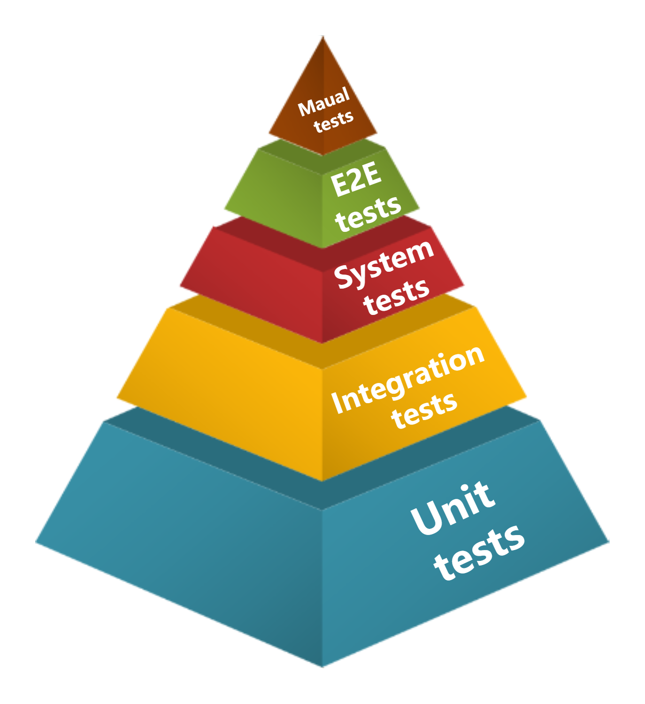
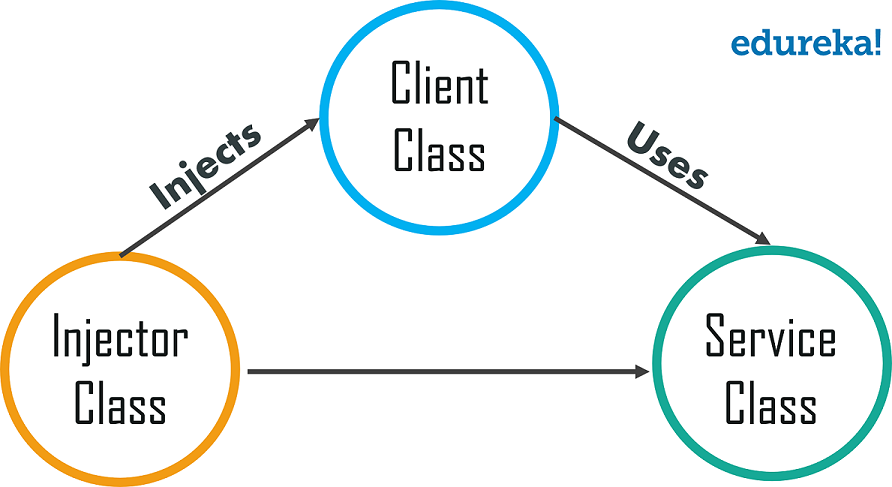

# **:test_tube: Test**

## **Types of Tests**

There are four major types of `tests`. You can see their relations in the diagram below:

{width="50%", : .center}

???+note "Definitions"

    === "Unit tests"

        * **Formula:** $A$
        * **Explanation:** test the function of the **smallest functional unit** `A`. Each unit is independent.
        * **Note:** `Code coverage`: for **quantity**, measure how much of the original code has been tested.

    === "Integration tests"

        * **Formula:** $A\supset B$ or $A\rightarrow B$
        * **Explanation:** test the function of the **parent function** `A` including `B`. 
        * **Note:** Test `A` individually needs `dependency injection`. Test `B` individually can just use `unit test`.

        {width="50%", : .center}
        
    === "System tests"

        * **Formula:** $A\supset B + C$
        * **Explanation:** test object: Some **system function** from **frontend** `C` to **backend** `A`. 
        * **Note:** The `system test` is the same as `UI test`, which focuses on some <u>system functions</u>.

    === "E2E tests"

        * **Formula:** $U_{Frontend} + U_{Backend}$
        * **Explanation:** End to end tests. From **frontend** to **backend** for {==all==} the system functions. 
        * **Note:** One specific `E2E test` or a few `E2E tests` specific to some feature **is classified into** `system tests`.

    === "Manual tests"

        * **Formula:** $\forall \{A|A\in U_{Frontend}\} + \{C|C\in U_{Backend}\}$
        * **Explanation:** **manual** and **arbitrary** tests from customers or maintainers.

## **Syntax of Tests**

???+note "Tests syntax"

    1. **Given:** setup & assumptions
    2. **When:** thing that actually be tested
    3. **Then:** assertions (what do you expect)

### **References:**

- [Picture Resource 1](https://www.edureka.co/blog/wp-content/uploads/2019/06/Types-of-Classes-What-is-Dependency-Injection-Edureka.png)