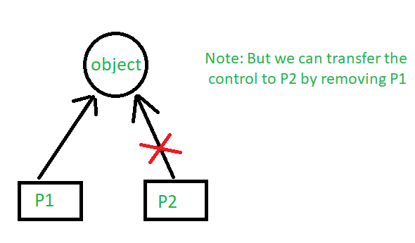
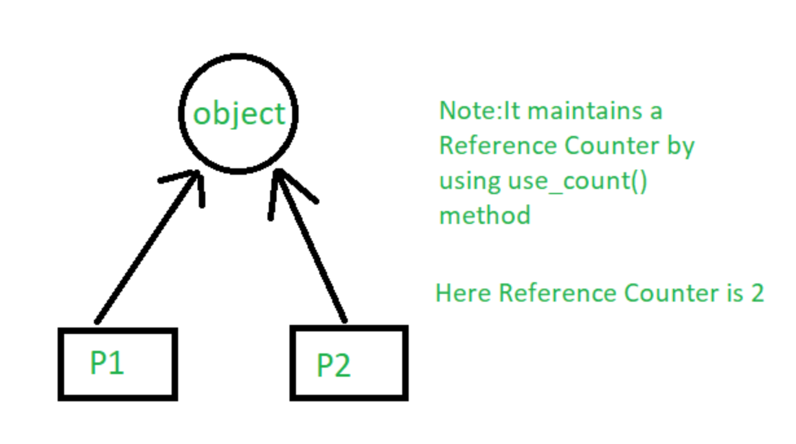
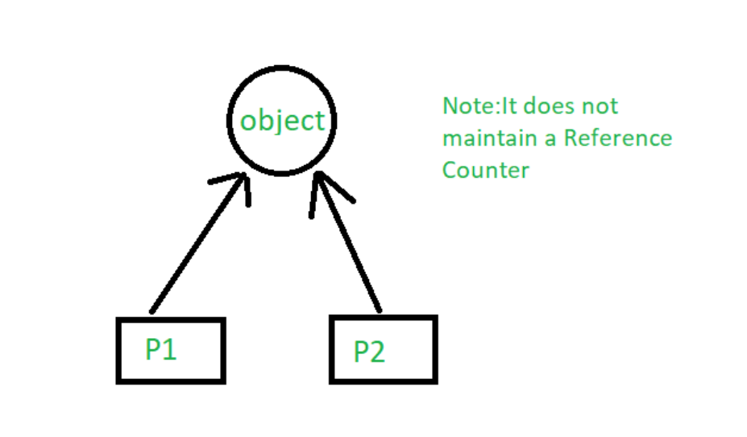

# **:simple-cplusplus: Smart Pointer**

## **Smart pointer**

`Smart pointer` were first popularized during the first half of the 1990s. However, it has been refined by `C++ 11`. Let's learn this modern C++ feature!

## **Benifits**

???+success "Benifits"

    Prevent memory leak. It provides **Garbage Collection Mechanisms**.

## **Theory**

???note "How? (click to unfold)"
    A `smart pointer` is a class template that you declare on the **stack**, and initialize by using a **raw pointer** that points to its heap-allocated object. 
    
    After the `smart pointer` is initialized, it owns the **raw pointer**. This means that the smart pointer is responsible for **deleting** the memory that the raw pointer specifies.

    The `smart pointer` destructor <u>**contains** the call to delete, and because the smart pointer is declared on the stack, its destructor is invoked when the smart pointer goes out of scope, even if an exception is thrown somewhere further up the stack.</u>


## **Glance**

???+question "Pseudo Comparison"

    ```cpp title="comparison.cpp"
    void UseRawPointer()
    {
        // Using a raw pointer -- not recommended.
        Song* pSong = new Song(L"Nothing on You", L"Bruno Mars"); 

        // Use pSong...

        // Don't forget to delete!
        delete pSong;   
    }


    void UseSmartPointer()
    {
        // Declare a smart pointer on stack and pass it the raw pointer.
        unique_ptr<Song> song2(new Song(L"Nothing on You", L"Bruno Mars"));

        // Use song2...
        wstring s = song2->duration_;
        //...

    } // song2 is deleted automatically here.
    ```

## **Details**

???+question "Library?"

    Defined in `<memory>` header file.

    ```cpp title="head.cpp"
    #include <memory>
    ```

???+question "Types?"

    There are three types of `smart pointers`:

      1. [unique_ptr](#unique_ptr)
      2. [shared_ptr](#shared_ptr)
      3. [weak_ptr](#weak_ptr)

### **unique_ptr**
???+note "unique_ptr"

    `unique_ptr` stores **one pointer only**. We can assign a different object by removing the current object from the pointer. Notice the code below. First, the unique_pointer is pointing to `P1`. But, then we remove `P1` and assign `P2` so the pointer now points to `P2`.

    {width="60%", : .center} 

    ```cpp title="unique_ptr.cpp"
    #include <iostream>
    #include <cassert>
    using namespace std;
    #include <memory>
    
    class Rectangle {
        int length;
        int breadth;
    
    public:
        Rectangle(int l, int b){
            length = l;
            breadth = b;
        }
    
        int area(){
            return length * breadth;
        }
    };
    
    int main(){
    
        unique_ptr<Rectangle> P1(new Rectangle(10, 5));
        assert(P1->area()==50); // This'll print 50
    
        // unique_ptr<Rectangle> P2(P1);
        unique_ptr<Rectangle> P2;
        P2 = move(P1);
        assert(P2->area()==50);// This'll print 50
    
        // This'll give an error,
        //assert(P1->area()==50);
        return 0;
    }
    ```

### **shared_ptr**
???+note "shared_ptr"

    By using `shared_ptr` more than one pointer can point to this one object at a time. It’ll maintain a Reference **Counter** using `use_count()` method. 

    {width="60%", : .center} 

    ```cpp title="shared_ptr.cpp"  
    #include <iostream>
    #include <cassert>
    using namespace std;
    #include <memory>
    
    class Rectangle {
        int length;
        int breadth;
    
    public:
        Rectangle(int l, int b)
        {
            length = l;
            breadth = b;
        }
    
        int area()
        {
            return length * breadth;
        }
    };
    
    int main()
    {
    
        shared_ptr<Rectangle> P1(new Rectangle(10, 5));
        // This'll print 50
        assert(P1->area()==50);
    
        shared_ptr<Rectangle> P2;
        P2 = P1;
    
        // This'll print 50
        assert(P2->area()==50);
    
        // This'll now not give an error,
        assert(P1->area()==50);
    
        // This'll also print 50 now
        // This'll print 2 as Reference Counter is 2
        assert(P1.use_count()==2);
        return 0;
    }
    ```

### **weak_ptr**
???+note "weak_ptr"

    `weak_ptr` is much more similar to [`shared_ptr`](#shared_ptr) except it’ll NOT maintain a Reference Counter. 
    
    In this case, a pointer will not have a stronghold on the object. The reason is, if suppose pointers are holding the object and requesting for other objects then they may form a **Deadlock**. 

    {width="60%", : .center} 


### **References:**

- [Smart pointers (Modern C++)](https://learn.microsoft.com/en-us/cpp/cpp/smart-pointers-modern-cpp?view=msvc-170)

- [Smart Pointers in C++ and How to Use Them](https://www.geeksforgeeks.org/smart-pointers-cpp/)