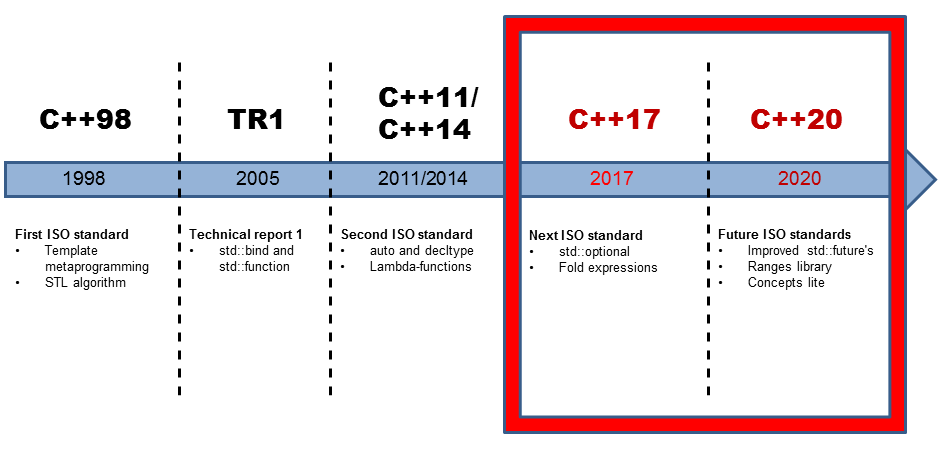
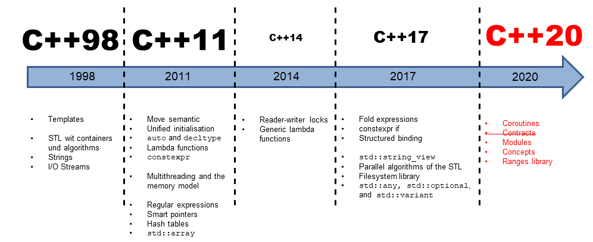

# **:simple-cplusplus: C++ 11/14/17/20**

{width="60%", : .center}   
{width="60%", : .center}     

### **:book: Table of contents**

1. [C++11](C++11/README.md)

2. [C++14](C++14/README.md)
   
3. [C++17](C++17/README.md)

4. [C++20](C++20/README.md)

### **References:**

- [Functional in C++17 and C++20](https://www.modernescpp.com/index.php/functional-in-c-17-and-c-20)