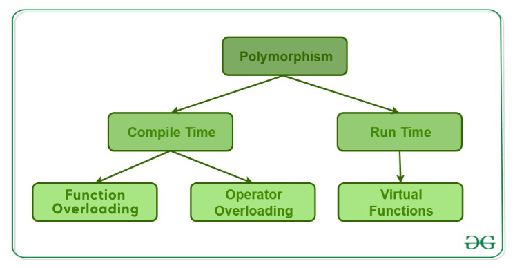

# **:simple-cplusplus: OOP concepts**

> This material is for listing different OOP concepts:

> - [**Inheritance**](#inheritance)
> - [**Polymorphism**](#polymorphism)
> - [**Encapsulation**](#encapsulation)
> - [**Interface**](#interface)
> - [**Abstract class**](#abstract-class)
> - [**Virtual function**](#virtual-function-method)
> - [**Overloading**](#overloading)
> - [**Overriding**](#overriding)
> - [**Compile & Run time**](#compile--run-time)
> - [**Static methods and variables**](#static-methods-and-variables)


### **Inheritance**

???+Note "`Inheritance`"

    A **mechanism** in OOP that allows `subclass(derived class)` to inherit properties and methods from a `parent class(base class)`. And it can add new properties and methods or override the old class's methods

    * **Usage:** `Subclasses` can inherit <u>public</u> and <u>protected</u> members from the `parent class`, but NOT <u>private</u> members.

    * **Advantages:** It is an important way of <u>code reuse</u>. (for avoiding duplicates, organizing code structure, and improving code readability and maintainability).

### **Polymorphism**

???+Note "`Polymorphism`"

    The **ability** of different objects to respond to the same message in different ways.

    * **Usage:** method [overloading](#overloading), method [overriding](#overriding), [interface](#virtual-function--interface) implementation, and more. 

    * **Advantages:** Improve code <u>flexibility and extensibility</u>, reduce code <u>repetition</u>, and better adhere to the <u>open-closed principle</u>.

    {width="80%", : .center}  


### **Encapsulation**

???+Note "`Encapsulation`"

    A **mechanism** for combining <u>data</u> and <u>methods</u> together as a single entity (class) and controls access to these data and methods through a public [interface](#virtual-function--interface).

    * **Usage:** By encapsulating, the internal details of an object can be hidden, and only the interface exposed to the outside world can be used.

    * **Advantages:** Improve code <u>security and reliability</u>, reduce unnecessary <u>coupling</u>, and make code more <u>maintainable</u> and easier to <u>extend</u>.

### **Interface**

???+Note "`Interface`"

    An **abstract type** defines a <u>standard specification</u> for a <u>set of methods</u> WITHOUT providing an implementation.

    * **Usage:** Interfaces allow different classes to implement the same methods with specific implementation.

    * **Advantages:** Improve code <u>flexibility</u> and <u>extensibility (code decoupling)</u>.

    ```cpp
    /*an interface declaration*/
    class InterfaceClass{
        public:
            virtual void method_first() = 0 ; // declaring a pure virtual method by assigning 0
            virtual void method_second() = 0;
    };
    ```
    === "Interface class"

        Satisfy: 

          1. has all methods declared as pure virtual methods.
          2. has no variable declaration.

    === "Abstrac class"

        Satisfy: 

          3. must have at least one pure virtual method.
          4. can have implemented methods.
          5. can have variables declaration.


### **Abstract class**

???+Note "`Abstract class`"

    A **class** that CANNOT be <u>instantiated</u> and defines some methods without implementation.

    * **Usage:** Its main purpose is to allow derived classes to implement these methods, thus achieving [polymorphism](#polymorphism). 
  
      * Subclasses must <u>implement all</u> the abstract methods in the abstract class, otherwise, the subclass must also be an abstract class.
      * The abstract class <==> contains at least one abstract method ([pure virtual function](#virtual-function)).
    * **Advantages:** Provide <u>standard</u>. (Provide a template and standard for subclasses to ensure that subclasses implement the methods and properties defined in the abstract class.)

    ```cpp
    #include <string>
    #include <iostream>

    /*Declaring an abstract class*/
    class AbstractClass{
        public:
            AbstractClass(std::string msg): message(msg){}
            virtual void method_first() = 0; // a pure virtual method
            virtual void method_second(){   // implemented virtual method
                std::cout << message << std::endl;
            }

        private:
            std::string message;    
    }; 
    ```
### **Virtual function (method)**

???+Note "`Virtual function (method)`"

    - `Abstract methods`: are **pure virtual methods**, which have no actual code in them, and (non-abstract) subclasses **HAVE TO override** the method.
    - `Virtual methods`: can have code, which is usually a default implementation of something, and any subclasses CAN **override** the method using the override modifier and provide a custom implementation to achieve [polymorphism](#polymorphism).

    ```cpp
    virtual void method_first() = 0; // a pure virtual method
    virtual void method_second(){   // implemented virtual method
        std::cout << message << std::endl;
    }
    ```

### **Overloading**

???+Note "`Overloading`"
        
    A **concept** specifies more than one definition for a <u>function name</u> or an <u>operator</u> in the same scope, which is called `function overloading` and `operator overloading` respectively. 

    * **Usage:** when a program calls a method with the same name, the <u>compiler</u> automatically matches and calls the corresponding method based on the differences in parameter types and numbers. 

    * **Advantages:** make the code more <u>concise and flexible</u>, reducing code <u>duplication and redundancy</u>.

    === "Function overloading"

        ```cpp title="function_overloading.cpp"
        #include <iostream>
        using namespace std;

        class printData {
           public:
              void print(int i) {
                cout << "Printing int: " << i << endl;
              }
              void print(double  f) {
                cout << "Printing float: " << f << endl;
              }
              void print(char* c) {
                cout << "Printing character: " << c << endl;
              }
        };

        int main(void) {
           printData pd;

           // Call print to print integer
           pd.print(5);

           // Call print to print float
           pd.print(500.263);

           // Call print to print character
           pd.print("Hello C++");

           return 0;
        }
        ```
    === "Operator overloading"

        ```cpp title="operator_overloading.cpp"
        #include <iostream>
        using namespace std;

        class Point {
            public:
                int x, y;

                Point operator+ (const Point& other) {
                    Point result;
                    result.x = x + other.x;
                    result.y = y + other.y;
                    return result;
                }
        };

        int main() {
            Point p1, p2, p3;

            p1.x = 5;
            p1.y = 10;

            p2.x = 3;
            p2.y = 2;

            // Add two Point objects using operator overloading
            p3 = p1 + p2;

            cout << "Result of point addition: (" << p3.x << ", " << p3.y << ")" << endl;

            return 0;
        }
        ```

### **Overriding**

???+note "Overrding"

    A **concept** refers to redefining a method inherited from a base class in a derived class. 
    
    * **Usage:** 
      - The overriding method has the same <u>signature</u> (name, parameters, and return type) as the base class method but can have a <u>different implementation</u>.
      - When a program calls a same-named method of a subclass object, it <u>first looks</u> for an implementation of the method in the subclass. If an implementation exists, it calls the method in the subclass. If there is no implementation, it continues to look for the method in the parent class. 

    ```cpp
    // C++ program to demonstrate function overriding
    // by calling the overridden function
    // of a member function from the child class
    
    #include <iostream>
    using namespace std;
    
    class Parent {
    public:
        void GeeksforGeeks_Print()
        {
            cout << "Base Function" << endl;
        }
    };
    
    class Child : public Parent {
    public:
        void GeeksforGeeks_Print()
        {
            cout << "Derived Function" << endl;
    
            // call of overridden function
            Parent::GeeksforGeeks_Print();
        }
    };
    
    int main()
    {
        Child Child_Derived;
        Child_Derived.GeeksforGeeks_Print();
        return 0;
    }
    ```
    <button id="open-window-btn" onclick="toggleWindow()">Open Mini Compiler</button>

### **Compile & Run time**

### **Static methods and variables**


#### **Reference**

- [Picture resource 1](https://www.geeksforgeeks.org/cpp-polymorphism/)
- [OpenAI](https://chat.openai.com/chat)
- [Abstract class vs Interface in C++](https://manishs-kth.medium.com/abstract-class-vs-interface-in-c-d1702d2c193e)
- [C++ Overloading (Operator and Function)](https://www.tutorialspoint.com/cplusplus/cpp_overloading.htm)


<head>
  <title>C++ Code Compiler</title>
  <link rel="stylesheet" href="https://github.com/codemirror/CodeMirror/blob/master/addon/edit/closetag.js">
  <link rel="stylesheet" href="https://cdnjs.cloudflare.com/ajax/libs/codemirror/5.62.0/theme/abcdef.min.css">
  <link rel="stylesheet" href="https://cdnjs.cloudflare.com/ajax/libs/codemirror/5.62.0/codemirror.min.css" />
  <script src="https://cdnjs.cloudflare.com/ajax/libs/codemirror/5.62.0/codemirror.min.js"></script>
  <script src="https://cdnjs.cloudflare.com/ajax/libs/codemirror/5.62.0/mode/clike/clike.min.js"></script>
  <style>
    .CodeMirror-cursor {
      border-left: 1px solid black;
      animation: blink 1s linear infinite;
    }
    @keyframes blink {
      0% {
        opacity: 1;
      }
      50% {
        opacity: 0;
      }
      100% {
        opacity: 1;
      }
    }
    .CodeMirror {
      font-family: monospace;
      font-size: 14px;
    }
    .CodeMirror-line{
      background-color: rgba(1,1,1,0.5);
    }
    .CodeMirror-vscrollbar {
      background-color: #f1f1f1;
    }

    .CodeMirror-vscrollbar-filler {
      background-color: #f1f1f1;
    }

    .CodeMirror-vscrollbar-handle {
      background-color: #888;
      border-radius: 5px;
    }
    #floating-window .mini-title {
      position: fixed;
      width: 100%;
      cursor: move;
      z-index: 9998;
    }
    .CodeMirror-vscrollbar-handle:hover {
      background-color: #555;
    }
    #floating-window {
      position: fixed;
      top: 70px;
      bottom: 0;
      right: 20px;
      height: 75%;
      width: 500px;
      min-height: 200px;
      max-height: 100%;
      background-color: rgba(1,1,1,0.3);
      border-radius: 5px;
      box-shadow: 0 0 10px rgba(0,0,0,0.3);
      z-index: 9999;
      display: none;
      overflow-y: auto;
      resize: none;
    }

    .resize-handle {
      position: absolute;
      width: 10px;
      height: 10px;
      bottom: 0;
      right: 0;
      cursor: nwse-resize;
      z-index: 10;
      background-color: rgba(0, 0, 0, 0.3);
    }
    #floating-window input[type="text"],
    #floating-window textarea {
      display: block;
      margin-bottom: 10px;
      width: 100%;
      height: 100px;
      padding: 10px;
      font-size: 14px;
      line-height: 1.5;
      border-radius: 5px;
      border: 1px solid #ccc;
      resize: none;
      background-color: rgba(1,1,1,0.5);
    }
    #floating-window button {
      display: block;
      margin: 10px auto;
      padding: 10px 20px;
      background-color: rgba(1,1,1,1);
      color: white;s
      border: none;
      border-radius: 5px;
      font-size: 16px;
      cursor: pointer;
      box-shadow: 0 0 10px rgba(0,0,0,0.3);
    }
    #floating-window button:hover {
      background-color: #0052cc;
    }
    #floating-window #code-editor {
      height: 100px;
    }
    #open-window-btn{
      display: block;
      padding: 10px 20px;
      background-color: rgba(1,1,1,1);
      color: white;
      border: none;
      border-radius: 5px;
      font-size: 16px;
      cursor: pointer;
      box-shadow: 0 0 10px rgba(0,0,0,0.3);
    }
    #open-window-btn:hover {
      background-color: #0052cc;
    }
    #output::placeholder {
      color: #ABCDEF;
    }
    #input::placeholder {
      color: #ABCDEF;
    }
    #floating-window::-webkit-scrollbar {
    width: 10px;
    }

    #floating-window::-webkit-scrollbar-track {
    background-color: #f1f1f1;
    }

    #floating-window::-webkit-scrollbar-thumb {
      background-color: #888;
      border-radius: 5px;
      border: 2px solid #f1f1f1;
    }

    #floating-window::-webkit-scrollbar-thumb:hover {
      background-color: #555;
    }

  </style>
</head>
<body>
    <!--<button id="open-window-btn" onclick="toggleWindow()">
       Open Mini Compiler
    </button>-->
    <div id="floating-window">
        <h3 class = "mini-title" style="margin: 0; padding: 10px; background-color: #000000; color: white; border-top-left-radius: 5px; border-top-right-radius: 5px;">C++ Code Compiler</h3>
        <div style="padding: 10px;">
            <label for="input" style="display: block; margin-bottom: 5px; font-weight: bold;">Input:</label>
            <textarea id="input" style="color: white;" name="input" placeholder="(Optional) Enter input here..." rows="4"></textarea>
            <label for="code-editor" style="display: block; margin-top: 10px; margin-bottom: 5px; font-weight: bold;">Code:</label>
            <textarea id="code-editor" placeholder="Enter C++ code here..." rows="5"></textarea>
            <button onclick="compileCode()">Compile</button>
            <div id="output">
                <label for="output" style="display: block; margin-bottom: 5px; font-weight: bold;">Output:</label>
                <textarea id="output" style="color: white;" name="output" placeholder="Output will be displayed here" rows="4" readonly></textarea>
            </div><div class="resize-handle"></div>
        </div>
    </div>
    <script>
        var isDragging = false;
        var isResizing = false;
        var mouseX = 0;
        var mouseY = 0;
        var windowX = 0;
        var windowY = 0;

        var floatingWindow = document.getElementById('floating-window');

        floatingWindow.addEventListener('mousedown', function(e) {
          if (e.target.classList.contains('resize-handle')) {
            isResizing = true;
            mouseX = e.clientX;
            mouseY = e.clientY;
          } 
          else if (e.target.classList.contains('mini-title')) {
            isDragging = true;
            windowX = floatingWindow.offsetLeft;
            windowY = floatingWindow.offsetTop;
            mouseX = e.clientX;
            mouseY = e.clientY;
          }
        });
        
        document.addEventListener('mousemove', function(e) {
          if (isDragging) {
            var deltaX = e.clientX - mouseX;
            var deltaY = e.clientY - mouseY;
            floatingWindow.style.left = (windowX + deltaX) + 'px';
            floatingWindow.style.top = (windowY + deltaY) + 'px';
          } else if (isResizing) {
            var deltaX = e.clientX - mouseX;
            var deltaY = e.clientY - mouseY;
            floatingWindow.style.width = (floatingWindow.offsetWidth + deltaX) + 'px';
            floatingWindow.style.height = (floatingWindow.offsetHeight + deltaY) + 'px';
            mouseX = e.clientX;
            mouseY = e.clientY;
          }
        });
        
        document.addEventListener('mouseup', function(e) {
          isDragging = false;
          isResizing = false;
        });
    </script>
    <script>
        // Edit arguments for CodeMirror
        var editor = CodeMirror.fromTextArea(document.getElementById("code-editor"), {
            lineNumbers: true,
            mode: "text/x-c++src",
            theme: "abcdef", // Set the theme to Monokai
            autoCloseTages: true
        });
        editor.setOption('theme', 'abcdef');
        editor.refresh();
        
        function toggleWindow() {
            var window = document.getElementById("floating-window");
            if (window.style.display === "none") {
                window.style.display = "block";
            } else {
                window.style.display = "none";
            }
        }
        // Event listener for paste event
        document.addEventListener('paste', function(event) {
            // Check if code editor has focus
            //if (editor.hasFocus()) {
                // Get the selected text from the clipboard
                var selectedText = event.clipboardData.getData('text');
                // Paste the selected text into the editor
                editor.replaceSelection(selectedText);
                // Prevent the default paste behavior
                event.preventDefault();
            //}
        });
        // RESTful API response
        async function compileCode() {
          var code = editor.getValue();
          var input = document.getElementById("input").value;
          var response = await fetch('https://coliru.stacked-crooked.com/compile', {
            method: 'POST',
            headers: {
              'Content-Type': 'application/json'
            },
            body: JSON.stringify({
              cmd: 'g++ -std=c++17 -O2 -Wall -pedantic -pthread main.cpp && ./a.out',
              src: code,
              input: input
            })
          });
        if (response.ok) {
            if (response.headers.get("content-type").includes("application/json")) {
                var result = await response.json();
                if (result.execResult) {
                    var output = "Compiled output: " + result.execResult.stdout;
                    document.getElementById("output").innerHTML = output;
                } else {
                    document.getElementById("output").innerHTML = "Error compiling code. Please try again.";
                }
            } else {
                var output = await response.text();
                var lines = output.split("\n");
                var formattedOutput = "";
                for (var i = 0; i < lines.length; i++) {
                  formattedOutput += lines[i] + "<br/>";
                }
                document.getElementById("output").innerHTML = formattedOutput;
            }
        } else {
            document.getElementById("output").innerHTML = "Error of Response, 404, Please check .";
        }
            }
    </script>
</body>

