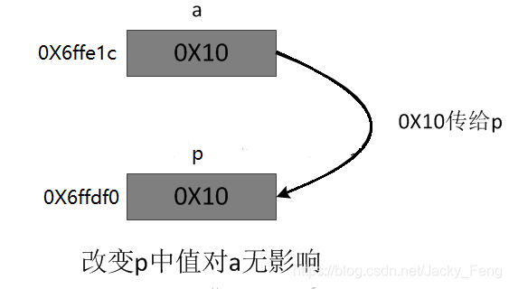
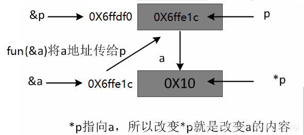
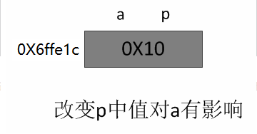

# **:simple-cplusplus: Pointer and Reference**

> This material is focusing on describing the difference when **passing parameters**


## **Definition difference**

???+note "Definition diff?"

    === "Definition"
        - A `pointer` is a variable, except that the variable stores an **address** that points to a storage unit in memory.
        - A `reference` is essentially the **same thing** as the original variable, just an **alias** for the original variable

    === "Variability"
        - The value of the `pointer` is **changeable** after initialization
        - A `reference` can only be initialized once in a definition. Then it **cannot be changed**.

    === "Const"
        - Const pointer: `int* const a`
        - **No** const reference: no `int& const a`
        - We can have a const referred value： `const int& a`

    === "NULL"
        - `Pointer`'s value can be `NULL`.
        - `Reference`'s value cannot be `NULL`. {==References must be initialized when they are defined==}

    === "sizeof"
        - `Pointer`: the size of pointer.
        - `Reference`': the size of referred variable.

    === "++"
        ```cpp
        int a[2] = {0,10}
        int *pa =a；pa++   //now pa == a[1] == 10;
        int &pa =a；pa++   //now pa == a[0] == 1;
        ```
    === "Safety"
        - `Pointer` is **not** type safe
        - `Reference` is type safe since it has **type checking**

    === "Layers"
        - `Pointer` can have several layers such as `int** p`
        - `Reference` **can not** have several layer such as `int&& p` 

## **Parameter passing diff**

### **Pass by value**

???+question "What is pass by value?"

    -  When <u>calling function</u> passes parameter in <u>called function</u>, `stack` will open up a new space for storing a **memory copy** of the {==value==} of `actual parameter` from the <u>calling function</u>.

    - Any operation in the <u>called function</u> on a formal parameter is performed as a **local variable** since you are using the copied value. It **does not** affect the value of the `actual parameter` of the main <u>calling function</u>.


    ```cpp title="value.cpp" hl_lines="4 16 22 25"
    #include<iostream>
    using namespace std;
    
    void Rfun(int p) // Called function: copy the value from "a"
    {
    	cout<<"local p's address:"<<&p<<endl;         //0x6ffdf0
    	cout<<"local p's value:"<<p<<endl;            //16
    	p=0Xff;
    }
    
    int main()
    {
    	int a=0x10;
    	cout<<"a's address:"<<&a<<endl;               //0x6ffe1c
    	cout<<"a's value:"<<a<<endl;                  //16
    	Rfun(a);     // Calling function: passing a's value
    	cout<<"a's now address:"<<a<<endl;            //16
    }

    >>>
    a's address:0x7ffd8a777d04
    a's value:16
    local p's address:0x7ffd8a777cec
    local p's value:16
    a's now address:16
    ``` 

    {width="50%", : .center}  


### **Pointer passing**

???+note "Pointer passing"

    `Pointer parameter passing` is essentially [`Pass by value`](#pass-by-value). It passes an {==address as value==}. 

    ```cpp title="pointer.cpp" hl_lines="4 24 35 36"
    #include<iostream>
    using namespace std;

    void Pfun(int* p) // Called function: copy the address value from "a"
    {
        //new address for storing address value passed by "a"
    	cout<<"local p's address:"<<&p<<endl;         //0x6ffdf0
    	cout<<"local p's value:"<<p<<endl;            //0x6ffe1c

        //test if p points to a's value
    	cout<<"local p's pointing value:"<<*p<<endl;  //16
    	*p=0Xff;

        //test if p will affect "a"'s address value
        p++;
        cout<<"local p's updated value:"<<p<<endl;    //0x6ffe1d
    }

    int main() 
    {
    	int a=0x10;
        cout<<"a's address:"<<&a<<endl;               //0X6ffe1c
    	cout<<"a's value:"<<a<<endl;                  //16
    	Pfun(&a);   // Calling function: passing a's address
        cout<<"a's now address:"<<&a<<endl;           //0X6ffe1c
    	cout<<"a's now value:"<<a<<endl;              //255
    }

    <<<
    a's address:0x7ffd233a9854
    a's value:16
    local p's address:0x7ffd233a9838
    local p's value:0x7ffd233a9854
    local p's pointing value:16
    local p's updated value:0x7ffd233a9858
    a's now address:0x7ffd233a9854
    a's now value:255
    ```

    {width="50%", : .center}  


### **Reference passing**

???+note "Reference passing"

    -  When <u>calling function</u> passes parameter in <u>called function</u>, `stack` will open up a new space for storing a **memory copy** of the {==address==} of `actual parameter` from the <u>calling function</u>.

    - Any operation in the <u>called function</u> on a formal parameter will affect the value of the `actual parameter` since you are tracking and editing the content in the same address.

    ```cpp title="reference.cpp" hl_lines="4 16 22 25"
    #include<iostream>
    using namespace std;
    
    void Rfun(int &p)
    {
    	cout<<"local p's address:"<<&p<<endl;         //0x6ffdf0
    	cout<<"local p's value:"<<p<<endl;            //16
    	p=0Xff;
    }
    
    int main()
    {
    	int a=0x10;
    	cout<<"a's address:"<<&a<<endl;               //0x6ffe1c
    	cout<<"a's value:"<<a<<endl;                  //16
    	Rfun(a);
    	cout<<"a's now address:"<<a<<endl;            //255
    }

    >>>
    a's address:0x7ffebbcabd44
    a's value:16
    local p's address:0x7ffebbcabd44
    local p's value:16
    a's now address:255
    ``` 

    {width="40%", : .center}  


#### **Reference**

[Picture source 1](https://blog.csdn.net/Jacky_Feng/article/details/103248186)