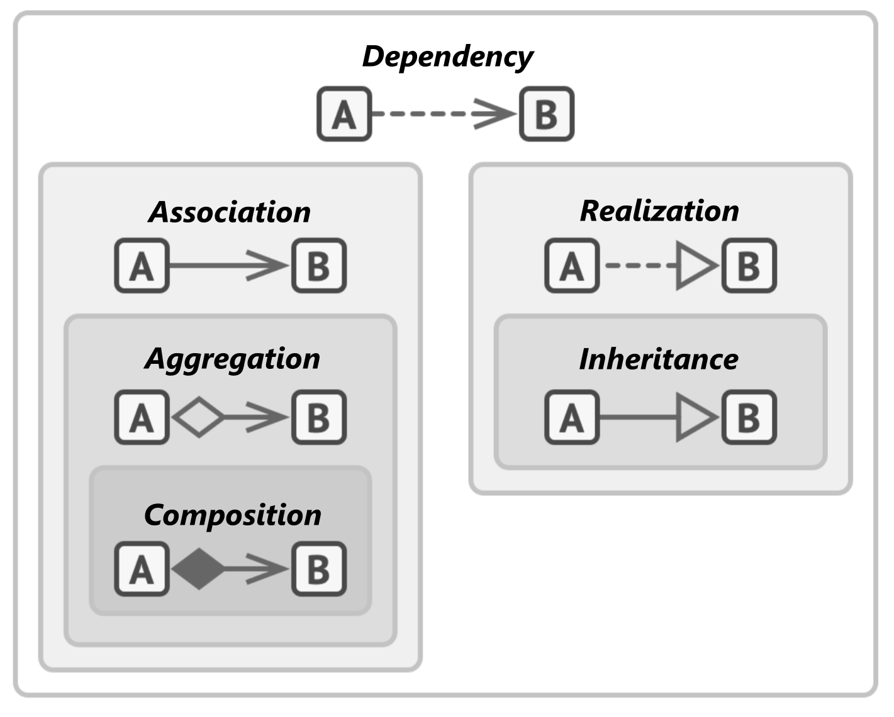

# ** :simple-matternet: UML & Object relationships**

> Let's see how to express OOP by using UML class diagram. With UML we then import the relationship between classes.

- [**UML**](#uml)
    - [**1.1 Classes**](#11-classes)
    - [**1.2 Visibility**](#12-visibility)
    - [**1.3 Multiplicity on relations**](#13-multiplicity-on-relations)
    - [**1.4 Annotations on classes**](#14-annotations-on-classes)
- [**Object relationships**](#object-relationships)


## **UML**

`Unified Modeling Language (UML)` is a type of static structure diagram used to show the structure of a system, including:
- Classes
- Attributes (Properties)
- Methods (Operations)
- Relationships (between objects)

### **1.1 Classes**

???+question "How to express `class`?"

    A `class` in `UML` should encapsulate the **class name**, **state** (attributes), and **behavior** (methods).
    
    ```cpp
    class BankAccount{
        public:
            int m_ownerID;
            float m_balance;
        public:
            int Deposit(int amount){...};
            int Withdrawal(int ID){...};
    }
    ```
    Let's say we have a class as above; then we can show the **diagram** below (w/o <u>signature</u>):

    === "Class with signature"

        ``` mermaid
        classDiagram
            class BankAccount{
                +m_ownerID : int
                +m_balance : float
                +Deposit(amount : int) int
                +Withdrawal(amount : int) int
            }
        ```

    === "Class without signature"
    
        ``` mermaid
        classDiagram
            class BankAccount
            BankAccount : +m_ownerID
            BankAccount : +m_balance
            BankAccount : +Deposit()
            BankAccount : +Withdrawal()
        ```

### **1.2 Visibility**

???+question "How to set visibility of attribute and method?"

    We can change the symbol before the attributes or methods as below:

    - `+` denotes `public` attributes or method
    - `-` denotes `private` attributes or method
    - `#` denotes `protected` attributes or method
  
    ```cpp
    class BankAccount{
        private:
            int m_ownerID;
        protect:
            float m_balance;
        public:
            int m_age;

    }
    ```
    Let's say we have a class as above; then we can show the **diagram** below (w/o <u>signature</u>):

    ``` mermaid
    classDiagram
        class BankAccount{
            -m_ownerID : int
            #m_balance : float
            +m_age : int
        }
    ```
### **1.3 Multiplicity on relations**

???+question "How to express multiplicity between classes?"

    **Multiplicity **or** cardinality** in class diagrams indicates the <u>number of instances</u> of one class that can be linked to an instance of the other class.

    The different cardinality options are :

    - `1` Only 1
    - `0..1` Zero or One
    - `1..*` One or more
    - `*` Many
    - `n n`
    - `0..n` zero to n
    - `1..n` one to n
    
    ``` mermaid
    classDiagram
        direction TB
        Customer "1" --> "*" Ticket
        Student "1" --> "1..*" Course
        Galaxy --> "many" Star : Contains
    ```

### **1.4 Annotations on classes**

???+question "How to add annotations on classes?"

    Some common annotations include:

    - `<<Interface>>` To represent an Interface class
    - `<<Abstract>>` To represent an abstract class
    - `<<Service>>` To represent a service class
    - `<<Enumeration>>` To represent an enum


    ``` mermaid
    classDiagram
        direction TB
        class A{
            <<interface>>
        }
        class B{
            <<Abstract>>
        }

        class C{
            <<Service>>
        }

        class D{
            <<Enumeration>>
        }
    ```

## **Object relationships**

Now we have the `UML` diagram as a tool for visualizing relationships. Let's look at the **relationships** between objects.

???+question "How to express relationships between classes?"
    
    {width="60%", : .center}  

    Below are all the **relationships** used among classes.

    === "Dependency"

        - **Intuition:** The behavior of one object depends on another object.

        - **Iff:** `class A` depends on `class B` (The edition of `class B` will affect `class A`).

        - **E.g:** A car (`A`) needs to have tires, an engine, and oil (`B`) to work correctly.
  
        ``` mermaid
        classDiagram
            direction LR
            classA ..> classB : Dependency
        ```
    === "Association"
        - **Intuition:** The relationship among multiple objects.

        - **Iff:**  `class A` depends on `class B`
          
            - `object A` can visit info in `object B`

        - **E.g:** An order form (`A`) associated with one customer object and multiple product objects (`B`).

        ``` mermaid
        classDiagram
            direction LR
            classA --> classB: Association
        ```
    === "Aggregation"
        - **Intuition:** The relationship between the whole and the parts. The parts can survive without the whole.

        - **Iff:**  `class A` depends on `class B`

            - `object A` can visit info in `object B`
            - `object A` is constructed by `object B` 
            - `object A` do not controls the {==life-circle==} of `object B`(`object B` can survive without `object A`)

        - **E.g:** An order form (`A`) associated with one customer object and multiple product objects (`B`).

        ``` mermaid
        classDiagram
            direction LR
            classA --o classB : Aggregation
        ```

    === "Composition"
        - **Intuition:** The relationship between the whole and the parts. The parts cannot survive without the whole.

        - **Iff:**  `class A` depends on `class B`

            - `object A` can visit info in `object B`
            - `object A` is constructed by `object B`
            - `object A` controls the {==life-circle==} of `object B` (`object B` can not live without `object A`)

        - **E.g:** A car (`A`) needs to have tires, an engine, and oil (`B`) to work correctly.

        ``` mermaid
        classDiagram
            direction LR
            classA --* classB : Composition
        ```

    === "Realization"
        - **Intuition:** The relationship between the interface and class implimentation.
         
        - **Iff:**  `class A` depends on `class B`
  
            - `object A` can be seen as `object B`
            - `method A` (Methods defined in class A) is declared by `interface B`

        - **E.g:** An interface (`B`) defines a set of methods that an implementation class implements (`A`).
        
        ``` mermaid
        classDiagram
            direction LR
            classA ..|> classB : Realization
        ```  
      
    === "Inheritance"
        - **Intuition:** The relationship between the interface and class implimentation.

        - **Iff:**  `class A` depends on `class B`
          
            - `object A` can be seen as `object B`
            - `class A` inherits interfaces and implementations in `class B` and can extend them.

        - **E.g:** An animal (`B`) as a parent, dogs and cats as a subclass (`A`) inherit some of the characteristics and behaviors of animals, while having their own unique characteristics and behaviors
        
        ``` mermaid
        classDiagram
            direction LR
            classA --|> classB : Inheritance
        ```


### **Reference**
-[UML Class Diagram Tutorial](https://www.visual-paradigm.com/guide/uml-unified-modeling-language/uml-class-diagram-tutorial/)