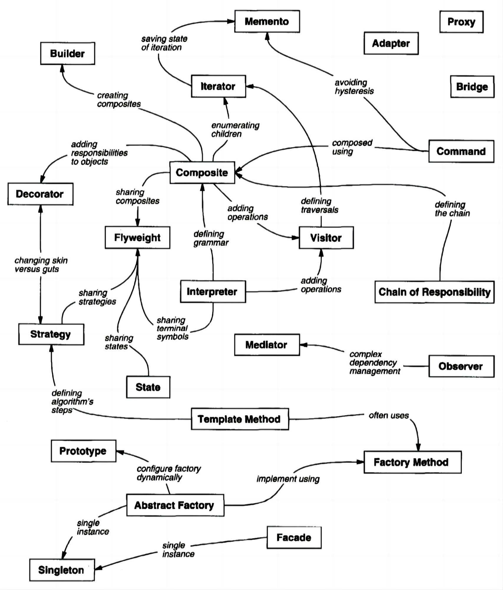

# **:simple-matternet: Desgin Patterns**

> `Design pattern` is a <u>reusable solution</u> to a commonly occurring problem in software design. It provides a general <u>framework</u> for solving a particular design problem, which can be adapted to suit the specific needs of a particular application.

Design patterns are typically classified into three categories:

=== "**Creational patterns**"

    - [**Creational patterns**](#creational-patterns)
        - [**1.1 Singleton**](#11-singleton)
        - [**1.2 Factory Method**](#12-factory-method)
        - [**1.3 Abstract Factory**](#13-abstract-factory)
        - [**1.4 Builder**](#14-builder)
        - [**1.5 Prototype**](#15-prototype)

=== "**Structural patterns**"

    - [**Structural patterns**](#structural-patterns)
        - [**2.1 Adapter**](#21-adapter)
        - [**2.2 Bridge**](#22-bridge)
        - [**2.3 Composite**](#23-composite)
        - [**2.4 Decorator**](#24-decorator)
        - [**2.5 Facade**](#25-facade)
        - [**2.6 Flyweight**](#26-flyweight)
        - [**2.7 Proxy**](#27-proxy)
        
=== "**Behavioral patterns**"

    - [**Behavioral patterns**](#behavioral-patterns)
        - [**3.1 Chain of Responsibility**](#31-chain-of-responsibility)
        - [**3.2 Command**](#32-command)
        - [**3.3 Interpreter**](#33-interpreter)
        - [**3.4 Iterator**](#34-iterator)
        - [**3.5 Mediator**](#35-mediator)
        - [**3.6 Memento**](#36-memento)
        - [**3.7 Observer**](#37-observer)
        - [**3.8 State**](#38-state)
        - [**3.9 Strategy**](#39-strategy)
        - [**3.10 Template Method**](#310-template-method)
        - [**3.11 Visitor**](#311-visitor)

The relationship among them can be seen in picture below:
{width="80%", : .center}

## **Creational patterns** 

### **1.1 Singleton**
### **1.2 Factory Method**
### **1.3 Abstract Factory**
### **1.4 Builder**
### **1.5 Prototype**

## **Structural patterns**
### **2.1 Adapter**
### **2.2 Bridge**
### **2.3 Composite**
### **2.4 Decorator**
### **2.5 Facade**
### **2.6 Flyweight**
### **2.7 Proxy**

## **Behavioral patterns**
### **3.1 Chain of Responsibility**
### **3.2 Command**
### **3.3 Interpreter**
### **3.4 Iterator**
### **3.5 Mediator**
### **3.6 Memento**
### **3.7 Observer**
### **3.8 State**
### **3.9 Strategy**
### **3.10 Template Method**
### **3.11 Visitor**
