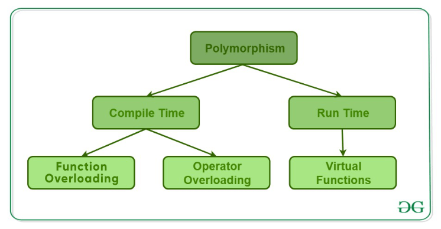

# **:simple-cplusplus: OOP concepts**

> This material is for listing different OOP concepts:

```markmap
- [**OOP**](#oop)
- [**Class and Object**](#class-and-object)
- [**Inheritance**](#inheritance)
- [**Polymorphism**](#polymorphism)
- [**Encapsulation**](#encapsulation)
- [**Interface**](#interface)
- [**Abstract class**](#abstract-class)
- [**Abstract methods & Virtual function (method)**](#abstract-methods--virtual-function-method)
- [**Overloading**](#overloading)
- [**Overriding**](#overriding)
- [**Compile & Run time**](#compile--run-time)
- [**Static methods and variables**](#static-methods-and-variables)
- [**Constructor and Destructor**](#constructor-and-destructor)
- [**Access modifier**](#access-modifier)
```

## **OOP**

???+Note "Benefits of `OOP`"

    `Object-oriented programming` has several **advantages** over procedural programming:

    - OOP is <u>faster and easier</u> to execute
    - OOP provides a <u>clear structure</u> for the programs
    - OOP helps to keep the code <u>DRY "Don't Repeat Yourself"</u>. It create full reusable applications with less code and shorter development time
    - OOP makes the code easier to <u>maintain, modify and debug</u>.

## **Class and Object**

???+Note "`Class and Object`"

    - A `class` is a **template or blueprint** for creating objects. 
        - It defines the <u>properties and behaviors</u> that an object of that class should have. 
        - A class encapsulates data and methods that operate on that data, providing a way to <u>organize and structure</u> complex programs.

    - An `object` is an **instance** of a class. 
        - When a program creates an object of a class, it <u>allocates memory</u> for that object and initializes its member variables and methods according to the class definition. 
        - Objects can <u>interact with each other</u> and with the program through their methods and public member variables.

## **Inheritance**

???+Note "`Inheritance`"

    A **mechanism** in OOP that allows `subclass(derived class)` to inherit <u>properties and methods</u> from a `parent class(base class)`. And it can add new properties and methods or override the old class's methods

    * **Usage:** `Subclasses` can inherit <u>public</u> and <u>protected</u> members from the `parent class`, but NOT <u>private</u> members. See [C++ Inheriance](../Inheritance/Inheritance) for more details.

    * **Advantages:** It is an important way of <u>code reuse</u>. (for avoiding duplicates, organizing code structure, and improving code readability and maintainability).

## **Polymorphism**

???+Note "`Polymorphism`"

    The **ability** of **methods** with the same name to behave differently (depending on the type of object they are called on or the arguments that are passed to them).

    * **Usage:** method [overloading](#overloading), method [overriding](#overriding), [interface](#virtual-function--interface) implementation, and more. 

    * **Advantages:** Improve code <u>flexibility and extensibility</u>, reduce code <u>repetition</u>, and better adhere to the <u>open-closed principle</u>.

    {width="80%", : .center}  


## **Encapsulation**

???+Note "`Encapsulation`"

    A **mechanism** for combining <u>data</u> and <u>methods</u> together as a single entity (class) and controls access to these data and methods through a public [interface](#virtual-function--interface).

    * **Usage:** By encapsulating, the internal details of an object can be hidden, and only the interface exposed to the outside world can be used.

    * **Advantages:** Improve code <u>security and reliability</u>, reduce unnecessary <u>coupling</u>, and make code more <u>maintainable</u> and easier to <u>extend</u>.

## **Interface**

???+Note "`Interface`"

    An **abstract type** defines a <u>standard specification</u> for a <u>set of methods</u> WITHOUT providing an implementation. 

    ???+Warning "`Interface` & `Type`"

        Theoretically, the <u>signature (name, parameters, and return type)</u> of all the methods declared by an object is called the `Interface` to the object. An object's `interface` characterizes the complete set of **requests** that can be sent to the object. Any request that matches a signature in the object's interface may be sent to the object [[ref. Gamma 94](http://www.javier8a.com/itc/bd1/articulo.pdf)].

        A `type` is a name used to denote a <u>particular interface</u>. We speak of an object as having the type "Window" if it <u>accepts all requests</u> for the operations defined in the interface named "Window." An object may have many types, and widely different objects can share a type.

    * **Usage:** Interfaces allow different classes to implement the same methods with specific implementation.

    * **Advantages:** Improve code <u>flexibility</u> and <u>extensibility (code decoupling)</u>.

    ```cpp
    /*an interface declaration*/
    class InterfaceClass{
        public:
            virtual void method_first() = 0 ; // declaring a pure virtual method by assigning 0
            virtual void method_second() = 0;
    };
    ```
    === "Interface class"

        Satisfy: 

          1. has all methods declared as pure virtual methods.
          2. has no variable declaration.

    === "Abstract class"

        Satisfy: 

          3. must have at least one pure virtual method.
          4. can have implemented methods.
          5. can have variables declaration.


## **Abstract class**

???+Note "`Abstract class`"

    A **class** that CANNOT be <u>instantiated</u> and defines some methods without implementation.

    * **Usage:** Its main purpose is to allow derived classes to implement these methods, thus achieving [polymorphism](#polymorphism). 
  
        * Subclasses must <u>implement all</u> the abstract methods in the abstract class, otherwise, the subclass must also be an abstract class.
        * The abstract class <==> contains at least one abstract method ([pure virtual function](#virtual-function)).
    
    * **Advantages:** Provide <u>standard</u>. (Provide a template and standard for subclasses to ensure that subclasses implement the methods and properties defined in the abstract class.)

    ```cpp
    #include <string>
    #include <iostream>

    /*Declaring an abstract class*/
    class AbstractClass{
        public:
            AbstractClass(std::string msg): message(msg){}
            virtual void method_first() = 0; // a pure virtual method
            virtual void method_second(){   // implemented virtual method
                std::cout << message << std::endl;
            }

        private:
            std::string message;    
    }; 
    ```
## **Abstract methods & Virtual function (method)**

???+Note "`Virtual function (method)`"

    - `Abstract methods`: are **pure virtual methods**, which have no actual code in them, and (non-abstract) subclasses **HAVE TO override** the method. It can only be used in an abstract class.
    - `Virtual methods`: can have code, which is usually a default implementation of something, and any subclasses CAN **override** the method using the override modifier and provide a custom implementation to achieve [polymorphism](#polymorphism).

    ```cpp
    virtual void method_first() = 0; // a pure virtual method
    virtual void method_second(){   // implemented virtual method
        std::cout << message << std::endl;
    }
    ```

## **Overloading**

???+Note "`Overloading`"
        
    A **concept** specifies more than one definition for a <u>function name</u> or an <u>operator</u> in the same scope, which is called `function overloading` and `operator overloading` respectively. 

    * **Usage:** when a program calls a method with the same name, the <u>compiler</u> automatically matches and calls the corresponding method based on the differences in parameter types and numbers. 

    * **Advantages:** make the code more <u>concise and flexible</u>, reducing code <u>duplication and redundancy</u>.

    === "Function overloading"

        ```cpp title="function_overloading.cpp"
        #include <iostream>
        using namespace std;

        class printData {
           public:
              void print(int i) {
                cout << "Printing int: " << i << endl;
              }
              void print(double  f) {
                cout << "Printing float: " << f << endl;
              }
              void print(char* c) {
                cout << "Printing character: " << c << endl;
              }
        };

        int main(void) {
           printData pd;

           // Call print to print integer
           pd.print(5);

           // Call print to print float
           pd.print(500.263);

           // Call print to print character
           pd.print("Hello C++");

           return 0;
        }
        ```
    === "Operator overloading"

        ```cpp title="operator_overloading.cpp"
        #include <iostream>
        using namespace std;

        class Point {
            public:
                int x, y;

                Point operator+ (const Point& other) {
                    Point result;
                    result.x = x + other.x;
                    result.y = y + other.y;
                    return result;
                }
        };

        int main() {
            Point p1, p2, p3;

            p1.x = 5;
            p1.y = 10;

            p2.x = 3;
            p2.y = 2;

            // Add two Point objects using operator overloading
            p3 = p1 + p2;

            cout << "Result of point addition: (" << p3.x << ", " << p3.y << ")" << endl;

            return 0;
        }
        ```

## **Overriding**

???+note "`Overrding`"

    A **concept** refers to redefining a method inherited from a base class in a derived class. 
    
    * **Usage:** 
        - The overriding method has the same <u>signature</u> (name, parameters, and return type) as the base class method but can have a <u>different implementation</u>.
        - When a program calls a same-named method of a subclass object, it <u>first looks</u> for an implementation of the method in the subclass. If an implementation exists, it calls the method in the subclass. If there is no implementation, it continues to look for the method in the parent class. 

    ```cpp
    // C++ program to demonstrate function overriding
    // by calling the overridden function
    // of a member function from the child class
    
    #include <iostream>
    using namespace std;
    
    class Parent {
    public:
        void GeeksforGeeks_Print()
        {
            cout << "Base Function" << endl;
        }
    };
    
    class Child : public Parent {
    public:
        void GeeksforGeeks_Print()
        {
            cout << "Derived Function" << endl;
    
            // call of overridden function
            Parent::GeeksforGeeks_Print();
        }
    };
    
    int main()
    {
        Child Child_Derived;
        Child_Derived.GeeksforGeeks_Print();
        return 0;
    }
    ```
    <button id="open-window-btn" onclick="toggleWindow()">Open Mini Compiler</button>

## **Compile & Run time**

???+note "`Compile & Run time`"

    - `Compile time`: the **period** when the <u>program code</u> is being translated into <u>machine code</u> by the compiler, which:
        - Checks the syntax, types, declarations, and other information in the code.
        - Generates <u>executable</u> code.
        - Compile-time exceptions are errors that occur during the compilation or translation of a program. These errors are caught by the compiler and reported to the programmer. 
            - E.g. syntax errors, type errors, and name errors.
    - `Run time`: the **period** when the program is being executed, which
        - Executes the program (executable code generated by the compiler)
        - Produces <u>output</u> based on user input and the logic of the code.
        - Runtime exceptions are errors that occur during the execution of a program. They are not caught by the compiler and may cause the program to terminate abnormally.
            - E.g. invalid input, null pointer access, and arithmetic overflow.

## **Static methods and variables**

???+note "`Static methods and variables`"

    **Methods** and **variables** that are associated with a class rather than with an instance of the class. 
    
    * **Usage:** 
        - When defining it, add `static` keyword.
        - They can be accessed directly by the class name without needing to create an instance of the class.
        - `Static variables` can be accessed in any method of the class WITHOUT creating an object instance.
        - `Static methods` cannot access instance variables, because they do not depend on the existence of an instance.

    * **Advantages:**
        - `Static variables` can be used to share data among all instances of a class.
        - `Static methods` can be used to provide some global utility functions that can be called without creating an object instance.

    ```cpp
    // The example to use static variable for counting and static method for reading the counter
    #include <iostream>
    using namespace std;

    class Employee {
        private:
            int num;
            static int count; // static variable

        public:
            Employee(int n) {
                num = n;
                count++; // increment count every time a new instance is created
            }

            static int getCount() { // static method to return count
                return count;
            }

            void getID() {
                cout << "Instance number: " << num << endl;
            }
    };

    int Employee::count = 0; // initialize static variable

    int main() {
        Employee ex1(1);
        Employee ex2(2);
        Employee ex3(3);

        ex1.getID();
        ex2.getID();
        ex3.getID();

        cout << "Total number of instances: " << Example::getCount() << endl;

        return 0;
    }
    ```
    <button id="open-window-btn" onclick="toggleWindow()">Open Mini Compiler</button>

## **Constructor and Destructor**

???+note "`Constructor and Destructor`"

    - A `constructor` is a **special function** used to <u>create objects</u>. When an <u>object is created</u>, the <u>compiler automatically</u> calls the constructor of the class to initialize the object.
    - A `destructor` is a **special function** used to <u>destroy objects</u>. When an object is destroyed, the <u>compiler automatically</u> calls the destructor of the class to clean up the object, such as releasing dynamically allocated memory. 
    * **Usage:** 
        - The `constructor` must have the <u>same name</u> as the class, <u>no return type</u> (including void), and <u>can have a parameter list</u>.
        - The `destructor` must have the <u>same name</u> as the class, with a tilde (~) in front, and <u>no return type or parameter list</u>. 

    * **Advantages:** Save coding time and system do it automatically for you.
        ```cpp
        // Without constructor
        int main() {
            Car Ford;
            Ford.model = "Mustang";
            Ford.color = "red";
            Ford.year = 1969;

            Car Opel;
            Opel.model = "Astra";
            Opel.color = "white";
            Opel.year = 2005;
        }
        // With constructor
        int main() {
            Car Ford("Mustang", "Red", 1969);
            Car Opel("Astra", "White", 2005);
        }
        ```
    ```cpp
    #include <iostream>
    using namespace std;

    class MyClass {
    public:
        // Constructor
        MyClass() {
            cout << "Constructor called." << endl;
        }

        // 析构函数
        ~MyClass() {
            cout << "Destructor called." << endl;
        }
    };

    int main() {
        // 创建对象
        MyClass obj;
        return 0;
    }
    ```
    <button id="open-window-btn" onclick="toggleWindow()">Open Mini Compiler</button>

## **Access modifier**

???+note "`Access modifier`"

    `Access modifier` is the **keyword** used to set the class member's accessibility for others (classes, fields, methods and properties).
    
    * **Usage:** See [Access modifier](../Inheritance/Inheritance/#inheritance-access).
  
    * **Advantages:**
        - Data encapsulation: Gaurantee [encapsulation](#encapsulation).
        - Behavior concealment: Create public APIs but hide it's corresponding inside behaviors in the class.


### **Reference**

- [Picture resource 1](https://www.geeksforgeeks.org/cpp-polymorphism/)
- [OpenAI](https://chat.openai.com/chat)
- [Abstract class vs Interface in C++](https://manishs-kth.medium.com/abstract-class-vs-interface-in-c-d1702d2c193e)
- [C++ Overloading (Operator and Function)](https://www.tutorialspoint.com/cplusplus/cpp_overloading.htm)
- [Design Patterns Elements of Reusable Object-Oriented Software](http://www.javier8a.com/itc/bd1/articulo.pdf)

<head>
  <title>C++ Code Compiler</title>
  <!-- Include SweetAlert2 CSS -->
  <link rel="stylesheet" href="https://cdn.jsdelivr.net/npm/sweetalert2@10.16.6/dist/sweetalert2.min.css">
  <!-- Include SweetAlert2 JS -->
  <script src="https://cdn.jsdelivr.net/npm/sweetalert2@10.16.6/dist/sweetalert2.min.js"></script>
  <link rel="stylesheet" href="https://github.com/codemirror/CodeMirror/blob/master/addon/edit/closetag.js">
  <link rel="stylesheet" href="https://cdnjs.cloudflare.com/ajax/libs/codemirror/5.62.0/theme/abcdef.min.css">
  <link rel="stylesheet" href="https://cdnjs.cloudflare.com/ajax/libs/codemirror/5.62.0/codemirror.min.css" />
  <script src="https://cdnjs.cloudflare.com/ajax/libs/codemirror/5.62.0/codemirror.min.js"></script>
  <script src="https://cdnjs.cloudflare.com/ajax/libs/codemirror/5.62.0/mode/clike/clike.min.js"></script>
  <style>
    .CodeMirror-cursor {
      border-left: 1px solid black;
      animation: blink 1s linear infinite;
    }
    @keyframes blink {
      0% {
        opacity: 1;
      }
      50% {
        opacity: 0;
      }
      100% {
        opacity: 1;
      }
    }
    .CodeMirror {
      font-family: monospace;
      font-size: 14px;
    }
    .CodeMirror-line{
      background-color: rgba(1,1,1,0.5);
    }
    .CodeMirror-vscrollbar {
      background-color: #f1f1f1;
    }

    .CodeMirror-vscrollbar-filler {
      background-color: #f1f1f1;
    }

    .CodeMirror-vscrollbar-handle {
      background-color: #888;
      border-radius: 5px;
    }
    #floating-window .mini-title {
      position: fixed;
      cursor: move;
      z-index: 9998;
      width: inherit;
    }
    .CodeMirror-vscrollbar-handle:hover {
      background-color: #555;
    }
    #floating-window {
      position: fixed;
      top: 70px;
      bottom: 0;
      left: 70%;
      height: 71%;
      width: 30%;
      min-height: 200px;
      max-height: 100%;
      background-color: rgba(1,1,1,0.3);
      border-radius: 5px;
      box-shadow: 0 0 10px rgba(0,0,0,0.3);
      z-index: 9999;
      display: none;
      overflow-y: auto;
      resize: both;
    }

    #floating-window input[type="text"],
    #floating-window textarea {
      display: block;
      margin-bottom: 10px;
      width: 100%;
      height: 100px;
      padding: 10px;
      font-size: 14px;
      line-height: 1.5;
      border-radius: 5px;
      border: 1px solid #ccc;
      resize: none;
      background-color: rgba(1,1,1,0.5);
    }
    #floating-window button {
      display: block;
      margin: 10px auto;
      padding: 10px 20px;
      background-color: rgba(1,1,1,1);
      color: white;
      border: none;
      border-radius: 5px;
      font-size: 16px;
      cursor: pointer;
      box-shadow: 0 0 10px rgba(0,0,0,0.3);
    }
    #floating-window button:hover {
      background-color: #0052cc;
    }
    #floating-window #code-editor {
      height: 100px;
    }
    #open-window-btn{
      display: block;
      padding: 10px 20px;
      background-color: rgba(1,1,1,1);
      color: white;
      border: none;
      border-radius: 5px;
      font-size: 16px;
      cursor: pointer;
      box-shadow: 0 0 10px rgba(0,0,0,0.3);
    }
    #open-window-btn:hover {
      background-color: #0052cc;
    }
    #output-window::-webkit-scrollbar {
    width: 10px;
    }

    #output-window::-webkit-scrollbar-track {
    background-color: #f1f1f1;
    }

    #output-window::-webkit-scrollbar-thumb {
      background-color: #888;
      border-radius: 5px;
      border: 2px solid #f1f1f1;
    }

    #output-window::-webkit-scrollbar-thumb:hover {
      background-color: #555;
    }
    #output-window::placeholder {
      color: #ABCDEF;
    }
    #input::placeholder {
      color: #ABCDEF;
    }
    #floating-window::-webkit-scrollbar {
    width: 10px;
    }

    #floating-window::-webkit-scrollbar-track {
    background-color: #f1f1f1;
    }

    #floating-window::-webkit-scrollbar-thumb {
      background-color: #888;
      border-radius: 5px;
      border: 2px solid #f1f1f1;
    }

    #floating-window::-webkit-scrollbar-thumb:hover {
      background-color: #555;
    }
    #floating-window #minimize-window-btn {
      margin: 0;
      padding: 2px 10px 2px 10px;
    }
    #floating-window #tips-btn {
      margin: 0;
      padding: 2px 10px 2px 10px;
    }
  </style>
</head>
<body>
    <!--<button id="open-window-btn" onclick="toggleWindow()">
       Open Mini Compiler
    </button>-->
    <div id="floating-window">
        <h4 class = "mini-title" style="margin: 0; padding: 10px; background-color: #000000; color: white; border-top-left-radius: 5px; border-top-right-radius: 5px;">
        C++ Code Compiler
        <button id="minimize-window-btn" style="float:right; margin-right:5px;" onclick="minimizeWindow()">✕</button>
        <button id="tips-btn" style="float:right; margin-right:5px;" onclick="showTips()">?</button>
        </h4>
        <div style="padding: 10px;">
            <label for="input" style="display: block; margin-top: 50px; margin-bottom: 5px; font-weight: bold;">Input:</label>
            <textarea id="input" style="color: white;" name="input" placeholder="(Optional) Enter input here..." rows="4"></textarea>
            <label for="code-editor" style="display: block; margin-top: 10px; margin-bottom: 5px; font-weight: bold;">Code:</label>
            <textarea id="code-editor" placeholder="Enter C++ code here..." rows="5"></textarea>
            <button onclick="compileCode()">Compile</button>
            <select id="language-select">
              <option value="c++17">C++</option>
              <option value="c">C</option>
              <option value="c++98">C++98</option>
              <option value="c++11">C++11</option>
              <option value="c++14">C++14</option>
              <option value="c++17">C++17</option>
              <option value="c++20">C++20</option>
              <option value="sql">SQL</option>
              <option value="python2.7">Python2.7</option>
              <option value="Swift">Swift</option>
              <option value="ruby">ruby</option>
              <option value="bash">bash</option>
              <option value="Haskell">Haskell</option>
              <option value="OCaml">OCaml</option>
              <option value="Lua">Lua</option>
            </select>
            <div id="output">
                <label for="output" style="display: block; margin-bottom: 5px; font-weight: bold;">Output:</label>
                <textarea id="output-window" style="color: white;" name="output" placeholder="Output will be displayed here." rows="4" readonly></textarea>
            </div>
        </div>
    </div>
    <script>
        var isDragging = false;
        var mouseX = 0;
        var mouseY = 0;
        var windowX = 0;
        var windowY = 0;

        var floatingWindow = document.getElementById('floating-window');

        floatingWindow.addEventListener('mousedown', function(e) {
          if (e.target.classList.contains('mini-title')) {
            isDragging = true;
            windowX = floatingWindow.offsetLeft;
            windowY = floatingWindow.offsetTop;
            mouseX = e.clientX;
            mouseY = e.clientY;
          }
        });

        document.addEventListener('mousemove', function(e) {
          if (isDragging) {
            var deltaX = e.clientX - mouseX;
            var deltaY = e.clientY - mouseY;
            floatingWindow.style.left = (windowX + deltaX) + 'px';
            floatingWindow.style.top = (windowY + deltaY) + 'px';
          }
        });
        
        document.addEventListener('mouseup', function(e) {
          isDragging = false;
        });

        function minimizeWindow() {
         document.getElementById("floating-window").style.display = "none";
        }

        function showTips() {
          Swal.fire({
            title: "<span style='color:#FFCE54;'>👋🎉👓 Welcome to the mini compiler! 👓🎉👋</span>",
            html: `
              <div style='
                background-color: #1a1a1a;
                color: #fff;
                padding: 20px;
                border-radius: 10px;
                font-family: "Comic Sans MS", cursive, sans-serif;
                font-size: 20px;
                line-height: 1.5;
              '>
                <p style='text-align: center;'>Here are some instructions:</p>
                <ul style='list-style-type: none; margin: 0; padding: 0;'>
                  <li>📝 You can enter input for your program in the 'Input' section (optional).</li>
                  <li>👉 Select the code on the page, and it will automatically be added into code window.</li>
                  <li>🔧 To compile your code, click the 'Compile' button.</li>
                  <li>🎓 Select a programming language from the dropdown menu.</li>
                  <li>🎉 Enjoy! 🎈</li>
                </ul>
              </div>
            `,
            confirmButtonText: "Got it!",
            confirmButtonColor: "#FFCE54",
            background: '#000000'
          });
        }

    </script>
    <script>

        // Edit arguments for CodeMirror
        var editor = CodeMirror.fromTextArea(document.getElementById("code-editor"), {
            lineNumbers: true,
            mode: "text/x-c++src",
            theme: "abcdef", // Set the theme to Monokai
            autoCloseTags: true
        });
        editor.setOption('theme', 'abcdef');
        editor.refresh();
        const floatWindow = document.getElementById('floating-window');
        document.addEventListener('mouseup', (event) => {              // Listen for the 'mouseup' event on the document
          const selection = window.getSelection().toString();     // Get the user's selection
          if (!floatWindow.contains(event.target) && selection !== '') {        // If the selection is not empty, insert it into the code subwindow
            editor.setValue(selection);                      // Insert the selected text into the CodeMirror editor
          }
        });
        // Click button and see float window
        function toggleWindow() {
            var window = document.getElementById("floating-window");
            if (window.style.display === "none") {
                window.style.display = "block";
            } else {
                window.style.display = "none";
            }
        }
        // RESTful API response
        async function compileCode() {
          var code = editor.getValue();
          var input = document.getElementById("input").value;
          var lang = document.getElementById("language-select").value;
          var cmd = "";

          switch(lang) {
            case "c":
              cmd = "gcc -std=c11 -O2 -Wall -pedantic -pthread main.cpp && ./a.out";
            case "c++98":
              cmd = "g++ -std=c++98 -O2 -Wall -pedantic -pthread main.cpp && ./a.out";
              break;
            case "c++11":
              cmd = "g++ -std=c++11 -O2 -Wall -pedantic -pthread main.cpp && ./a.out";
              break;
            case "c++14":
              cmd = "g++ -std=c++14 -O2 -Wall -pedantic -pthread main.cpp && ./a.out";
              break;
            case "c++17":
              cmd = "g++ -std=c++17 -O2 -Wall -pedantic -pthread main.cpp && ./a.out";
              break;
            case "c++20":
              cmd = "g++ -std=c++20 -O2 -Wall -pedantic -pthread main.cpp && ./a.out";
              break;
            case "sql":
              cmd = "sqlite3 :memory: < /dev/null";
              break;
            case "python2.7":
              cmd = "python2.7 main.py";
              break;
            case "Swift":
              cmd = "swift main.swift";
              break;
            case "ruby":
              cmd = "ruby main.rb";
              break;
            case "bash":
              cmd = "bash main.sh";
              break;
            case "Haskell":
              cmd = "runhaskell main.hs";
              break;
            case "OCaml":
              cmd = "ocamlrun main.ml";
              break;
            case "Lua":
              cmd = "lua5.1 main.lua";
              break;
            default:
              cmd = "g++ -std=c++17 -O2 -Wall -pedantic -pthread main.cpp && ./a.out";
          }

          var response = await fetch('https://coliru.stacked-crooked.com/compile', {
            method: 'POST',
            headers: {
              'Content-Type': 'application/json'
            },
            body: JSON.stringify({
              cmd: cmd,
              src: code,
              input: input
            })
          });

          response.headers.append('Access-Control-Allow-Origin', '*');
          response.headers.append('Access-Control-Allow-Methods', 'PUT, GET, HEAD, POST, DELETE, OPTIONS');
          response.headers.append('Access-Control-Allow-Headers', 'origin, x-requested-with, content-type');

          if (response.ok) {
              if (response.headers.get("content-type").includes("application/json")) {
                  var result = await response.json();
                  if (result.execResult) {
                      var output = "Compiled output: " + result.execResult.stdout;
                      document.getElementById("output-window").innerHTML  = output;
                  } else {
                      document.getElementById("output-window").innerHTML = "Error compiling code. Please try again.";
                  }
              } else {
                  var output = await response.text();
                  var lines = output.split("\n");
                  var formattedOutput = "";
                  for (var i = 0; i < lines.length; i++) {
                    formattedOutput += lines[i] + "\n";
                  }
                  document.getElementById("output-window").innerHTML = formattedOutput;
              }
          } else {
              document.getElementById("output-window").innerHTML = "Error of Response, 404, Please check .";
          }
        }
    </script>
</body>

