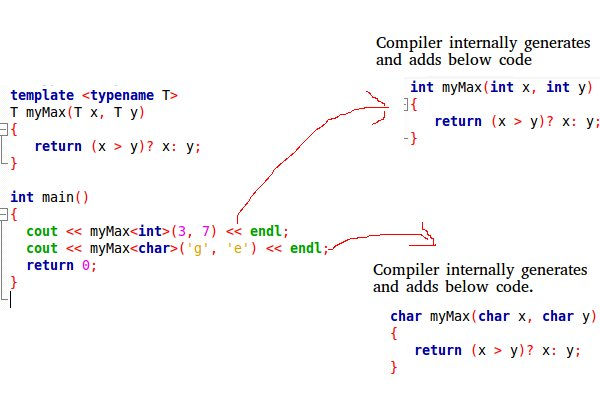

# **:simple-cplusplus: Template**

???+question "What?"

    C++ adds two new keywords to support templates: `template` and `typename`. `typename` can always be replaced by the keyword `class`.

???+question "For?"

    When we want to use some **classes** or **functions** for different data types. But we do not want to write multiple versions of the identical code implementation.

???+question "How does it work?"

    Templates are expanded at **compiler time**. 
    
    The function is basically like <u>macros</u>. The {++DIFFERENCE++} is:
    
        - Compiler needs to do **type checking** before template expansion.
        - Compiled code will finally contain **multiple copies** of the same templated class/function
        - For the same type of function/class calling, the compiler will not create a new copy; instead, it uses the old copy. 

{width="60%", : .center}   


## **Function Templates**

For functions that are used for different data types:

???+example "Function Templates"

    ```c++ title="func_temp.c++"
    #include <iostream>
    #include <cassert>
    using namespace std;
    
    //Function template that is used to compare size.
    template <typename T> T myMax(T x, T y)
    {
        return (x > y) ? x : y;
    }
    
    int main()
    {
        assert(myMax<int>(3, 7) == 7); // Call myMax for int
        assert(myMax<double>(3.0, 7.0) == 7); // call myMax for double
        assert(myMax<char>('g', 'e') == 'g'); // call myMax for char
    
        return 0;
    }
    ```

## **Class Templates**

For classes that are used for different data types:

???+example "Class Templates"

    ```c++ title="class_temp.c++"
    #include <iostream>
    #include <string>
    #include <cassert>
    using namespace std;
    
    template <typename T> class Array {
    private:
        T* ptr;
        int size;
    
    public:
        Array(T arr[], int s);
        string print();
    };
    
    template <typename T> Array<T>::Array(T arr[], int s)
    {
        ptr = new T[s];
        size = s;
        for (int i = 0; i < size; i++)
            ptr[i] = arr[i];
    }
    
    template <class T> string Array<T>::print()
    {
        string result = "";
        for (int i = 0; i < size; i++)
            result += " " + to_string(*(ptr + i));
        return result;
    }
    
    int main()
    {
        int arr[5] = { 1, 2, 3, 4, 5 };
        Array<int> a(arr, 5);
        assert(a.print() == " 1 2 3 4 5");
        return 0;
    }
    ```

## **Multiple arguments to Templates**

???+example "Multiple Arguments Templates"

    ```c++ title="mul_temp.c++"
    #include <iostream>
    using namespace std;
    
    template <class T, class U> class A {
        T x;
        U y;
    
    public:
        A() { cout << "Constructor Called" << endl; }
    };
    
    int main()
    {
        A<char, char> a;
        A<int, double> b;
        return 0;
    }
    ```
    
## **Default argument type to Templates**

???+example "Default Argument Type Templates"

    ```c++ title="da_temp.c++"
    #include <iostream>
    using namespace std;
    
    template <class T, class U = char> class A {
    public:
        T x;
        U y;
        A() { cout << "Constructor Called" << endl; }
    };
    
    int main()
    {
        A<char> a; // This will call A<char, char>
        return 0;
    }
    ```


### **References:**

- [Templates in C++ with Examples](https://www.geeksforgeeks.org/templates-cpp/)