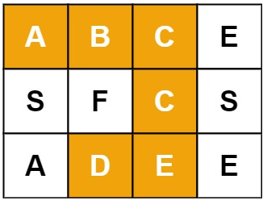
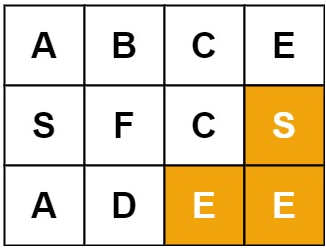

# **Backtracking**

>Keywords: 2D Matrix

## **Situation**
???+question "Situation"

    `Backtracking`, which is a methodology where we **mark** the current path of exploration, if the path does not lead to a solution, we then revert the change (i.e. backtracking) and try another path.

## **Question Example**
???+question "79. Word Search"

    Given an `m x n` grid of characters `board` and a string `word`, return `true` if word exists in the grid.

    The word can be constructed from letters of sequentially adjacent cells, where adjacent cells are horizontally or vertically neighboring. The same letter cell may not be used more than once.

## **Example**
???+example "Example"

    === "Example 1:"

        {width=40%, : .center}   

        * **Input:** board = [["A","B","C","E"],["S","F","C","S"],["A","D","E","E"]], word = "ABCCED"
        * **Output:** true


    === "Example 2:"

        {width=40%, : .center}   

        * **Input:** board = [["A","B","C","E"],["S","F","C","S"],["A","D","E","E"]], word = "SEE"
        * **Output:** true


## **Pseudo-code**
???+success "Code frame"

    ``` c++ title="Pseudo"
    bool Find_Solution(matrix, path) {
        for candidate in matrix:
            if backtrace(candidate, path[0]) return true;
        return false;
    }

    bool backtrace(candidate, path[index]){
        //Step1. Check the bottom case
        if(index == path.end) -> return true

        //Step2. Check if candidates locates at the outside the boundaries
        if(candidate at out || candidate != path[index]) -> return false

        //Step3. If match explore the neighbors in DFS
        candidate = '#'; // mark as used

        for neighbor of candidate:
            if (backtrace(neighbor, path[index+1])) -> return true

        //Step4. Clean up and return the false as the wrong path
        candidate = path[index]; // mark back when fail
        return false;
    }
    ```

## **Answer**
???+success "Simplified Solution"

    ``` c++ title="solution.c++"
    class Solution {
    private:
        int rows, cols;
    public:
        bool exist(vector<vector<char>>& board, string word) {
            rows = board.size();
            cols = board[0].size();
            for(int row = 0; row < rows; row++){
                for(int col = 0; col < cols; col++){
                    if(backtrace(row, col, board, word, 0)) return true;
                }
            }
            return false;
        }

        bool backtrace(int row, int col, vector<vector<char>>& board, string word, int index){
            //Step1. Check the bottom case
            if(index>=word.length())
                return true;

            //Step2. Check the boundaries
            if(row < 0|| row == rows||col < 0|| col == cols|| board[row][col] != word[index]){
                return false;
            }

            //Step3. If match explore the neighbors in DFS
            board[row][col] = '#'; // mark as used

            int row_offset[4] = {0, 1, 0, -1}, col_offset[4] = {1, 0, -1, 0};
            for(int i = 0; i < 4; i++){
                if (backtrace(row+row_offset[i], col+col_offset[i], board, word, index+1))
                    return true;
            }

            //Step4. Clean up and return the false as the wrong path
            board[row][col] = word[index];
            return false;
        }
    };
    ```

### **References**

[Solution of 79. Word Search](https://leetcode.com/problems/word-search/editorial/)

