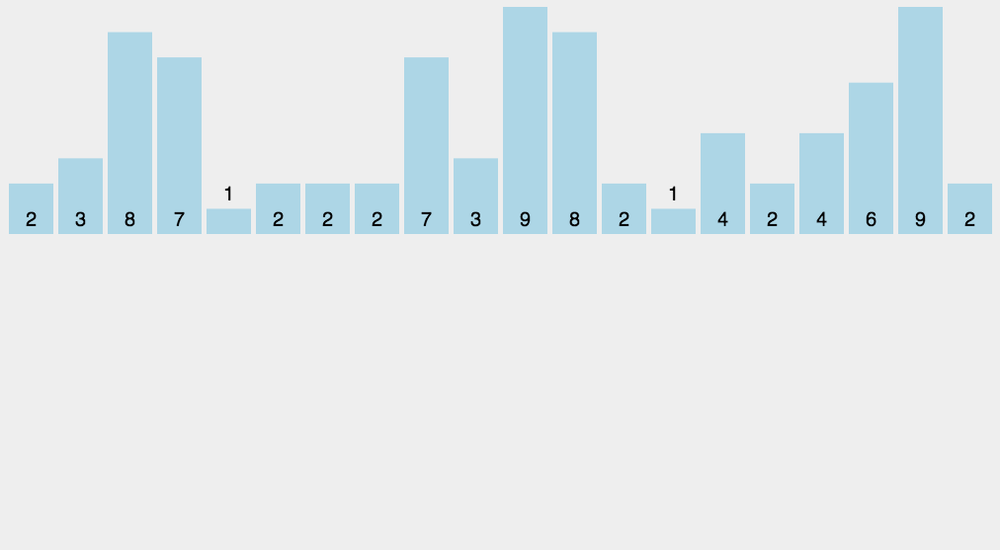

# **Counting Sort**

>Keywords: Sorting

## **Description**
???+question "Counting Sort?"

    `Counting Sort` works by iterating through the input, counting the number of times each item occurs, and using those counts to compute an item's index in the final, sorted array.

???+question "Efficiency?"

    **Time complexity:**  $O(N+M)$ (where `M` is $max(arr[])-min(arr[])$ and `N` is equal to size(arr[])).

    `Counting sort` is better than the comparison-based sorting techniques because there is no comparison between elements in counting sort. 


## **Algorithm Details**
???+success "Steps"

    **Step1. "Count":** pick a `pivot` in the array. We normally pick the most left element.

    **Step2. "Read":** scan the whole counting array in sequence, and output the sorted array.

## **Diagram**
???+success "Example of "Partition""

    {width="80%", : .center}  


## **Answer**
???+success "Realization"

    ``` c++ title="solution.c++"
    //--------------------------------------------
    // Author = "Tianle Yuan"
    //--------------------------------------------
    #include <iostream>
    #include <cassert>
    #include <vector>
    
    using namespace std;
    
    vector<int> countingSort(vector<int> array, int max_val){
        //Count
        int count[max_val+1] = {0};
        for(auto a: array){
            count[a] += 1;
        }

        //Read
        vector<int> result;
        for(int i = 0; i < max_val+1; i++){
            while(count[i]>0){
                result.push_back(i);
                count[i]--;
            }
        }
        return result;
    }
    
    int main()
    {
        vector<int> input = {4,1,5,3,6};
        
        vector<int> output = countingSort(input, 6);
        vector<int> test = {1,3,4,5,6};
        assert(output == test);
        //cout<<"output:";
        //for(auto i: output)
        //{
        //    if(i==output.back()){
        //        cout<<i<<endl;
        //    }
        //    else cout<<i<<",";
        //}
    }
    
    ```

### **References:**

- [Counting Sort Algorithm](https://www.interviewcake.com/concept/java/counting-sort)
- [Picture resource](https://miro.medium.com/max/1400/0*c7rXYaOy2zJNGpy3)