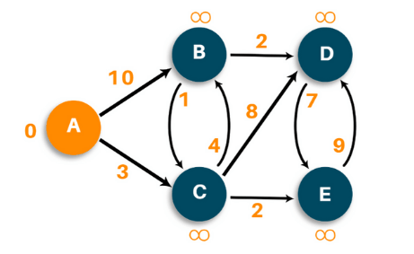
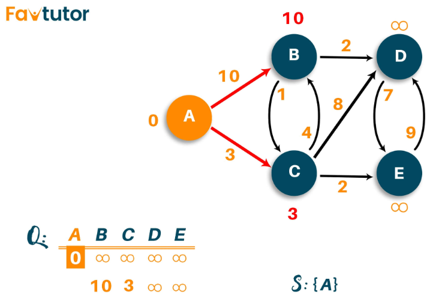

# **Dijkstra**

>Keywords: 2D Graphics, shortest path

## **Situation**
???+note "Situation"

    `Dijkstra` is an algorithm used to find the **shortest path** between nodes of the graph. The algorithm creates the tree of the shortest paths from the starting source vertex from all other points in the graph.

???+warning "Working conditions"

    Dijkstra's algorithm **only** works with the graph that possesses {==positive==} weights. 

???+question "Is Dijkstra BFS or DFS?"

    None of them. `Dijkstra` is a {==priority first==} algorithm (or `best first`). 
    
    Between `BFS` and `DFS` algorithms, the priority will be more to `BFS` rather than `DFS`. However, `Dijkstra` is much more than the `BFS` algorithm. 

## **Question**
???+question "Question"

    Consider the following situation: 

    {width="40%", : .center}  

    === "Example:"

        * **Input:** **Graphic matrix**[5][5], (A,B,C,D,E)
        * **Output:** **Dist**[0,7,3,9,5], **Trac matrix**[path_for_A, path_for_B, path_for_C...]
        * **Explanation:** Take "B" as an **example**: A --3--> C --4--> B **=>** Dist[1] = 3+4 = 7 

## **Explanation**
???+example "Explanation"

    === "Algorithm Description:"
    
        1. First of all, we will mark all vertex as unvisited vertex
        1. Then, we will mark the source vertex as 0 and all other vertices as infinity
        1. Consider the source vertex as current vertex
        1. Calculate the path length of all the neighboring vertex from the current vertex by adding the weight of  the edge in the current vertex
        1. Now, if the new path length is smaller than the previous path length, then replace it otherwise ignore it
        1. Mark the current vertex as visited after visiting the neighbor vertex of the current vertex
        1. Select the vertex with the smallest path length as the new current vertex and go back to step 4.
        1. Repeat this process until all the vertex are marked as visited.
    
    === "Algorithm Diagram:"
    
        1. {width="40%", : .center}    
        1. {width="40%", : .center}  
        1. {width="40%", : .center}  
        1. {width="40%", : .center}  
        1. {width="40%", : .center}  
        1. {width="40%", : .center}  
        1. {width="40%", : .center}  
        1. {width="40%", : .center}  
        1. {width="40%", : .center}  


## **Pseudo-code**
???+success "Pseudo-code"

    ``` c++ title="Pseudo-code"
    //--------------------------------------------
    // Author = "Tianle Yuan, Shivali Bhadaniya"
    //--------------------------------------------

    //G is the graph, S is the Sources Vertex
    function dijkstra(G, S){
        dist[] //record distance from each Vertex to the Source Vertex
        prev[]
        for each vertex V in G
            dist[V] <- infinite
            prev[V] <- NULL
            If V != S, add V to Priority Queue Q
            dist[S] <- 0

        while Q != ∅
            //U is another Vertex
            U <- Extract MIN from Q //Pop the top of heap Q
            for each unvisited neighbour V of U
                temperoryDist <- dist[U] + edgeWeight(U, V)
                if temperoryDist < dist[V]
                    dist[V] <- temperoryDist
                    prev[V] <- U
        return dist[], prev[]
    }
    ```

## **Answer**
???+success "Realization"

    ``` c++ title="solution.c++"
    //--------------------------------------------
    // Author = "Tianle Yuan, Shivali Bhadaniya"
    //--------------------------------------------

    #include<iostream>
    using namespace std;

    // global variables
    int dimension;
    vector<bool> grabage_set; // boolean array to mark visited and unvisited for each node
    vector<int> distance_set; // // array to calculate the minimum distance for each node 
    vector<vector<int>> prev_set;

    //Algorithm body
    void Dijkstra(vector<vector<int>> graph, int src)   // adjacency matrix 
    {                     
        distance_set[src] = 0;   // Source vertex distance is set 0               
        
        priority_queue<pair<int,int>, vector<pair<int,int>>, greater<pair<int,int>>> heap;
        heap.push({src, 0});
        
        while (heap.size() != 0){
            auto current = heap.top().second;
            heap.pop();
            
            grabage_set[current] = true;
            for(int k = 0; k < dimension; k++)                  
            {
                // updating the distance of neighbouring vertex
                int tempdist = distance_set[current] + graph[current][k];
                if(!grabage_set[k] && graph[current][k])
                {
                    if (tempdist < distance_set[k])
                    {   
                        distance_set[k] = tempdist;
                        prev_set[k].push_back(current);
                    }                    
                    heap.push({tempdist,k});
                    //cout << tempdist << "," << k  << endl;
                }
            }
        }
    }
    
    void printout();
    
    int main()
    {
        vector<vector<int>> graph={
            {0, 10, 3, 0, 0},
            {0, 0, 1, 2, 0},
            {0, 4, 0, 8, 2},
            {0, 0, 0, 0, 7},
            {0, 0, 0, 9, 0}};
        dimension = graph[0].size();
        grabage_set.resize(dimension,false); 
        distance_set.resize(dimension,INT_MAX);
        prev_set.resize(dimension,vector<int>());

        Dijkstra(graph,0);
        
        printout();
        return 0;                           
    }

    void printout(){
        for(auto i: distance_set)
        {
            cout << i << endl;
        }
        cout << endl;
        for(int k = 1; k < prev_set.size(); k++)
        {
            cout << char('A'+ k) << " to A: ";
            for (int t = 0; t < prev_set[k].size(); t++)
            {
                if (t < prev_set[k].size() - 1)
                    cout << char('A'+ prev_set[k][t]) << " <- ";
                else
                    cout << char('A'+ prev_set[k][t]) << " <- " << char('A'+ k) << endl;
            }
        }
    }
    ```

    ```c++ title="Output"
    0
    7
    3
    9
    5

    B to A: A <- C <- B
    C to A: A <- C
    D to A: C <- B <- D
    E to A: C <- E
    ```

### **References:**

- [Dijkstra's Algorithm in C++ | Shortest Path Algorithm](https://favtutor.com/blogs/dijkstras-algorithm-cpp#:~:text=What%20is%20Dijkstra's%20Algorithm%3F,other%20points%20in%20the%20graph.)