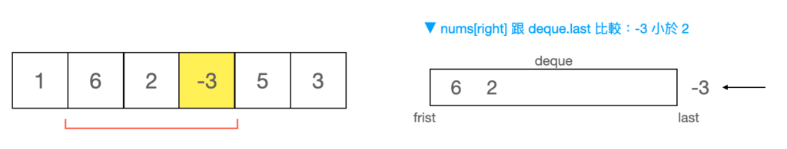
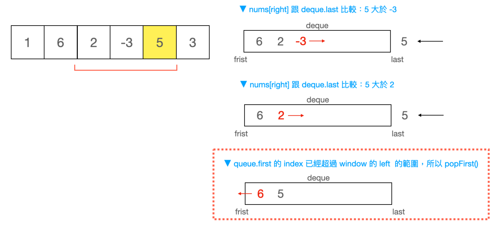

# **Monotonic Decreasing Queue**

>Keywords: Slide Window, Array

## **Situation**
???+question "239. Sliding Window Maximum"

    You are given an array of integers `nums`. There is a sliding window of size `k`, which is moving from the very left of the array to the very right. You can only see the `k` numbers in the window. Each time the sliding window moves right by one position.

    Return the max sliding window.
    
## **Example**
???+example "Example"

    === "Example 1:"

        * **Input:** `nums` = [1,3,-1,-3,5,3,6,7], `k` = 3
        * **Output:** [3,3,5,5,6,7]
        * **Explanation:** 

        Window position|Max
        :-: | :-: 
        [1  3  -1] -3  5  3  6  7   |   3
         1 [3  -1  -3] 5  3  6  7   |   3
         1  3 [-1  -3  5] 3  6  7   |   5
         1  3  -1 [-3  5  3] 6  7   |   5
         1  3  -1  -3 [5  3  6] 7   |   6
         1  3  -1  -3  5 [3  6  7]  |   7


    === "Example 2:"

        * **Input:** `nums` = [1], `k` = 1
        * **Output:** [1]


## **Pseudo-code**
???+success "Pseudo-code"

    ``` c++ title="Pseudo-code"
    //--------------------------------------------
    // Author = "Tianle Yuan"
    //--------------------------------------------

    class Monoqueue {

        deque<int> myque; // The monotonic queue is constructed based on dequeue. Every element in this queue is maintained to be monotonously decreasing.

    public:

        //Monotonize: when push in a new element, keep popping out current back elements until E_back >= E_pushin.
        void push(int n) {
            while(!myque.empty() && myque.back() < n) myque.pop_back();
            myque.push_back(n);
        }

        //"Large Front": return front element (magnitude compared after monotonization) in the data structure
        int front() {
            return myque.front();
        }
        
        //Pop "Large Front": if the value has already been popped previously (small than the current, we do not have to pop it again)
        void pop(int n) {  
            if(n == myque.front())
                myque.pop_front();
        }
    };
    ```

## **Explainations**
???+question "Monotonize & "Large Front"?"

    Assume our `monotonic queue` looks like the below, and we need to **monotonize** it when pushing back elements in. Run the codes below:

    - `myque`: [6, 2]
    {width="70%", : .center}
    - `myque.push(-3)` --> `-3` is smaller than any elements inside, which should stay in the queue back.
    {width="70%", : .center}
    - `myque.push(5)` 
      
        - --> `5` is bigger than `-3`; pop out `-3`, which is out.
        - --> `5` is bigger than `2`; pop out `2`, which is out.
        - --> `5` is smaller than `6`; stop popping and push back 5.
    - `myque.front()`: 6 now is the "Large Front".


## **Answer**
???+success "Realization"

    ``` c++ title="solution.c++"
    class Monoqueue {
        deque<int> myque;
    public:
        void push(int n) {
            while(!myque.empty() && myque.back() < n) myque.pop_back();
            myque.push_back(n);
        }
        int front() {
            return myque.front();
        }
        void pop(int n) {
            if(n == myque.front()) myque.pop_front();
        }
    };

    class Solution {
    public:
        vector<int> maxSlidingWindow(vector<int>& nums, int k) {
            Monoqueue mq;
            vector<int> res;
            for(int i = 0; i < nums.size(); ++i) { //scan all the elements
                if(i < k-1) mq.push(nums[i]);      //initialize the dequeue
                else {
                    mq.push(nums[i]);           //push in new element, monotonize queue
                    res.push_back(mq.front());  //record the "large front"
                    mq.pop(nums[i-k+1]);        //start from the k-1 element, we pop the front of the monotonic queue
                }
            }
            return res;
        }
    };
    ```

### **References:**

- [[L 外商面試考題] Sliding Window Maximum – Monotonic queue 的應用](https://bengersay.com/sliding-window-maximum/)
