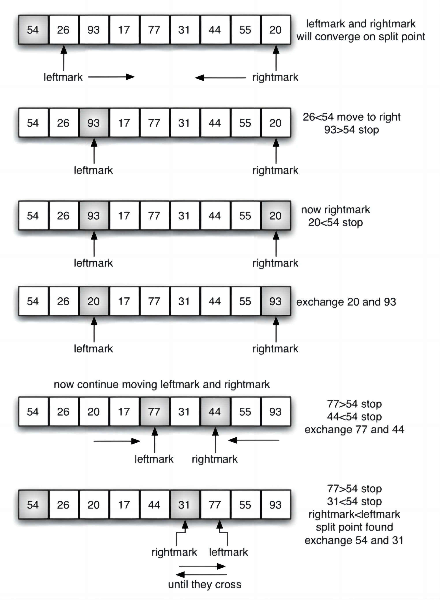

# **Quick Sort**

>Keywords: Sorting

## **Description**
???+question "Quick Sort?"

    `Quick Sort` is a sorting method that implements the `divide and conquer` idea. 

    The related `Quickselect` algorithm is known as Hoare's selection algorithm, developed by **Tony Hoare**.

???+question "Efficiency?"

    **Average time complexity:**  $O(n\log n)$

    **Worst time complexity:**  $O(n^2)$


## **Algorithm Details**
???+success "Steps"

    **Step1. "Pivot":** pick a `pivot` in the array. We normally pick the most left element.

    **Step2. "Partition":** scan the whole array. Compare the scanned element with the `pivot`: 

      - `element > pivot` -> move the right part, get the right part.
      - `element < pivot` -> move the left part, get the left part.

    **Step3. "Recursive":** redo left and right parts separately with **Step1** and **Step2**.

## **Diagram**
???+success "Example of "Partition""

    Let's **part** the array below when setting the **left element** as the `pivot`:

    {width="60%", : .center}    


## **Answer**
???+success "Realization"

    ``` c++ title="solution.c++"
    #include <iostream>
    #include <cassert>
    #include <vector>
    
    using namespace std;
    
    //partition
    int partitionArray(vector<int> &nums, int low, int high){
            if(low >= high) return -1;
            int pivot = low, l = pivot + 1, r = high;
            while(l <= r){
                if(nums[l] < nums[pivot]) l++;
                else if(nums[r] >= nums[pivot]) r--; // larger and  equal are all located at the right side
                else swap(nums[l], nums[r]);
            }
            swap(nums[pivot], nums[r]);
            return r;
        }

    //recursive body
    void quickSort(vector<int> &nums, int low, int high){  
        if(low >= high) return;
        swap(nums[low + rand() % (high - low + 1)], nums[low]);
        int pivot = partitionArray(nums, low, high);
        quickSort(nums,low, pivot);
        quickSort(nums,pivot+1, high);
    }
    
    int main()
    {
        vector<int> input = {4,1,5,3,6};
        //cout<<"input:";
        //for(auto i: input)
        //{
        //    if(i==input.back()){
        //        cout<<i<<endl;
        //    }
        //    else cout<<i<<",";
        //}
        quickSort(input,0,input.size()-1);
        assert(input == {1,3,4,5,6});
        //cout<<"output:";
        //for(auto i: input)
        //{
        //    if(i==input.back()){
        //        cout<<i<<endl;
        //    }
        //    else cout<<i<<",";
        //}
    }
    ```

### **References:**

- [7.8. The Quick Sort](https://runestone.academy/ns/books/published/cppds/Sort/TheQuickSort.html)